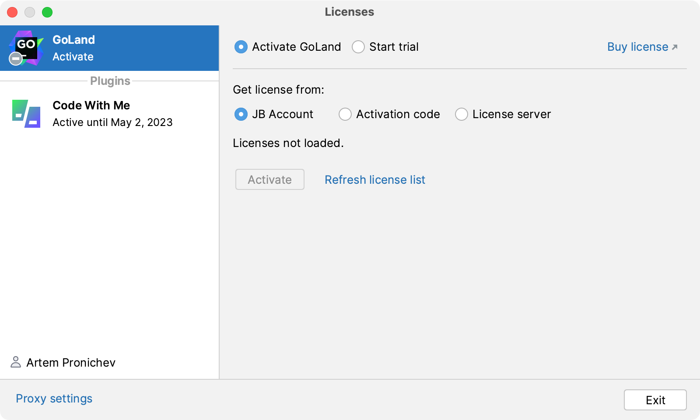
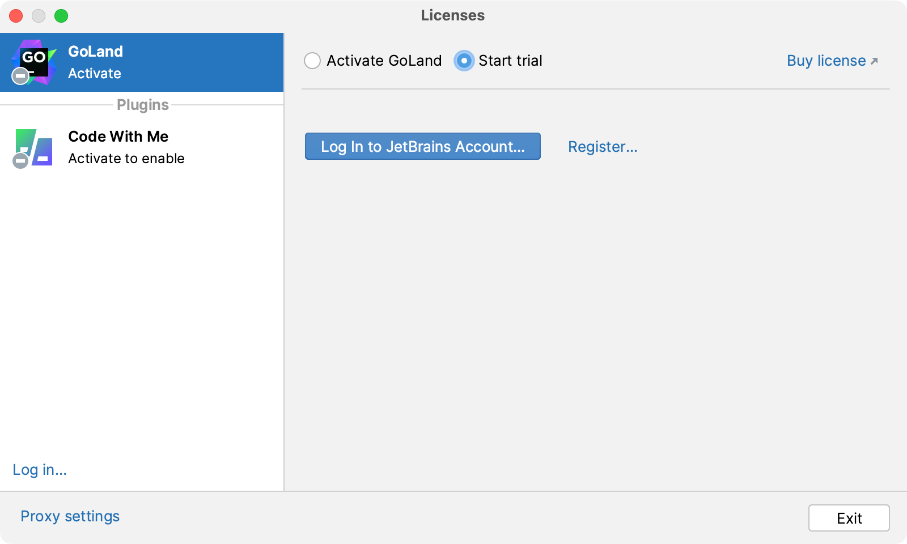
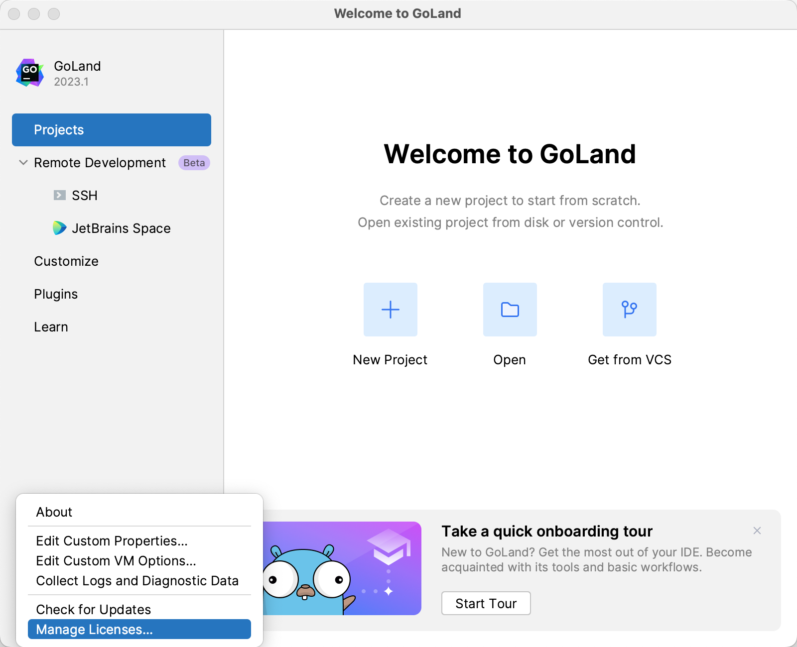
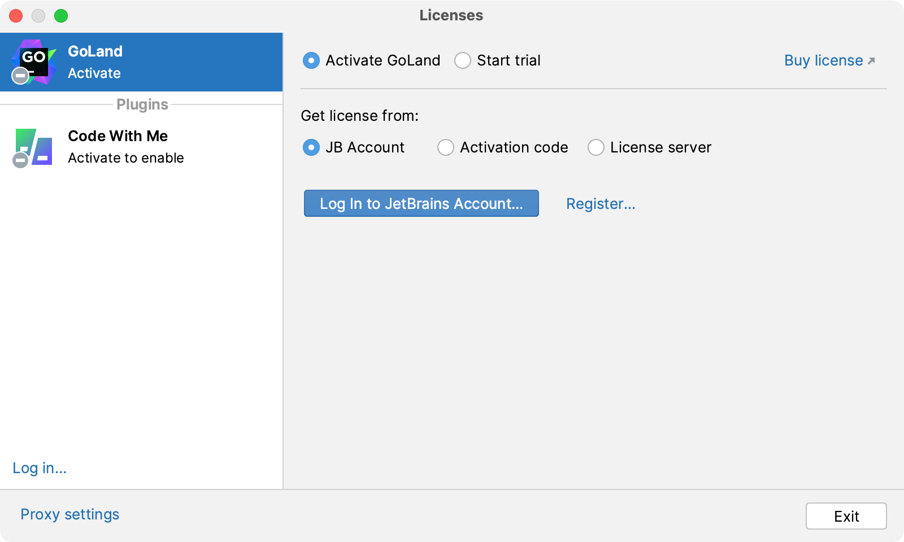
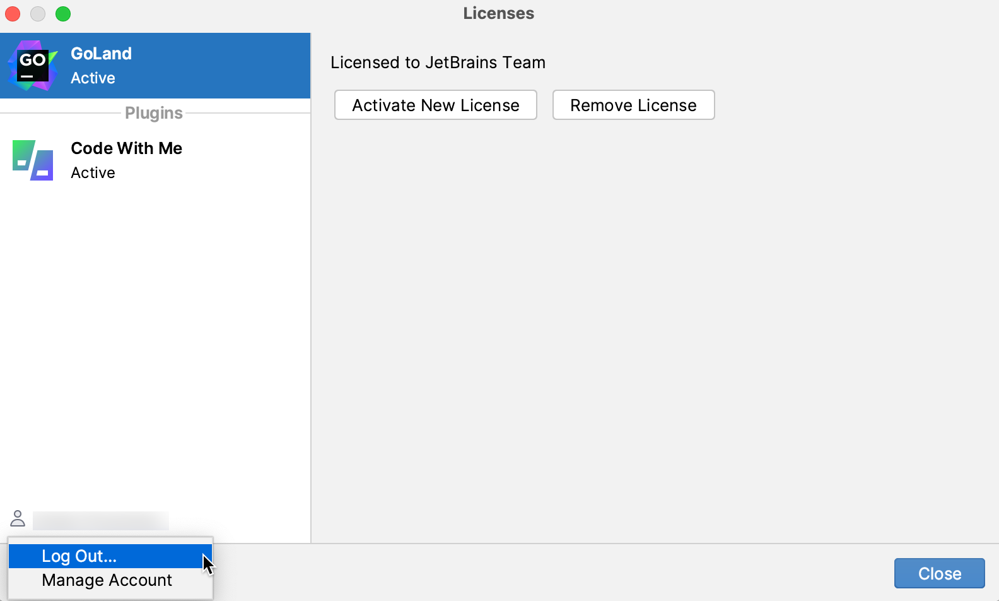
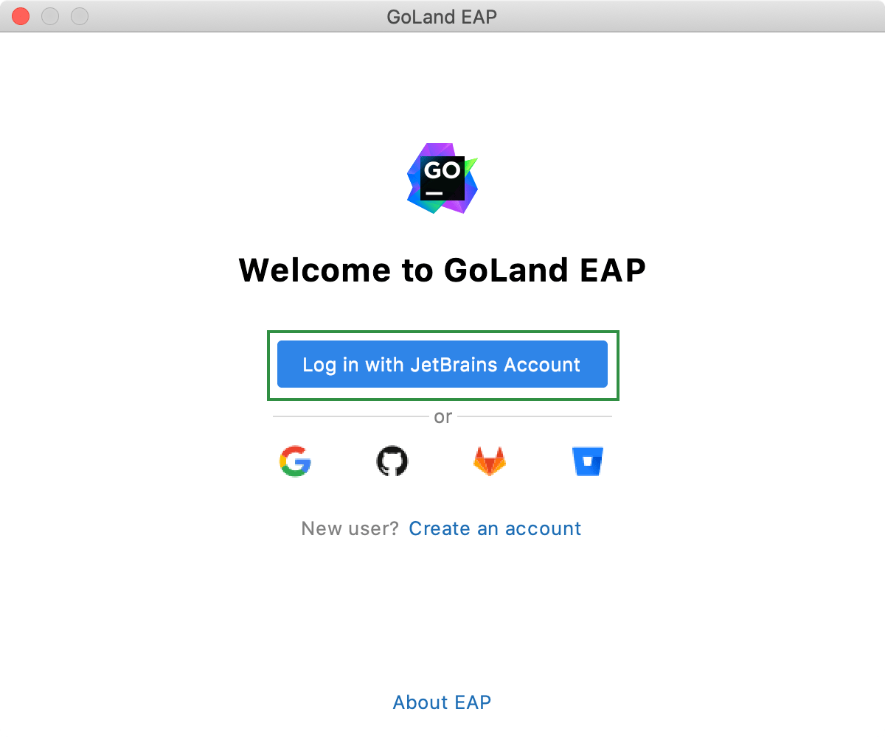
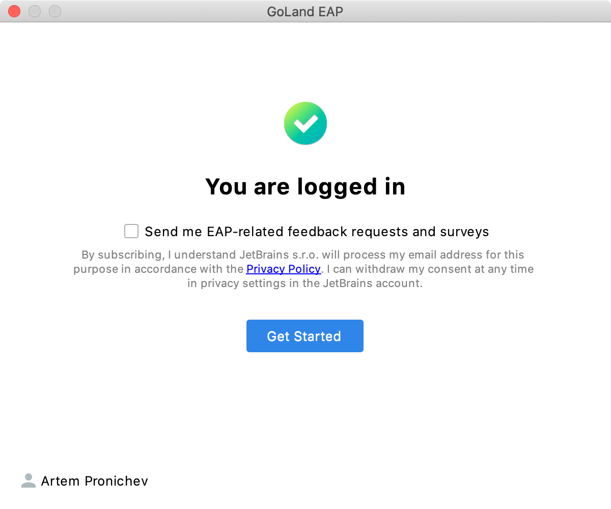
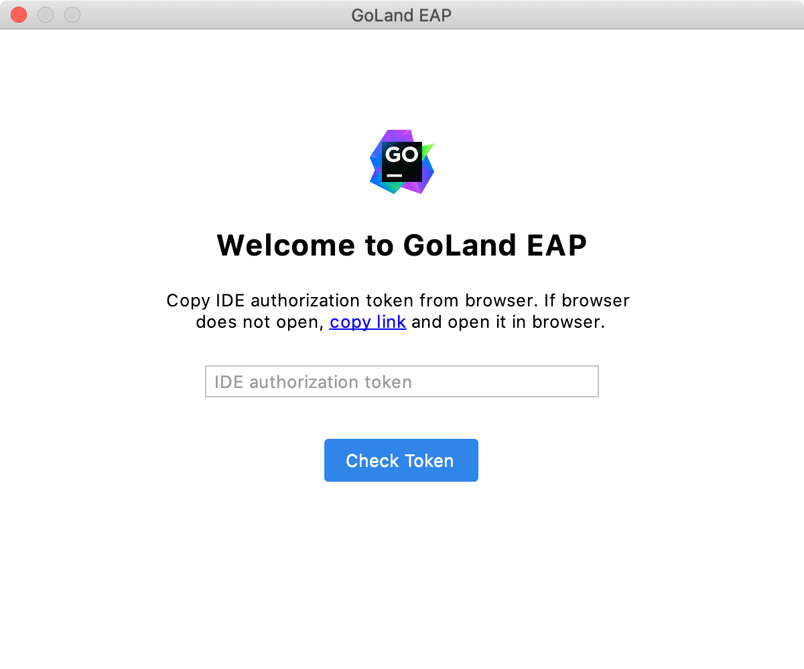

+++
title = "Register GoLand"
weight = 20
date = 2023-06-14T17:20:58+08:00
type = "docs"
description = ""
isCJKLanguage = true
draft = false
+++
# Register GoLand

https://www.jetbrains.com/help/go/register.html#jb_access_troubleshooting

Last modified: 21 April 2023

You can evaluate GoLand for up to 30 days. After installing the IDE, log in to your [JetBrains Account](https://account.jetbrains.com/) to start using the GoLand's trial version.

> ### 
>
> 
>
> - GoLand will automatically log you into your JetBrains Account if you're using ToolBox to install JetBrains products and already logged in there.
> - If you use two-factor authentication for your JetBrains Account, you can specify the generated app password instead of the primary JetBrains Account password.

### Start the free trial

1. In the Licenses dialog that opens when you start GoLand, select the Start trial option and click Log in to JetBrains Account. You will be redirected to the [JetBrains Account](https://account.jetbrains.com/login) website.

   

2. Log in to your JetBrains Account on the website and click the Start Trial button in the Licenses dialog to start your trial period.

   

Upon the expiration of the trial version, you need to buy and register a license to continue using GoLand . A new trial period will be available for the next released version of GoLand.

### Activate GoLand license

1. Select Help | Register from the main menu or click Help | Manage License on the Welcome screen to open the Licenses dialog.

   

2. Select how you want to register GoLand or a plugin that requires a license:

   

   

   JB Account

   Activation code

   License server

   

   

   Log in to your to your [JetBrains Account](https://account.jetbrains.com/login) get licenses that you purchased.

   If you don't have a JetBrains Account yet, use the Register button.

   GoLand automatically shows the list of your licenses and their details like expiration date and identifier. Click Activate to start using your license.

   If your license is not shown on the list, click Refresh license list.

   > ### 
   >
   > 
   >
   > GoLand detects the system proxy URL during initial startup and uses it for connecting to the JetBrains Account, Floating License Server, and License Vault. To override the URL of the system proxy, add the `-Djba.http.proxy` [JVM option](https://www.jetbrains.com/help/go/tuning-the-ide.html#configure-jvm-options). Specify the proxy URL as the host address and optional port number: `proxy-host[:proxy-port]`. For example: `-Djba.http.proxy=http://my-proxy.com:4321`.
   >
   > If you want to disable proxy detection entirely and always connect directly, set the property to `-Djba.http.proxy=direct`.

### Change the active user

1. Select Help | Register from the main menu or click Help | Manage License on the Welcome screen to open the Licenses dialog.

2. Click your name in the bottom left corner of the dialog and select Log Out.

   

   After logging out, you can [register](https://www.jetbrains.com/help/go/register.html#activate-license) using another JetBrains Account or a different activation method.

## Early Access Program

Pre-release builds of GoLand that are part of the [Early Access Program](https://www.jetbrains.com/community/eap/) are shipped with a 30-days license. Log in with your [JetBrains Account](https://account.jetbrains.com/) to start using GoLand EAP.

You can use either your JetBrains Account directly or your Google, GitHub, GitLab, or BitBucket account for authorization. You can also create a new JetBrains Account if you don't have one yet.

### Login options

Existing JetBrains Account

New JetBrains Account

Google, GitHub, GitLab, or BitBucket account

1. Click Log in to JetBrains Account. You will be automatically redirected to the JetBrains Account website.

   

2. On the website, log in using your JetBrains Account credentials.

3. Once you've successfully logged in, you can start using GoLand EAP by clicking Get Started.

   If you want to participate in EAP-related activities and provide your feedback, make sure to select the Send me EAP-related feedback requests and surveys option.

   

## Access to JetBrains Account: Troubleshooting

If you encounter problems when attempting to log in to your JetBrains Account, this may be due to one of the following reasons:

### No free ports

### Unable to open JetBrains Account in your browser

### No access to JetBrains Account

### Log in with an authorization token

An authorization token is a way to log in to your JetBrains Account if your system doesn't allow for redirection from the IDE directly, for example, due to your company's security policy. GoLand recognizes when redirection to the JetBrains Account website is impossible. It enables you to copy a link to generate an authorization token manually.

1. Click Copy link and open the copied link in your browser.

   

2. Log in to your JetBrains Account to generate an authorization token. After that, copy the token, paste it to the IDE authorization token field and click Check token. Once you've successfully logged in, you can start using GoLand.