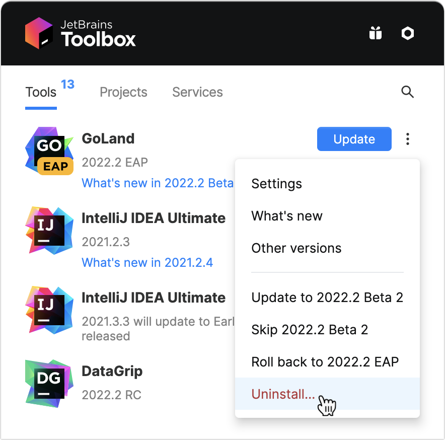

# Uninstall GoLand

https://www.jetbrains.com/help/go/uninstall.html#snap

Last modified: 03 January 2023

The proper way to remove GoLand depends on the method you used to install it.

## Uninstall using the Toolbox App

If you installed GoLand [using the Toolbox App](https://www.jetbrains.com/help/go/installation-guide.html#toolbox), do the following:

- Open the Toolbox App, click the settings icon  for the necessary instance, and select Uninstall.

  

## Uninstall a standalone instance

If you are running a [standalone GoLand instance](https://www.jetbrains.com/help/go/installation-guide.html#standalone), the [default IDE directories](https://www.jetbrains.com/help/go/directories-used-by-the-ide-to-store-settings-caches-plugins-and-logs.html) are preserved when you remove your instance in case you want to keep your settings for later or to use them with another instance, another version, or another IDE. You can remove those directories if you are sure you won't need them.


Windows

macOS

Linux


1. Open the Apps & Features section in the Windows Settings dialog, select the GoLand app and click Uninstall.

   Depending on your version of Windows, the procedure for uninstalling programs may be different. You can also manually run **Uninstall.exe** in the installation directory under **/bin**.

2. Remove the following directories:


> ### 
>
> 
>
> The default location of the IDE directories has changed starting from GoLand version 2020.1. If you had a previous version, new installations will import configuration from the old directories. For information about the location of the default directories in previous IDE versions, see the corresponding help version, for example: https://www.jetbrains.com/help/go/2019.3/tuning-the-ide.html#default-dirs.

## Uninstall silently on Windows

If you [installed GoLand silently](https://www.jetbrains.com/help/go/installation-guide.html#silent), you can run the uninstaller with the `/S` switch as an administrator. The uninstaller is located in the installation directory under **bin**.

Run **cmd** (Windows Command Prompt) as administrator, change to the GoLand installation directory, and run the following:

```bash
>bin\uninstall.exe /S
```


## Uninstall the snap package on Linux

If you [installed GoLand as a snap package](https://www.jetbrains.com/help/go/installation-guide.html#snap), use the following command to remove it:

```bash
$sudo snap remove goland
```