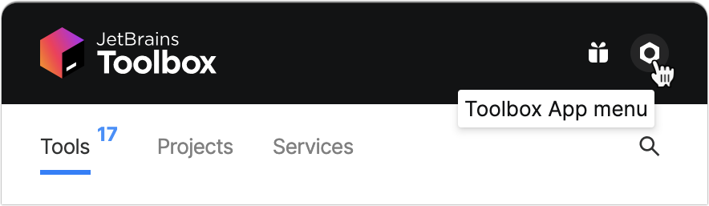
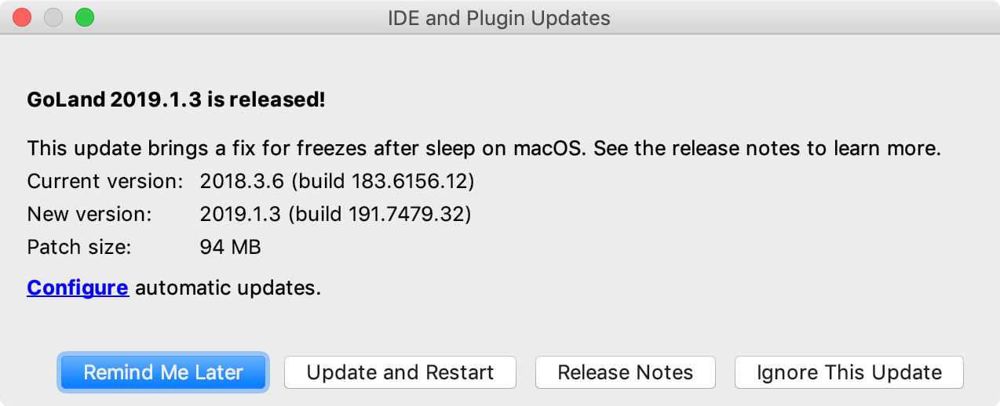

+++
title = "Update GoLand"
weight = 30
date = 2023-06-14T17:20:58+08:00
type = "docs"
description = ""
isCJKLanguage = true
draft = false
+++
# Update GoLand

https://www.jetbrains.com/help/go/update.html

Last modified: 07 March 2023

File | Settings | Appearance & Behavior | System Settings | Updates for Windows and Linux

GoLand | Settings | Appearance & Behavior | System Settings | Updates for macOS

Ctrl+Alt+S 

By default, GoLand is configured to check for updates automatically and notify you when a new version is available. Updates are usually patch-based: they are applied to the existing installation and only require you to restart the IDE. However, sometimes patch updates are not available, and a new version of GoLand must be installed.

When GoLand updates to a new major release, it opens the What's New in GoLand tab in the editor with information about the changes, improvements, and fixes. To open this tab manually, select Help | What's New in GoLand.

If GoLand does not have HTTP access outside your local network, it will not be able to check for updates and apply patches. In this case, you have to download new versions of the IDE and install them manually as described in [Standalone installation](https://www.jetbrains.com/help/go/installation-guide.html#standalone).

## Toolbox App

If you [installed GoLand using the Toolbox App](https://www.jetbrains.com/help/go/installation-guide.html#toolbox), it will suggest you to update the IDE when a new version is available.

### Automatically update all managed tools

1. Open the Toolbox App and click the Toolbox App menu icon in the top right corner.

   

2. In the Toolbox App Settings dialog, expand Tools and select Update all tools automatically.

If you disable this option, you will need to click Update next to any instance when a newer version comes out.

You can also configure the update policy for every managed IDE instance separately.

### Configure the update policy for a specific instance

1. Open the Toolbox App, click  next to the relevant IDE instance, and select Settings.
2. In the instance settings dialog, select the update channel to use for this IDE instance:
   - Release: Update only to stable releases that are recommended for production.
   - Early Access Program: Includes updates to release candidates , beta releases, and [EAP](https://www.jetbrains.com/community/eap/) builds, which are not recommended for production and include feature previews.

## Standalone instance

If you [installed GoLand manually](https://www.jetbrains.com/help/go/installation-guide.html#standalone), the standalone IDE instance will manage its own updates. It will notify you when a new version is available . You can choose to update the current instance, download and install the new version as a separate instance, postpone the notification, or ignore the update entirely.



### Configure the update policy

To manage the GoLand update policy, open Settings Ctrl+Alt+S and select Appearance & Behavior | System Settings | Updates.

> ### 
>
> 
>
> If the IDE instance is managed by the [Toolbox App](https://www.jetbrains.com/help/go/update.html#toolbox), these settings will affect only plugin updates.

The Updates page contains the following settings:

|                                                   |                                                              |
| ------------------------------------------------- | ------------------------------------------------------------ |
| Check for plugin updates                          | Select whether you want GoLand to check for new versions of plugins automatically. |
| Check for Updates                                 | Check for updates immediately.Alternatively, from the main menu, select Help \| Check for Updates on Windows or Linux, or GoLand \| Check for Updates on macOS. |
| Show What's New in the editor after an IDE update | Open a tab with information about new features and improvements after a major IDE update. |

## Snap package

If you [installed GoLand as a snap package](https://www.jetbrains.com/help/go/installation-guide.html#snap), it will manage updates automatically. All snaps are updated automatically in the background every day. You can also get the latest version of all snaps manually at any time by running the following command:

```bash
$sudo snap refresh
```


Or if you want to update only the GoLand snap:

```bash
sudo snap refresh goland
```