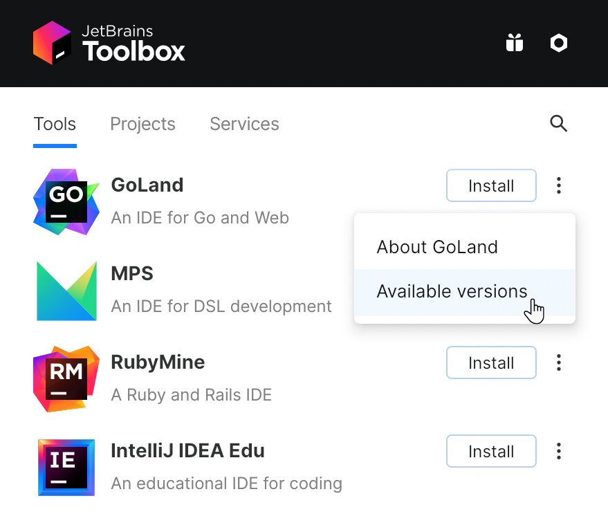

+++
title = "Install GoLand"
weight = 40
date = 2023-06-14T17:20:58+08:00
type = "docs"
description = ""
isCJKLanguage = true
draft = false
+++
# Install GoLand

https://www.jetbrains.com/help/go/installation-guide.html#snap

Last modified: 26 April 2023

GoLand is a cross-platform IDE that provides consistent experience on the Windows, macOS, and Linux operating systems.

## System requirements

| Requirement        | Minimum                                                      | Recommended                                                  |
| ------------------ | ------------------------------------------------------------ | ------------------------------------------------------------ |
| RAM                | 2 GB of free RAM                                             | 4 GB of total system RAM                                     |
| CPU                | Any modern CPU                                               | Multi-core CPU. GoLand supports multithreading for different operations and processes making it faster the more CPU cores it can use. |
| Disk space         | 3.5 GB                                                       | SSD drive with at least 5 GB of free space                   |
| Monitor resolution | 1024×768                                                     | 1920×1080                                                    |
| Operating system   | Officially released 64-bit versions of the following:Microsoft Windows 10 1809 or laterWindows Server 2019 or latermacOS 10.15 or laterAny Linux distribution that supports Gnome, KDE , or Unity DE.For more information about installing GoLand on Raspberry Pi 4, see [this blogpost at blog.jetbrains.com](https://blog.jetbrains.com/go/2020/02/18/running-goland-on-a-raspberry-pi-4/).Pre-release versions are not supported. | Latest 64-bit version of Windows, macOS, or Linux (for example, Debian, Ubuntu, or RHEL) |

You do not need to install Java to run GoLand because JetBrains Runtime is bundled with the IDE (based on JRE 17).

## Install using the Toolbox App

The [JetBrains Toolbox App](https://www.jetbrains.com/toolbox/app/) is the recommended tool to install JetBrains products. Use it to install and manage different products or several versions of the same product, including [Early Access Program](https://www.jetbrains.com/community/eap/) (EAP) and Nightly releases, update and roll back when necessary, and easily remove any tool. The Toolbox App maintains a list of all your projects to quickly open any project in the right IDE and version.

For more information about Nightly builds, see [What are nightly builds? in the FAQ section.](https://www.jetbrains.com/help/go/faq-about-goland.html#what-are-early-access-program-eap-and-nightly-builds)


Windows

macOS

Linux


### Install the Toolbox App

1. Download the installer **.exe** from the [Toolbox App web page](https://www.jetbrains.com/toolbox/app/).

2. Run the installer and follow the wizard steps.

3. After you run the Toolbox App, click its icon  in the notification area and select which product you want to install.

   To install a specific version, click  and select Available versions.

To install a nightly build, select the version that has `Nightly` in its name from the list of versions (for example, 2021.1 Nightly).



Log in to your JetBrains Account from the Toolbox App, and it will automatically activate the available licenses for any IDE that you install.

> ### 
>
> 
>
> If you installed GoLand via the [Toolbox App](https://www.jetbrains.com/toolbox/app/), you can find the installation directory in the app: open the settings of the IDE instance in the Toolbox App, expand Configuration and look for the Install location field.

## Standalone installation

Install GoLand manually to manage the location of every instance and all the configuration files. For example, if you have a policy that requires specific install locations.


xxxxxxxxxx1 1sudo snap refresh golandbash

macOS

Linux


1. [Download the installer](https://www.jetbrains.com/go/download/) **.exe**.

   > ### 
   >
   > 
   >
   > There is a separate installer for ARM64 processors.

2. Run the installer and follow the wizard steps.

To run GoLand, find it in the Windows Start menu or use the desktop shortcut. You can also run the launcher batch script or executable in the installation directory under **bin**.

When you run GoLand for the first time, you can take several steps to complete the installation, customize your instance, and start working with the IDE.

For more information, see [Run GoLand for the first time](https://www.jetbrains.com/help/go/run-for-the-first-time.html).

## Silent installation on Windows

Silent installation is performed without any user interface. It can be used by network administrators to install GoLand on a number of machines and avoid interrupting other users.

To perform silent install, run the installer with the following switches:

- `/S`: Enable silent install

- `/CONFIG`: Specify the path to the [silent configuration file](https://www.jetbrains.com/help/go/installation-guide.html#silent-config)

- `/D`: Specify the path to the installation directory

  This parameter must be the last in the command line, and it should not contain any quotes even if the path contains blank spaces.

For example:

```plaintext
goland.exe /S /CONFIG=d:\temp\silent.config /D=d:\IDE\GoLand
```


To check for issues during the installation process, add the `/LOG` switch with the log file path and name between the `/S` and `/D` parameters. The installer will generate the specified log file. For example:

```bash
goland.exe /S /CONFIG=d:\temp\silent.config /LOG=d:\JetBrains\GoLand\install.log /D=d:\IDE\GoLand
```


### Silent configuration file

You can download the default silent configuration file for GoLand at https://download.jetbrains.com/go/silent.config

The silent configuration file defines the options for installing GoLand. With the default options, silent installation is performed only for the current user: `mode=user`. If you want to install GoLand for all users, change the value of the installation mode option to `mode=admin` and run the installer as an administrator.

The default silent configuration file is unique for each JetBrains product. You can modify it to enable or disable various installation options as necessary.

> ### 
>
> 
>
> It is possible to perform silent installation without the configuration file. In this case, omit the `/CONFIG` switch and run the installer as an administrator. Without the silent configuration file, the installer will ignore all additional options: it will not create desktop shortcuts, add associations, or update the `PATH` variable. However, it will still create a shortcut in the Start menu under JetBrains.

## Install as a snap package on Linux

You can install GoLand as a self-contained [snap](https://snapcraft.io/) package. Since snaps update automatically, your GoLand installation will always be up-to-date.

> ### 
>
> 
>
> To use snaps, install and run the snapd service as described in the [installation guide](https://docs.snapcraft.io/core/install).
>
> On Ubuntu 16.04 LTS and later, this service is pre-installed.

GoLand is distributed via two channels:

- The stable channel includes only stable versions. To install the latest stable release of GoLand, run the following command:

  ```bash
  sudo snap install goland --classic
  ```

  

  The `--classic` option is required because the GoLand snap requires full access to the system, like a traditionally packaged application.

- The edge channel includes EAP builds. To install the latest EAP build of GoLand, run the following command:

  ```bash
  sudo snap install goland --classic --edge
  ```

  

When the snap is installed, you can launch it by running the `goland` command.

To list all installed snaps, you can run `sudo snap list`. For information about other snap commands, see the [Snapcraft documentation](https://docs.snapcraft.io/).