+++
title = "快速入门指南"
weight = 50
date = 2023-06-14T17:20:58+08:00
type = "docs"
description = ""
isCJKLanguage = true
draft = false

+++
# Quick start guide - 快速入门指南

https://www.jetbrains.com/help/go/quick-start-guide-goland.html#debug

Last modified: 21 April 2023

最后修改日期：2023年4月21日

​	本快速入门指南将介绍关键概念，并帮助您在GoLand中迈出第一步。

## 步骤1. 在GoLand中打开或创建一个Go项目

​	在您安装并首次启动GoLand之后，您需要创建一个项目。在GoLand中的所有操作都是在项目的上下文中进行的。它作为代码辅助、批量重构、代码风格一致性和其他功能的基础。

​	在IDE中开始处理项目的三种选项如下：

- [打开现有项目](https://www.jetbrains.com/help/go/quick-start-guide-goland.html#open-project)
- [从版本控制系统 (VCS) 中检出项目](https://www.jetbrains.com/help/go/quick-start-guide-goland.html#checkout-from-vcs)
- [创建新项目](https://www.jetbrains.com/help/go/quick-start-guide-goland.html#integration_of_go_modules)

### 打开现有项目

1. 在欢迎对话框中，点击"打开"。

   或者，点击"文件" | "打开"。

5. 在文件浏览器中，导航到包含项目文件的文件夹，然后点击"打开..."。

6. 点击"确定"。

   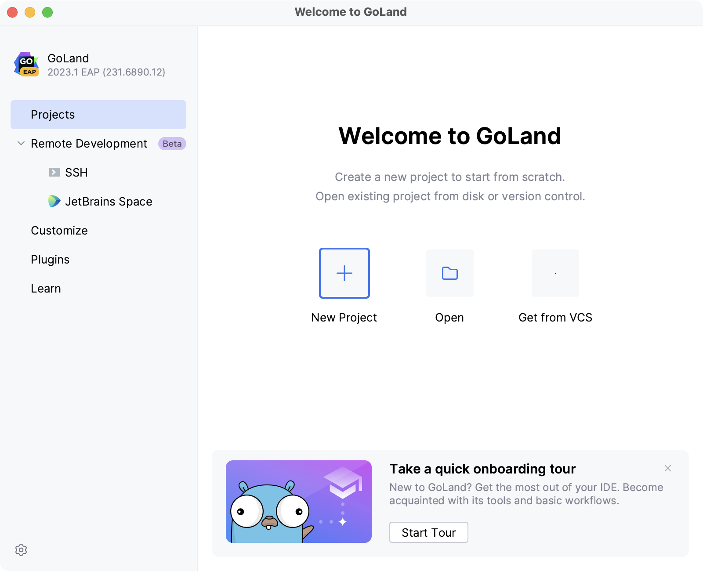

### 从版本控制系统中克隆现有项目

1. 在欢迎对话框中，点击"从版本控制获取"。

2. 从版本控制列表中，选择Git或Mercurial：

   

   - 要从GitHub检出文件，请选择GitHub，然后点击"通过GitHub登录"。您将被重定向到 [account.jetbrains.com](https://account.jetbrains.com/)，需要点击GitHub上的"授权"。输入您的GitHub凭据，并授权访问您的GitHub帐户。

     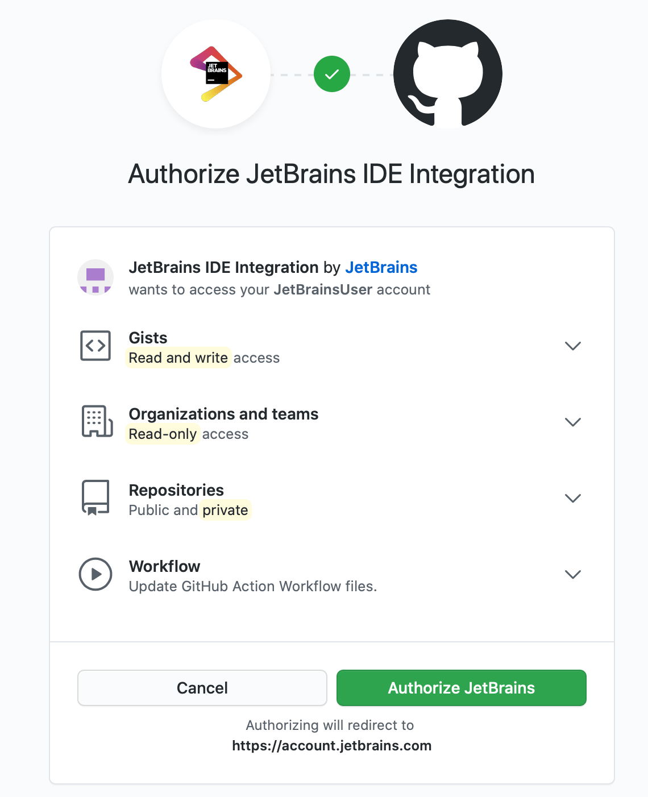

   - 要从Mercurial检出文件，[安装和配置Mercurial](https://www.jetbrains.com/help/go/using-mercurial-integration.html)，然后重新启动GoLand。输入源代码的路径，将存储库克隆到您的计算机上。

   

3. 打开项目后，您需要指定Go SDK的位置。您可以指定本地SDK路径或下载SDK。要设置Go SDK，打开设置 Ctrl+Alt+S，并导航到Go | GOROOT。点击"Add SDK"按钮，然后在两个选项中选择之一：

   - 添加SDK...：使用本地SDK副本。在文件浏览器中，导航到您硬盘上的SDK版本。
   - 下载...：下载SDK。在"位置"字段中，指定SDK的路径。要使用文件浏览器，请点击"浏览"图标 。点击"确定"。

   有关版本控制系统的更多信息，请参阅[版本控制](https://www.jetbrains.com/help/go/version-control-integration.html)。

   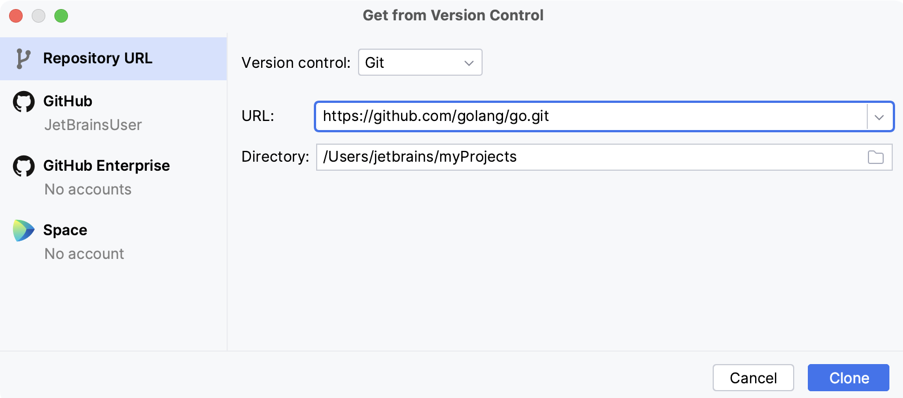

> ​	要使用其他版本控制系统，请安装相应的插件。有关安装插件的更多信息，请阅读[插件](https://www.jetbrains.com/help/go/managing-plugins.html)。

### 使用Go模块集成创建项目

1. 选择 File | New | Project…..

   或者，在欢迎界面中，点击New Project按钮。

2. 在New Project对话框中，从可用项目列表中选择 Go。

3. 在 GOROOT 字段中，指定您的 Go 安装位置。通常情况下，该位置会自动定义。

   若要更改或安装新的 Go SDK 版本，请单击添加 SDK 按钮，并选择本地选项以选择硬盘上的 Go SDK 版本，或选择下载选项以从官方仓库下载 Go SDK。

4. （可选）选择或取消选中自动启用供应商支持复选框。

   > ​	自 Go 1.14 RC 版本开始，自动供应商模式成为内置的 Go 功能。对于 Go 版本 1.14 RC 及更高版本，自动启用供应商支持复选框将被禁用。有关供应商的更多信息，请参阅[供应商](https://www.jetbrains.com/help/go/configuring-build-constraints-and-vendoring.html#vendoring)。

8. （可选）在环境字段中，指定您的项目所需的环境变量，例如 `GOPROXY` 环境变量。有关环境变量的更多信息，请阅读[环境变量部分](https://www.jetbrains.com/help/go/create-a-project-with-go-modules-integration.html#environment-variables)。

10. 点击 Create。

   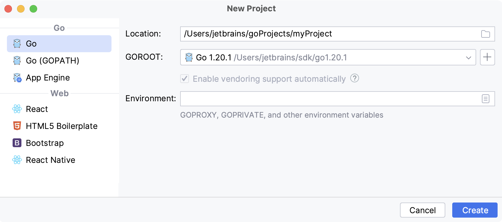

### 创建Go文件

1. 新建项目中没有Go文件。要创建Go文件，请执行以下操作之一：

   - 在项目的父文件夹上右键单击，然后选择新建 | Go文件。
   - 单击项目的父文件夹，按下Alt+Insert，然后选择Go文件。
   - 单击项目的父文件夹，导航到文件 | 新建 | Go文件。

   

2. 在新建Go文件对话框中，输入文件名，并选择是否创建一个空的Go文件（空文件）或带有定义的 `main` 函数的Go文件（简单应用程序）。

   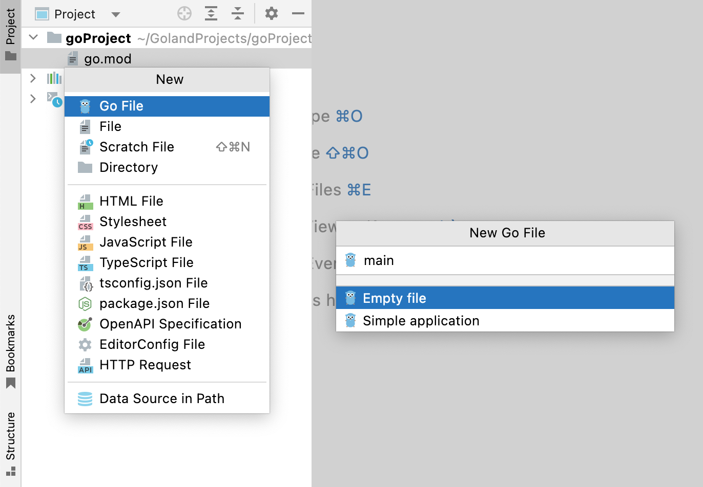

## 步骤2. 探索用户界面

​	当您首次启动GoLand时，会看到"欢迎使用GoLand"对话框。从该对话框中，您可以创建和打开项目、从版本控制系统中检出项目、查看文档并配置IDE。

​	打开项目后，您会看到主窗口分为几个逻辑区域。

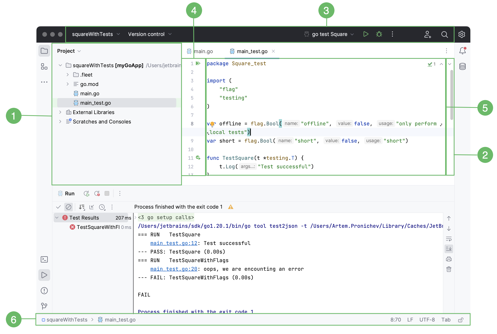

1. 左侧的[项目](https://www.jetbrains.com/help/go/project-tool-window.html)工具窗口显示您的项目文件。工具窗口是提供访问项目管理、搜索、运行和调试、与版本控制系统集成等任务的窗口。要查看所有工具窗口的列表，请导航到"视图 | 工具窗口"。
3. 右侧的[编辑器](https://www.jetbrains.com/help/go/using-code-editor.html)窗格是您编写代码的地方。它具有用于在打开文件之间进行导航的选项卡。
5. 导航栏位于编辑器上方，除了允许您快速运行和调试应用程序外，还可以执行基本的[VCS操作](https://www.jetbrains.com/help/go/version-control-integration.html)。
7. 沟槽是编辑器旁边的垂直条，它显示断点并提供方便的导航到定义或声明的方式。此外，您可以使用运行应用程序图标（)来运行或调试应用程序。
8. 滚动条位于编辑器的右侧。GoLand监视代码的质量，并显示[代码检查](https://www.jetbrains.com/help/go/code-inspection.html)的结果：错误、警告、拼写错误和其他问题。沟槽顶部的指示器显示整个文件的代码检查的整体状态。
10. 状态栏显示项目和整个IDE的状态，并向您显示有关文件编码、行分隔符、检查配置文件和其他警告和信息消息的信息。

​	在IDE的左下部分，状态栏中，您可以看到 或按钮。这些按钮用于切换工具窗口弹出窗口的显示。如果将鼠标指针悬停在此按钮上，将显示当前可用工具窗口的列表。

## 步骤3. 编写代码

​	在编辑器中工作时，GoLand会分析您的代码，寻找优化方法并检测潜在和实际问题。以下是可能对您的代码编写有用并提高您的生产力的基本功能和工具： 

- [重构](https://www.jetbrains.com/help/go/quick-start-guide-goland.html#refactorings)
- [代码补全](https://www.jetbrains.com/help/go/quick-start-guide-goland.html#code-completion)
- [生成代码](https://www.jetbrains.com/help/go/quick-start-guide-goland.html#generating-code)
- [Live templates](https://www.jetbrains.com/help/go/quick-start-guide-goland.html#live-templates)
- [检查](https://www.jetbrains.com/help/go/quick-start-guide-goland.html#inspections)
- [意图操作](https://www.jetbrains.com/help/go/quick-start-guide-goland.html#intention-actions)

### 重构

​	[重构](https://en.wikipedia.org/wiki/Code_refactoring)是改进源代码而不创建新功能的过程。重构帮助您保持代码的稳定、[dry](https://en.wikipedia.org/wiki/Don't_repeat_yourself)和易于维护。

​	GoLand为您提供以下重构选项： 

- [更改签名](https://www.jetbrains.com/help/go/change-signature.html)：更改方法或函数名称；添加、删除和重新排序参数；为新的非变参参数分配默认值。
- [提取重构](https://www.jetbrains.com/help/go/extract-constant.html)：提取可以分组的代码片段。可以提取常量、变量、方法和接口。
- [内联重构](https://www.jetbrains.com/help/go/inline.html)：将提取的代码片段移动到调用代码中。与提取重构相反。
- [复制重构](https://www.jetbrains.com/help/go/move-refactorings.html#copy_refactoring)：将文件、目录或包复制到不同的目录或包。
- [移动重构](https://www.jetbrains.com/help/go/move-refactorings.html#move_refactoring)：将源代码部分移动到另一个包或文件中。例如，您可以使用移动重构将方法移动到另一个包中。

### 代码补全

​	GoLand有两种类型的代码补全：

- 基本代码补全Ctrl+Space：帮助您完成在当前可见范围内的类型、接口、方法和关键字的名称。当您调用代码补全时，GoLand会分析上下文并建议可从当前光标位置到达的选择项。默认情况下，GoLand会在您输入时自动显示代码补全弹出窗口。

- 智能代码补全Ctrl+Shift+Space：过滤建议列表，仅显示适用于当前上下文的类型。

  以下动画显示了基本代码补全和智能类型匹配完成之间的区别。请注意不同完成类型建议的变体数量。

  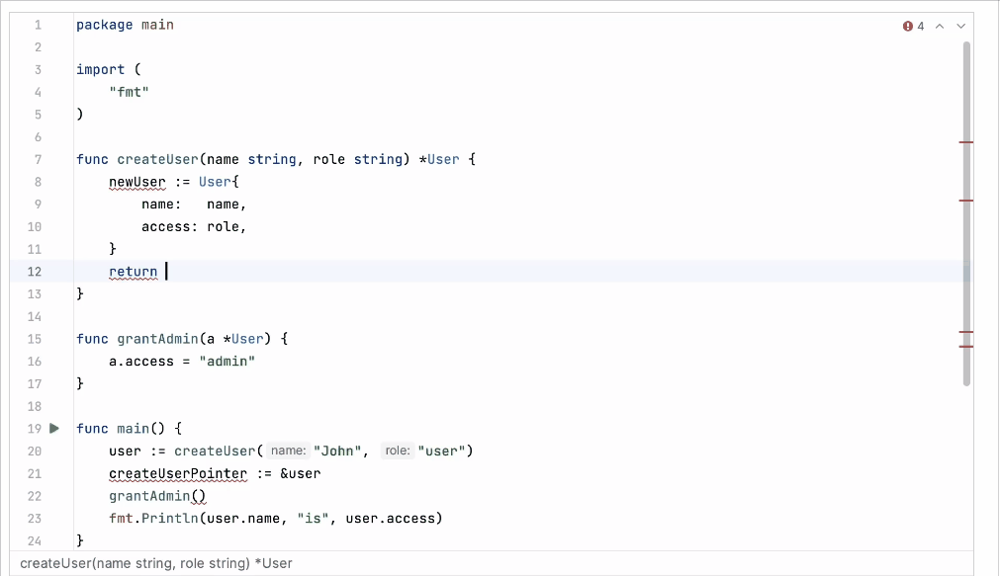

### 生成代码

​	GoLand提供多种方式生成常见的代码结构和重复元素，以帮助您提高生产力。这些可以是在创建新文件时使用的[文件模板](https://www.jetbrains.com/help/go/using-file-and-code-templates.html)，根据上下文应用不同的自定义或预定义[Live templates](https://www.jetbrains.com/help/go/using-live-templates.html)，各种包装器或字符的自动配对。

​	从主菜单中选择"Code | Generate Alt+Insert"以打开可生成的构造的弹出菜单。 

- 您可以生成getter、setter、构造函数、缺失的方法和测试文件。有关"Generate"操作的更多信息，请参阅[使用"Generate"操作](https://www.jetbrains.com/help/go/using-the-generate-action.html)。

  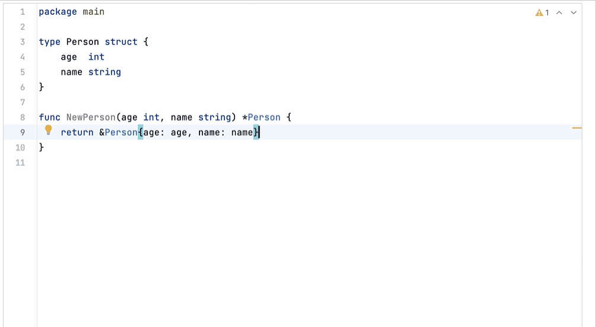

  

### Live templates

​	使用Live templates将常见构造插入到代码中，例如循环、条件、声明或打印语句。

​	要展开代码片段，请键入相应的模板缩写并按Tab键。按Tab键继续从模板中的一个[变量](https://www.jetbrains.com/help/go/template-variables.html)跳到下一个变量。按Shift+Tab键转到上一个变量。 

- 要查看Live templates列表，请打开设置Ctrl+Alt+S并导航到Editor | Live templates。

  考虑以下使用Live Templates编码的`Hello World`程序的示例。

  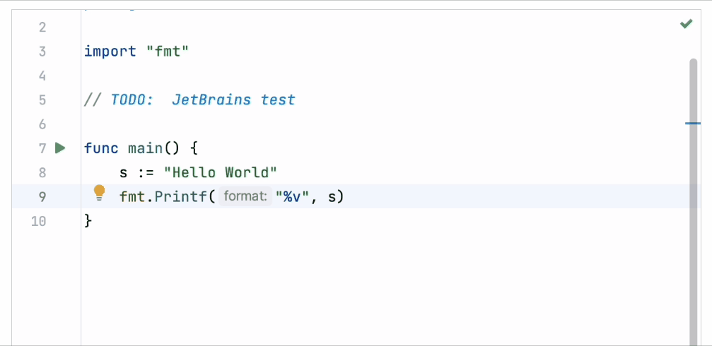

  

### 检查

​	在GoLand中，有一组代码检查工具可以在编译项目之前检测和修正代码中的异常。IDE可以找出和突出显示各种问题，包括死代码、潜在错误、拼写问题和改善整体代码结构。

​	检查可以在所有项目文件中或仅在特定[范围](https://www.jetbrains.com/help/go/configuring-scopes-and-file-colors.html)(例如，仅在生产代码或修改的文件中)中扫描代码。

​	每个检查都有一个[严重级别](https://www.jetbrains.com/help/go/configuring-inspection-severities.html)，表示问题对代码的影响程度。在编辑器中，严重级别显示不同，因此您可以快速区分关键问题和不太重要的问题。GoLand预定义了一组严重级别，并允许您创建自己的严重级别。 

- 要查看检查列表，请打开设置Ctrl+Alt+S并导航到Editor | Inspections。禁用其中一些检查，或启用其他检查，并调整每个检查的严重级别。您可以决定是否将其视为错误或警告。

  例如，"Unreachable code"检查检测到无法执行的代码片段。

  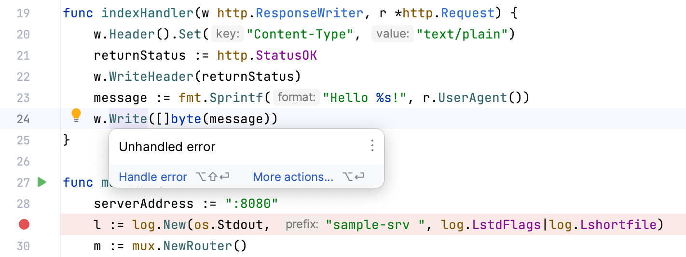

### 意图操作

​	在编辑器中工作时，GoLand会分析您的代码，搜索优化方法并检测潜在和实际问题。意图操作涵盖从错误和警告到优化建议的各种情况。

​	在GoLand中，您可以使用以下类型的意图操作：

 

- 意图操作：生成一段代码或建议代码的替代方案的操作。通常，意图操作适用于有效的代码片段。单击黄色灯泡图标，您可以查看当前上下文中可用的意图操作。例如，您可以创建生成结构类型值的构造函数。或者，用否定的条件和交换的if-else分支替换if-else语句。
- 快速修复：建议一种更好的解决方案的操作。通常，这些操作适用于错误或可能错误的代码。红色灯泡图标表示快速修复操作。如果有错误，红色波浪线将在出现错误的位置显示。当您将光标悬停在错误上方时，红色灯泡图标将出现。单击图标将显示可能的快速修复选项。

​	要查看意图操作列表，请打开设置Ctrl+Alt+S并导航到Editor | Intentions。

1. 要应用意图操作，请单击灯泡图标（或按Alt+Enter键）以打开建议列表。
2. 从列表中选择一个操作，然后按Enter键。

​	例如，您可以使用意图操作在代码中注入另一种语言：

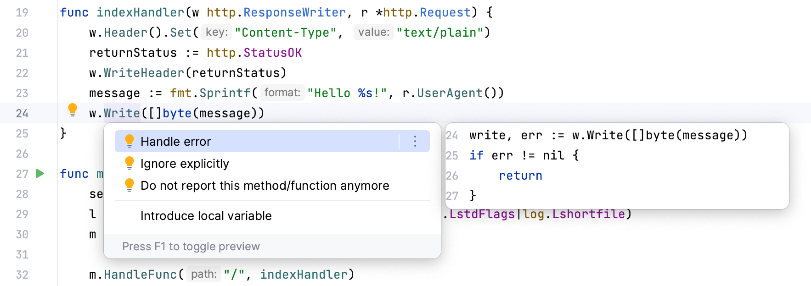

## 第4步：运行和调试代码

​	您可以使用键盘、上下文菜单、沟槽菜单或使用[运行/调试配置](https://www.jetbrains.com/help/go/run-debug-configuration.html)在GoLand中运行和调试代码。

### 运行代码

- 要运行您的应用程序，按Shift+F10，单击沟槽中的运行应用程序图标 然后选择运行 <应用程序名称>。

  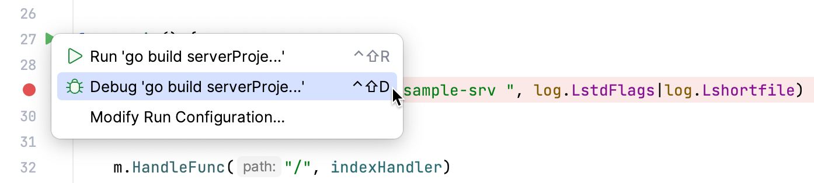

### 调试代码

​	[调试](https://www.jetbrains.com/help/go/debugging-code.html)从设置断点开始，程序执行将在断点处暂停，以便您可以探索程序数据。只需单击差旁中要设置断点的行号。

- 要调试您的应用程序，按Shift+F9，单击差旁中的运行应用程序图标然后选择调试 <应用程序名称>。然后，逐步执行程序（请参阅运行菜单或[调试工具窗口](https://www.jetbrains.com/help/go/debug-tool-window.html)中提供的选项)。

  有关详细信息，请参阅[调试](https://www.jetbrains.com/help/go/debugging-code.html)部分。

  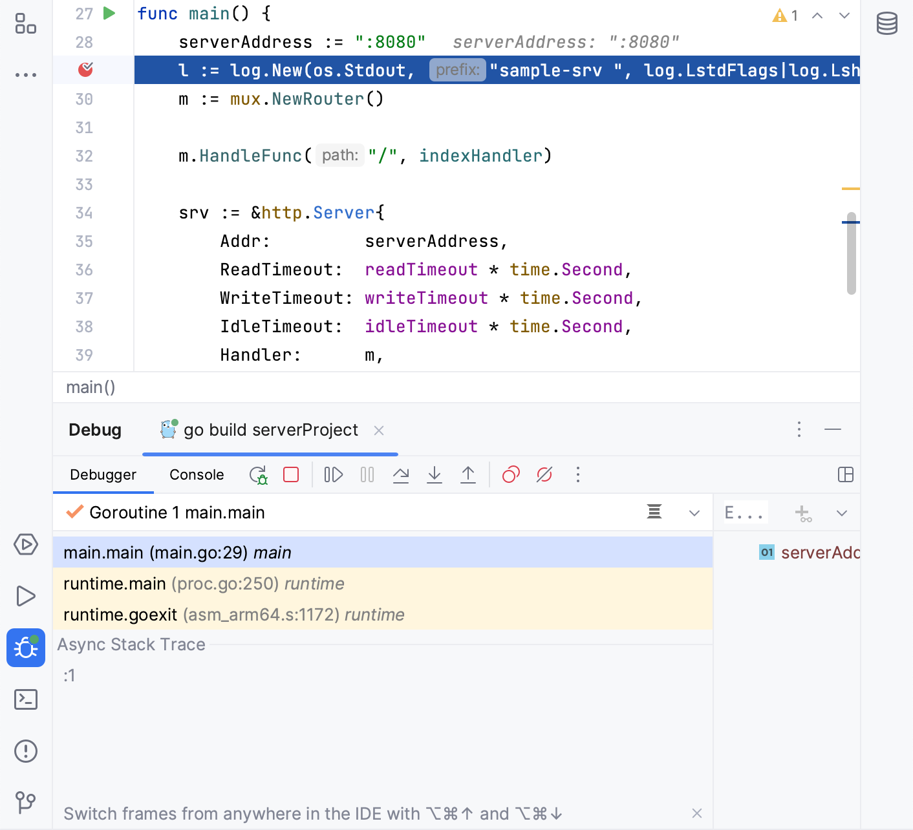

