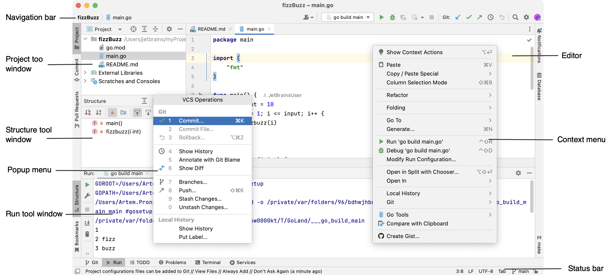
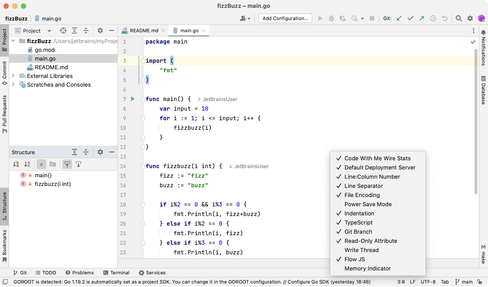
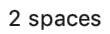
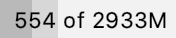

+++
title = "用户界面"
weight = 20
date = 2023-06-14T17:20:58+08:00
type = "docs"
description = ""
isCJKLanguage = true
draft = false

+++
# User interface - 用户界面

https://www.jetbrains.com/help/go/guided-tour-around-the-user-interface.html

Last modified: 06 March 2023

最后修改日期：2023年3月6日

​	当你在GoLand中打开一个项目时，默认的用户界面如下所示：

​	根据所设置的[插件](https://www.jetbrains.com/help/go/managing-plugins.html)和配置设置，你的IDE可能会有不同的外观和行为。

## 编辑器

焦点：Escape

​	使用[编辑器](https://www.jetbrains.com/help/go/using-code-editor.html)来阅读、编写和探索源代码。

## 操作指示器和操作列表

打开操作列表：Alt+Enter

​	出现在沟槽上的各种图标（例如，

）可以帮助你注意到快速修复和其他操作。单击操作指示器或按下Alt+Enter键会打开一个包含所有快速修复和其他操作的操作列表，这些操作可在当前插入符位置使用。

## 导航栏 Navigation bar

焦点：Alt+Home

显示/隐藏：View | Appearance | Navigation Bar

​	顶部的导航栏是一个快速的替代品，用于导航你的项目的结构并打开文件进行编辑，它与项目视图类似。

> ​	如果启用了[VCS集成](https://www.jetbrains.com/help/go/version-control-integration.html)，导航栏中的项目将根据[VCS文件状态颜色](https://www.jetbrains.com/help/go/file-status-highlights.html)进行高亮显示。

​	使用导航栏右侧的按钮来构建，运行 和[调试](https://www.jetbrains.com/help/go/debugging-code.html)

你的应用程序，并执行基本的版本控制操作（如果已配置了[版本控制集成](https://www.jetbrains.com/help/go/version-control-integration.html)）。

> ​	默认情况下，主工具栏上的按钮用于打开和保存文件、撤消和重做操作是隐藏的。若要显示它，选择View | Appearance | Toolbar。

## 状态栏

显示/隐藏：View | Appearance | Status Bar

​	主窗口底部状态栏的左侧显示最近的事件消息和操作的描述，当鼠标指针悬停在其上时。在状态栏中点击消息可以在通知工具窗口中打开它。右键单击状态栏中的消息，选择复制以将消息文本复制到搜索问题解决方案、添加到支持票据或GoLand问题跟踪器中。

​	使用快速访问按钮 或

在[工具窗口](https://www.jetbrains.com/help/go/guided-tour-around-the-user-interface.html#tool-windows)之间切换，并[显示/隐藏工具窗口栏](https://www.jetbrains.com/help/go/tool-windows.html#show_hide_tool_window_bars)。

​	状态栏还显示后台任务的进度。你可以点击 来显示后台任务管理器。

​	状态栏的右侧包含指示整体项目和IDE状态的小部件，并提供对各种设置的访问。根据所设置的[插件](https://www.jetbrains.com/help/go/managing-plugins.html)和配置设置，小部件的集合可能会有所改变。右键单击状态栏选择你要显示或隐藏的小部件。

| 小部件                                                       | 描述                                                         |
| ------------------------------------------------------------ | ------------------------------------------------------------ |
| 17:8                                                         | 显示编辑器中当前插入符位置的行号和列号。单击数字可以将插入符移到特定的行和列。如果在编辑器中选择了代码片段，GoLand还会显示所选片段中的字符数和换行数。 |
| LF                                                           | 显示当前文件中用于换行的[行尾](https://www.jetbrains.com/help/go/configuring-line-endings-and-line-separators.html)符号。单击此小部件可以更改行分隔符。 |
|           | 显示用于查看当前文件的[编码方式](https://www.jetbrains.com/help/go/encoding.html)。单击小部件可以使用其他编码方式。 |
| Column                                                       | 指示当前编辑器选项卡启用了[列选择模式](https://www.jetbrains.com/help/go/multicursor.html#column_selection)。你可以按下Alt+Shift+Insert来切换它。 |
|   | 单击以锁定文件以防止编辑（设置为只读），或解锁以编辑文件。   |
|  main | 如果启用了[版本控制集成](https://www.jetbrains.com/help/go/version-control-integration.html)，此小部件显示当前的VCS分支。单击它可以[管理VCS分支](https://www.jetbrains.com/help/go/manage-branches.html)。 |
|  | 显示当前文件中使用的[缩进样式](https://www.jetbrains.com/help/go/working-with-source-code.html#tabs_indents)。单击以配置当前文件类型的制表符和缩进设置，或禁用当前项目中的缩进检测。 |
|  | 显示GoLand占用的内存量占总堆内存的比例。有关更多信息，请参阅[增加IDE的内存堆大小](https://www.jetbrains.com/help/go/increasing-memory-heap.html)。 |

## 工具窗口

显示/隐藏：View | Tool Windows

​	[工具窗口](https://www.jetbrains.com/help/go/tool-windows.html)提供了增强代码编辑的功能。例如，[项目工具窗口](https://www.jetbrains.com/help/go/project-tool-window.html)显示项目的结构，而[运行](https://www.jetbrains.com/help/go/run-tool-window.html)工具窗口在运行应用程序时显示应用程序的输出。

​	默认情况下，工具窗口停靠在主窗口的侧边和底部。你可以根据需要[进行排列](https://www.jetbrains.com/help/go/manipulating-the-tool-windows.html)，取消停靠，调整大小，隐藏等操作。右键单击工具窗口的标题或单击标题中的 以获得排列选项。

​	你可以为经常使用的工具窗口[分配快捷键](https://www.jetbrains.com/help/go/configuring-keyboard-and-mouse-shortcuts.html)以快速访问它们。其中一些工具窗口默认带有快捷键。例如，要打开[项目工具窗口](https://www.jetbrains.com/help/go/project-tool-window.html)，按下Alt+1，要打开[服务](https://www.jetbrains.com/help/go/services-tool-window.html)工具窗口，按下Alt+8。要从编辑器跳转到最后活动的工具窗口，按F12键。

## 上下文菜单

​	你可以右键单击界面的各种元素以查看当前上下文中可用的操作。例如，在[项目工具窗口](https://www.jetbrains.com/help/go/project-tool-window.html)中右键单击文件以查看与该文件相关的操作，或者在编辑器中右键单击以查看适用于当前代码片段的操作。

Most of these actions can also be performed from the main menu at the top of the screen or the main window. Actions with shortcuts show the shortcut next to the action name.

​	大多数这些操作也可以从屏幕顶部的主菜单或主窗口执行。具有快捷键的操作在操作名称旁边显示快捷键。

## 弹出菜单

​	弹出菜单提供了与当前上下文相关的快速访问操作。以下是一些有用的弹出菜单及其快捷方式： 

- Alt+Insert打开“Generate”弹出菜单，用于根据上下文生成样板代码。
- Ctrl+Alt+Shift+T打开“Refactor This”弹出菜单，其中列出了上下文中可用的[重构](https://www.jetbrains.com/help/go/refactoring-source-code.html)。
- 在[项目工具窗口](https://www.jetbrains.com/help/go/project-tool-window.html)中按Alt+Insert打开“New”弹出菜单，用于向项目添加新文件和目录。
- Alt+`打开“VCS Operations”弹出菜单，其中列出了与你的[版本控制系统](https://www.jetbrains.com/help/go/version-control-integration.html)相关的可用操作。

​	你可以使用[快速列表](https://www.jetbrains.com/help/go/customize-actions-menus-and-toolbars.html#configure_quick_lists)创建自定义弹出菜单，其中包含你经常使用的操作。

## 主窗口

​	主窗口允许你使用一个GoLand项目。你可以在多个窗口中打开多个项目。默认情况下，窗口标题栏显示项目的名称和当前打开文件的名称。

​	要显示项目和当前文件的完整路径，请在Appearance & Behavior | Appearance页面的IDE设置 Ctrl+Alt+S 中选择始终在窗口标题栏中显示完整路径。