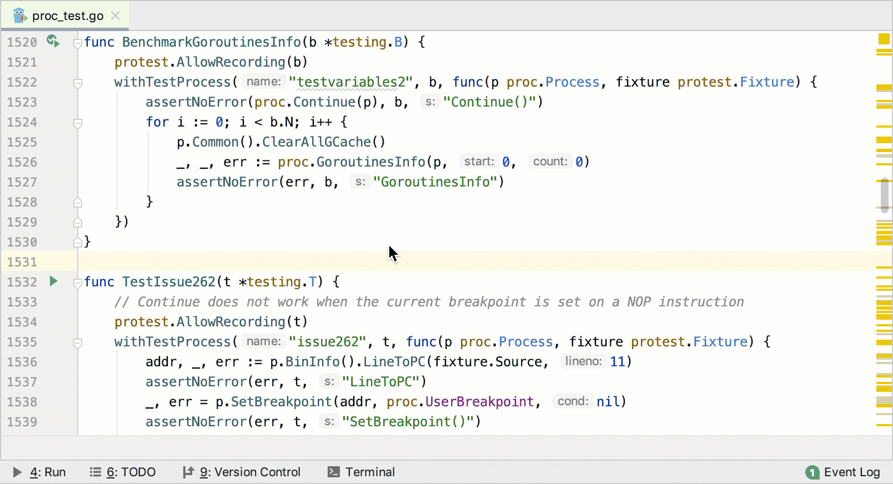
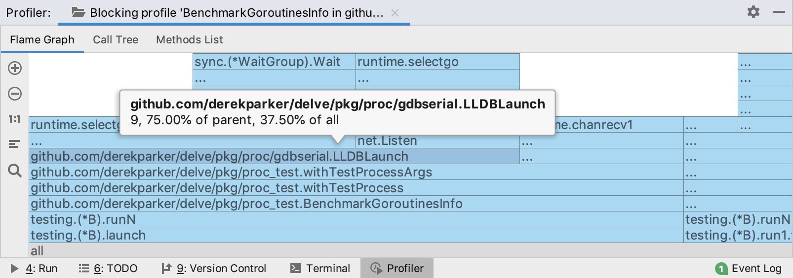
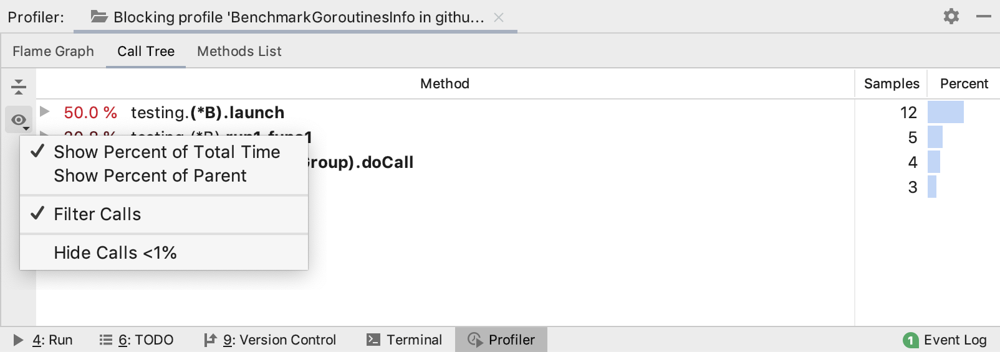

+++
title = "阻塞性能分析器"
weight = 30
date = 2023-06-21T13:50:58+08:00
type = "docs"
description = ""
isCJKLanguage = true
draft = false
+++
# Blocking profiler 阻塞性能分析器

https://www.jetbrains.com/help/go/blocking-profiler.html

Last modified: 16 January 2023

最近修改日期：2023年1月16日

​	您只能针对 Go 测试和基准测试运行阻塞性能分析器。

​	阻塞性能分析器显示了 Goroutine 未运行（等待）的时间段。如果您需要查找无缓冲或满通道、`sync.Mutex` 锁或其他瓶颈问题，阻塞性能分析器可能会很有用。

## 运行阻塞性能分析 

1. 打开 **_test.go** 文件。
3. 在您想要进行性能分析的函数或方法附近，单击代码沟槽区域的运行应用程序图标 ，然后选择Run <configuration_name> with 'Blocking Profiler'。

## 解读结果

### 火焰图

The Flame Graph tab shows you function calls and the amount of time in which goroutines are not running (waiting). Each block represents a function in the stack. On the Y-axis, there is a stack depth going from bottom up. The X-axis shows the stack profile sorted in the increasing order according to the number of delays for each function (with Contentions selected) or according to the time that was spent in the waiting state (with Delay selected).

​	火焰图选项卡显示了函数调用和 Goroutine 未运行（等待）的时间。每个方块代表堆栈中的一个函数。在 Y 轴上，从底部到顶部是栈深度。X 轴显示了根据每个函数的延迟次数（选择 Contentions）或等待状态下花费的时间（选择 Delay）按递增顺序排序的栈剖面（stack profile）。

​	在火焰图选项卡上，您可以将鼠标悬停在任何方块上以查看详细信息。

其中， 

- `9`：每个区域的延迟次数。
- `75.00% of parent`：属于单个父调用的不同过程之间的百分比。
- `37.50% of all`：该过程及其所有被调用者的延迟百分比。

### 调用树

​	调用树选项卡显示了每个函数的延迟次数（选择 Contentions）或等待状态下花费的时间（选择 Delay）的调用树。它按照递减顺序组织数据。要配置和过滤调用树视图，请使用 Presentation Settings 按钮 。

### 方法列表

​	方法列表选项卡显示按内容争用次数排序的方法列表。回溯选项卡显示了选择的方法被调用的位置。合并的被调方选项卡显示了从选择的方法开始的调用跟踪。
