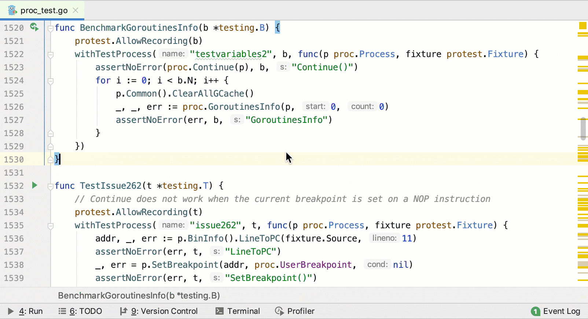
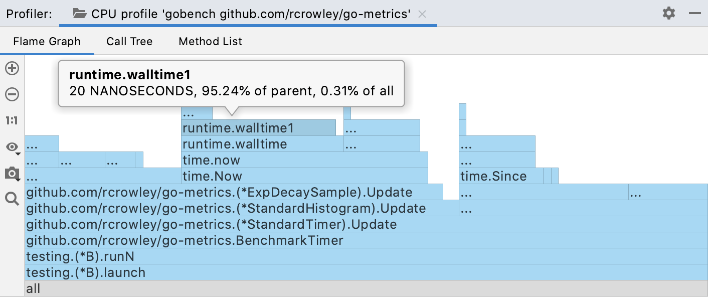
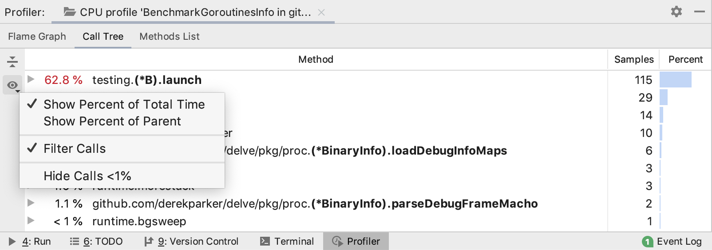
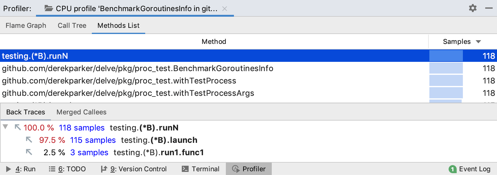

+++
title = "CPU 分析器"
weight = 10
date = 2023-06-21T13:50:58+08:00
type = "docs"
description = ""
isCJKLanguage = true
draft = false

+++
# CPU profiler - CPU 分析器

https://www.jetbrains.com/help/go/cpu-profiler.html

Last modified: 01 March 2023

最近修改日期：2023年3月1日

​	您只能针对 Go 测试和基准测试运行 CPU 分析器。

​	CPU 分析器显示了哪些函数占用了 CPU 时间的百分比。这些信息可以帮助您更好地理解应用程序的执行方式以及资源的分配情况。

​	分析完成后，分析器将以报告的形式可视化输出数据。

### 分析器配置 Profiler configuration

​	GoLand 提供了两个预定义的 Async Profiler 配置：CPU 分析器和内存分配分析器，您可以在Settings | Build, Execution, Deployment | Java Profiler中找到。

​	这些配置已经经过调整以提供最准确的结果，因此它们不需要进行任何修改。然而，如果您仍然需要更改设置，请参考 [GitHub 上的 Async Profiler](https://github.com/jvm-profiling-tools/async-profiler) 获取更多信息。

### 选择分析器配置 Select the profiler configuration

1. 在Settings 对话框（Ctrl+Alt+S）中，选择Build, Execution, Deployment | Go Profiler。
3. 选择一个预定义的 CPU 或内存分析配置，或者通过点击 创建一个新配置。
4. 应用更改并关闭对话框。

## 运行分析 Run profiling

### 运行 CPU 分析

1. 打开 **_test.go** 文件。
3. 在您想要进行分析的函数或方法附近，单击代码沟槽区域的运行应用程序图标 ，然后选择Run <configuration_name> with 'CPU Profiler'。

## 阅读分析报告

​	在分析器工具窗口中，收集的数据在三个选项卡上显示：Flame Graph、Call Tree 和 Method List。左侧列出了应用程序的线程；通过单击每个线程，可以查看更详细的信息。

### 火焰图

​	火焰图选项卡显示了函数调用以及每个调用的执行时间百分比。每个方块代表堆栈中的一个函数（一个堆栈帧）。在 Y 轴上，从底部到顶部是堆栈深度。X 轴上的堆栈剖面按照最耗费 CPU 时间的函数到最少耗费的函数排序。

​	在阅读火焰图时，重点关注最宽的方块。这些方块代表在分析中出现最频繁的函数。

​	将鼠标悬停在任何方块上可以查看详细信息：

> ​	有关火焰图的更多信息，请参见 [Flame Graphs](http://www.brendangregg.com/flamegraphs.html)。

### 调用树

​	调用树选项卡显示了在分析期间采样的程序调用栈的信息： 

- 方法名称
- 总采样时间的百分比（可以切换到父调用视图）
- 总采样计数
- 过滤后的调用次数

​	百分比后面的可选数字表示经过过滤的调用序列。单击它可以展开此序列。过滤规则可以在设置中配置。

​	要配置和过滤调用树视图，请使用演示设置按钮 ()。

### 方法列表

​	方法列表收集了分析数据中的所有方法，并按累计采样时间排序。列表中的每个项目都有一个回溯树和一个合并调用者树。

​	回溯选项卡显示了调用者的层次结构。使用此视图跟踪调用了选定方法的方法。合并调用者树尝试总结由选定方法调用的所有方法。

