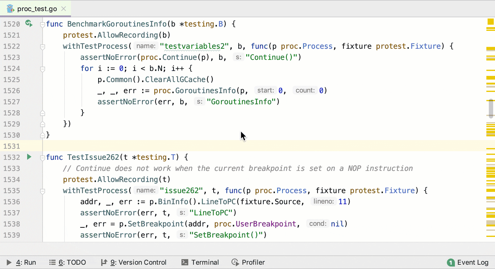
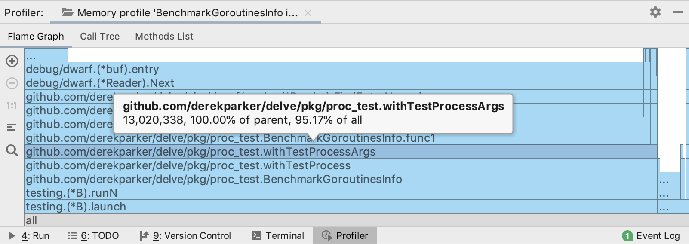
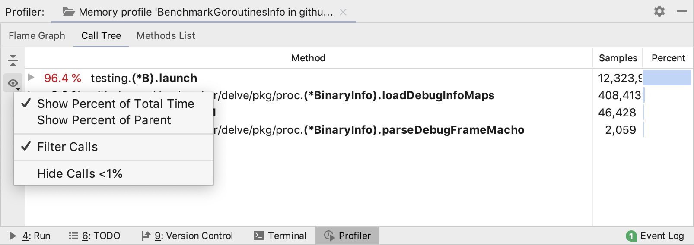

+++
title = "内存分析器"
weight = 20
date = 2023-06-21T13:50:58+08:00
type = "docs"
description = ""
isCJKLanguage = true
draft = false

+++
# Memory profiler 内存分析器

https://www.jetbrains.com/help/go/memory-profiler.html

Last modified: 16 January 2023

最近修改日期：2023年1月16日

​	您只能针对 Go 测试和基准测试运行内存分析器。

​	内存分析器显示哪些函数分配了堆内存。这些统计信息可以帮助您找到内存泄漏并优化整体内存使用情况。

## 运行内存分析 

1. 打开 **_test.go** 文件。
3. 在您想要进行分析的函数或方法附近，单击代码沟槽区域的运行应用程序图标 ，然后选择Run <configuration_name> with 'Memory Profiler'。

## 解读结果

### 火焰图

​	火焰图选项卡显示了函数调用以及每次调用分配的内存量。每个方块代表栈中的一个函数。在 Y 轴上，从底部到顶部是栈深度。X 轴上的栈剖面按照最耗费内存的函数（空间和对象数量）到最少耗费的函数排序。

​	在阅读火焰图时，请注意大对象会影响内存消耗和垃圾回收时间，而大量小的分配会影响执行速度。研究这两种情况可能会有所帮助。

​	在火焰图选项卡上，您可以将鼠标悬停在任何方块上以查看详细信息。

其中： 

- 13,020,338：直接内存使用量（以字节为单位）。
- 100.00% of parent：属于单个父调用的不同过程之间的百分比。
- 95.17% of all：该过程及其所有被调用者的内存使用百分比。

### 调用树 Call Tree

​	调用树选项卡显示了每个过程在总内存使用中所占的百分比的调用树。它按照数据组织方式展示应用程序在哪些地方使用了大部分内存或更多的内存对象。要配置和过滤调用树视图，请使用演示设置按钮 ()。

### 方法列表

​	方法列表选项卡显示按分配对象数量排序的方法列表。回溯选项卡显示了调用选定方法的层次结构。合并调用者选项卡显示了从选定方法开始的调用跟踪。
