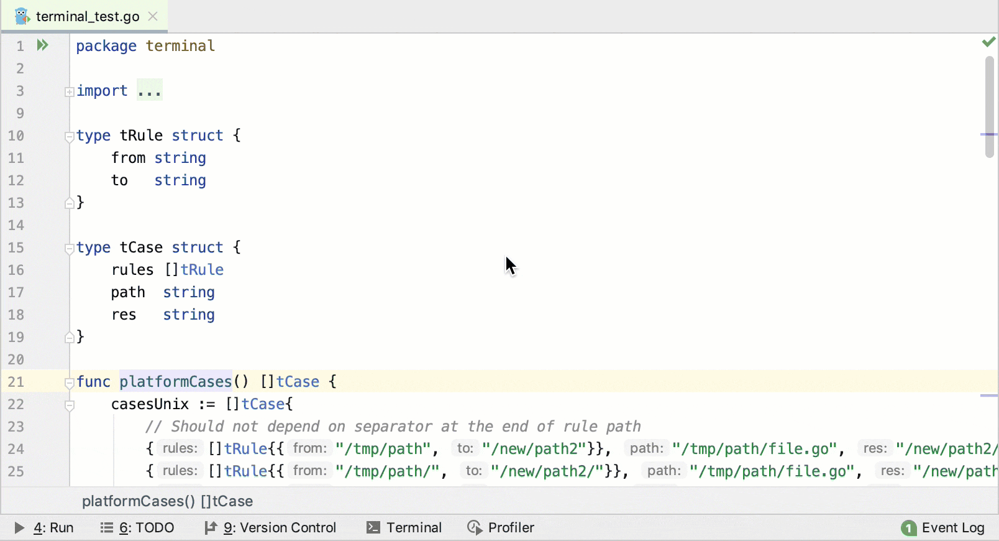
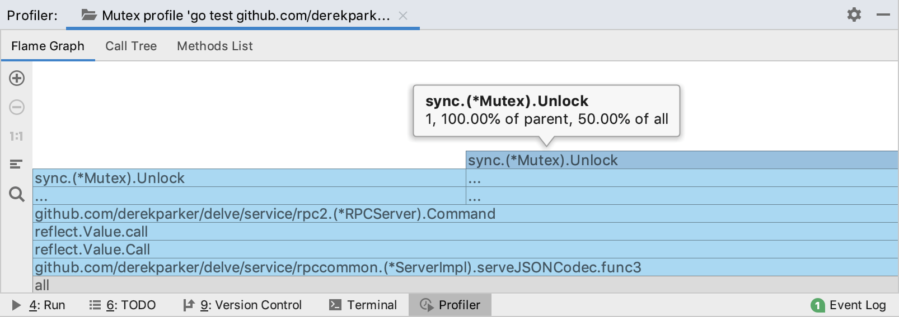
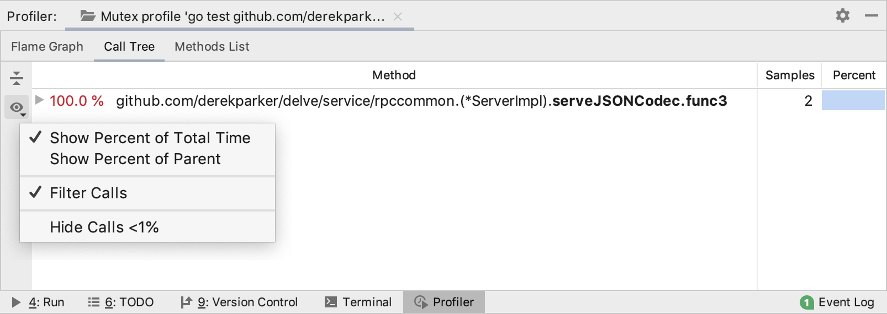

+++
title = "互斥锁分析器"
weight = 40
date = 2023-06-21T13:50:58+08:00
type = "docs"
description = ""
isCJKLanguage = true
draft = false

+++
# Mutex profiler 互斥锁分析器

https://www.jetbrains.com/help/go/mutex-profiler.html

Last modified: 16 January 2023

最近修改日期：2023年1月16日

​	您只能针对 Go 测试和基准测试运行互斥锁分析器。

​	互斥锁分析器显示了使用有竞争的互斥锁的 Goroutine 的部分栈跟踪。

## 运行互斥锁分析

1. 打开 **_test.go** 文件。
3. 在您想要进行分析的函数或方法附近，单击代码沟槽区域的运行应用程序图标 ，然后选择Run <configuration_name> with 'Mutex Profiler'。

## 解读结果

### 火焰图

​	火焰图选项卡显示了函数调用以及 Goroutine 在未运行（等待）状态下的时间量。每个方块代表栈中的一个函数。在 Y 轴上，从底部到顶部是栈深度。X 轴上的堆栈剖面按照每个函数的延迟次数（选择 Contentions）或在等待状态下花费的时间（选择 Delay）的递增顺序进行排序。

​	在火焰图选项卡上，您可以将鼠标悬停在任何方块上以查看详细信息。

其中：

- `1`：每个区域的延迟次数。
- `100.00% of parent`：属于单个父调用的不同过程之间的百分比。
- `50.00% of all`：该过程及其所有被调用者的延迟时间百分比。

### 调用树

​	调用树选项卡显示了每个函数的延迟次数（选择 Contentions）或在等待状态下花费的时间（选择 Delay）。它按照递减顺序组织数据。要配置和过滤调用树视图，请使用演示设置按钮 ()。

### 方法列表

​	方法列表选项卡显示按争用次数排序的方法列表。回溯选项卡显示了调用选定方法的层次结构。合并调用者选项卡显示了从选定方法开始的调用跟踪。

