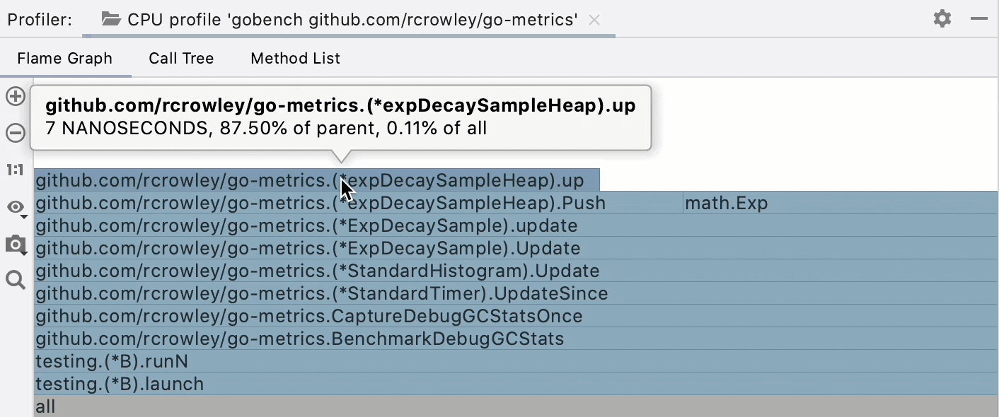
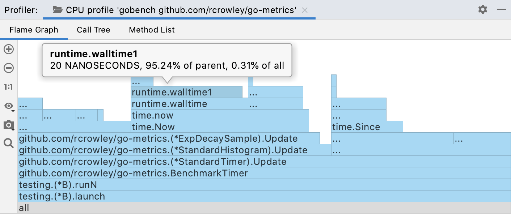
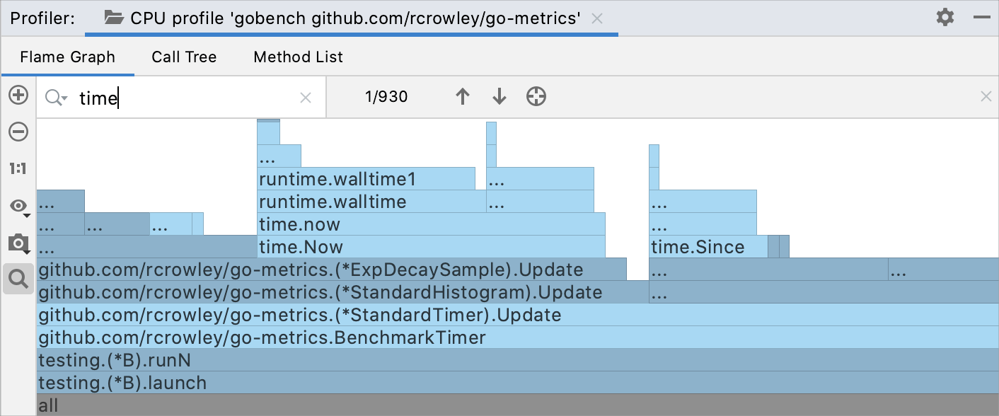
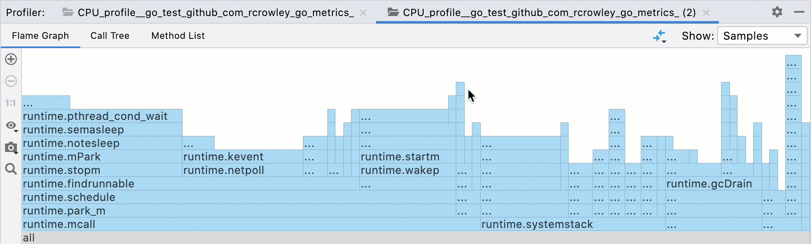
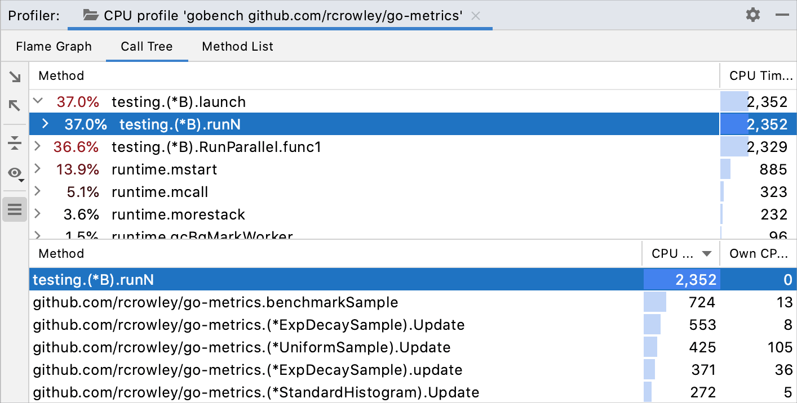
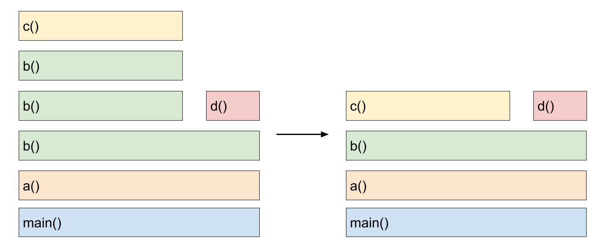
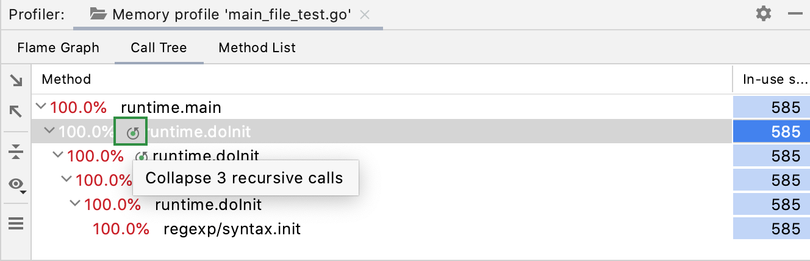
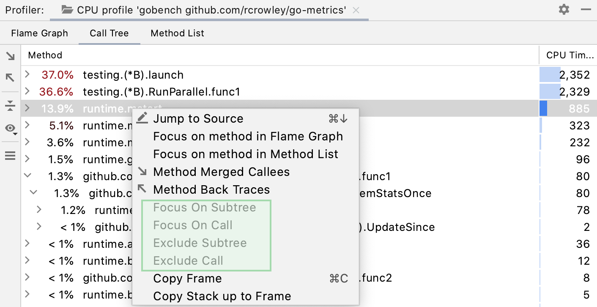
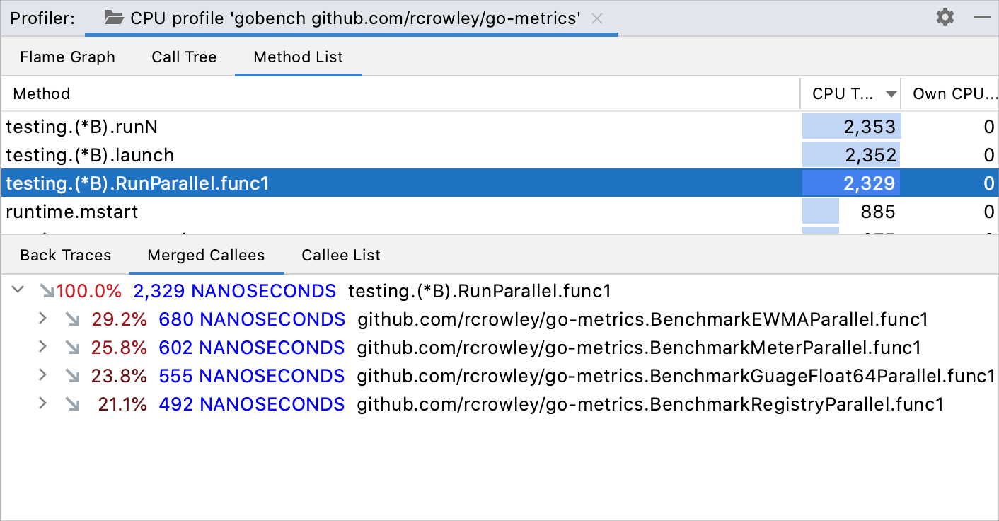

+++
title = "阅读性能分析快照"
weight = 50
date = 2023-06-21T13:50:58+08:00
type = "docs"
description = ""
isCJKLanguage = true
draft = false

+++
# Read the profiler snapshot - 阅读性能分析快照

https://www.jetbrains.com/help/go/read-the-profiling-report.html

Last modified: 27 March 2023

上次修改日期：2023年3月27日

​	在性能分析器工具窗口中，收集的数据以多个选项卡的形式呈现：火焰图、调用树和方法列表。

## 导航快照

​	您可以在保持对特定方法集中关注的同时在选项卡之间切换。右键单击所需的方法，并选择要在其中打开的其他视图。

​	对于任何选项卡上的方法，您可以打开[Merged Callees](https://www.jetbrains.com/help/go/read-the-profiling-report.html#callees)和[Back Traces](https://www.jetbrains.com/help/go/read-the-profiling-report.html#backtraces)树。右键单击方法，分别选择Method Merged Callees或Method Back Traces 。

​	如果您想要在编辑器中查看源代码，请在任何选项卡上右键单击它，并选择Jump to Source或按下F4。这将带您到声明此方法的位置。

## 火焰图

​	火焰图以矩形表示调用树的应用程序，并按宽度排序。消耗更多资源的方法比其他方法更宽。

> ​	原生性能分析默认处于关闭状态。要启用它，转到Settings | Build, Execution, Deployment | Java Profiler ，并选中Collect native calls选项。

​	阅读火焰图时，重点关注最宽的块。这些块是在分析中出现最多的方法。您可以从底部开始并向上移动，从父方法到子方法的代码流程。如果您喜欢从顶部到底部检查火焰图，请使用Show Icicle Graph按钮 更改图形视图。

### 获取调用详细信息

- 将鼠标悬停在块上以查看工具提示。

  工具提示显示完整的限定方法名、父样本时间百分比和总样本时间百分比。

### 缩放图形 Zoom the graph

- 使用放大按钮 和缩小按钮 ，或使用滚轮来缩放图形。
- 要专注于特定方法，请双击图形上对应的块。
- 要恢复图形的原始大小，请点击1:1。

### 搜索图形 Search the graph

- If you want to locate a specific method on the graph, start typing its name or click 如果您想要在图形上找到特定方法，请开始键入其名称或单击搜索工具栏，然后在搜索栏中输入名称。

  The graph highlights all blocks with method names matching your search request.

  图形将突出显示与搜索请求匹配的所有块。
  
  使用和 快速导航到搜索结果之间。您还可以在整个图形中搜索或仅在特定子树中搜索。

### 捕获图形 Capture the graph

You can capture and export the graph separately from other data in the snapshot.

​	您可以单独捕获和导出图形，与快照中的其他数据分开。 

- 单击 ，然后选择Copy to Clipboard或单击Save to export the graph as an image in the **.png** format。

> ​	有关火焰图的更多信息，请参阅[火焰图](http://www.brendangregg.com/flamegraphs.html)。

​	您可以在火焰图上可视化两个快照之间的差异。

### 与基准进行比较 Compare with a baseline

1. 打开两个快照。要打开快照，您可以运行性能分析器两次，或者转到Run | Open Profiler Snapshot，然后在此处选择快照。

2. 单击Compare With Baseline按钮，并选择要比较的快照。

   将打开一个单独的差异选项卡，显示比较结果，将两个火焰图合并在一起，并以红色和绿色显示差异。

   如果您看到帧的某个部分是绿色的，这意味着在此性能分析运行期间，对应的方法变得更快。红色表示对应的方法变慢。

   

## 调用树

​	调用树选项卡将采样数据组织成树状结构。

​	对于每个方法，选项卡显示以下信息：

- 方法名称
- 相对于总样本数或父样本数的百分比
- 总样本计数
- [递归调用](https://www.jetbrains.com/help/go/read-the-profiling-report.html#recursive-calls)

​	默认情况下，百分比是相对于总样本数。您可以选择将百分比相对于父帧进行查看。

### 在总时间和父时间之间切换百分比

 

- 单击，然后选择“显示总时间百分比”或“显示父时间百分比”。

### 折叠递归调用

A stack that involves recursion may be very difficult to analyze. In a regular Call Tree view, recursive calls are displayed as they are called – one after another, which may lead to almost infinite stack scrolling.

​	涉及递归的堆栈可能很难分析。在常规的调用树视图中，递归调用按顺序显示为一个接一个的调用，这可能导致几乎无限的堆栈滚动。

​	当在调用栈中更高层次上调用了相同的方法时，GoLand会检测到递归。在这种情况下，子树会从调用树中取出，然后重新附加到该方法的第一个调用上。通过这种方式，您可以绕过递归，专注于消耗大部分资源和所做的调用的方法。

​	折叠递归调用可以让您看到在没有递归的情况下在这些调用中花费的总时间。

​	在调用树选项卡上，折叠的递归调用标有递归图标。单击该图标可在单独的选项卡中打开递归调用树。您可以通过工具提示预览合并调用的数量。

### 假设：专注于特定方法

​	GoLand允许您在调用树中检查特定方法：您可以排除特定方法，或者反过来，仅关注您当前感兴趣的方法。

​	右键单击调用树选项卡上的必要方法，然后选择以下选项之一以在专用选项卡中打开结果：

- 专注于子树：仅显示所选方法的调用。父方法样本计数仅显示在所选子树中花费的时间。
- 专注于调用：显示所选方法和调用它的方法。启用此选项后，每个帧仅显示在所选方法中花费的时间。
- 排除子树：忽略所选方法的调用。
- 排除调用：忽略对所选方法的所有调用。

## 方法列表

​	方法列表收集配置文件数据中的所有方法，并按累积样本时间进行排序。列表中的每个项都有几个视图：

- 回溯显示调用者的层次结构。使用此视图跟踪调用所选方法的方法。
- 合并的被调用者总结了由所选方法调用的所有方法。
- 被调用者列表显示从所选方法调用的所有方法。

