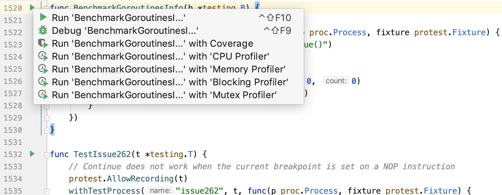
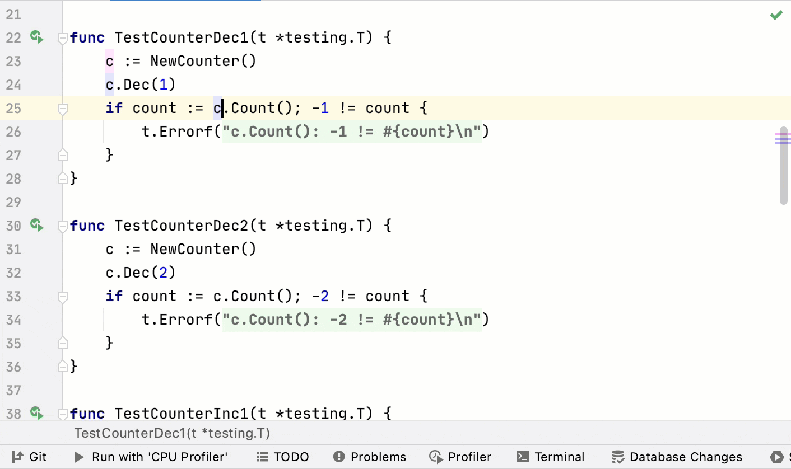

+++
title = "性能测试"
linkTitle = "性能测试"
date = 2023-06-21T13:50:58+08:00
type = "docs"
description = ""
isCJKLanguage = true
draft = false
[menu.main]
  weight = 13
+++
# Profiling for tests 测试的性能分析

https://www.jetbrains.com/help/go/profiling-tests-and-benchmarks.html

Last modified: 16 January 2023

最近修改日期：2023年1月16日

​	性能分析是对程序性能的分析。在性能分析过程中，您可以查看CPU和内存的使用情况，函数和方法调用的频率和持续时间。这些信息对于优化程序性能非常有帮助。

​	GoLand 可以收集和可视化 Go 测试和基准测试的 CPU 分析、跟踪和堆分析。为了收集所有必要的数据，GoLand 使用了 pprof 包。GoLand 包括四个性能分析器，您可以从用户界面中运行：CPU、内存、阻塞（争用）和互斥。

### 运行性能分析

- 所有性能分析器的运行过程是相同的。

  在您想要进行性能分析的函数或方法附近，单击代码沟槽区域的运行应用程序图标 ，然后选择使用 '<profiler_name> Profiler' 运行 <configuration_name>。

  

### 导入性能分析结果

- 您可以手动运行性能分析器代码，导入结果并在 GoLand 中显示它们。

  轻松按两次 Shift 键，输入Open Profiler Snapshot，然后按 Enter 键来导入性能分析结果。从列表中选择结果，或选择Open Profiler Snapshot来上传来自硬盘的结果。

  
