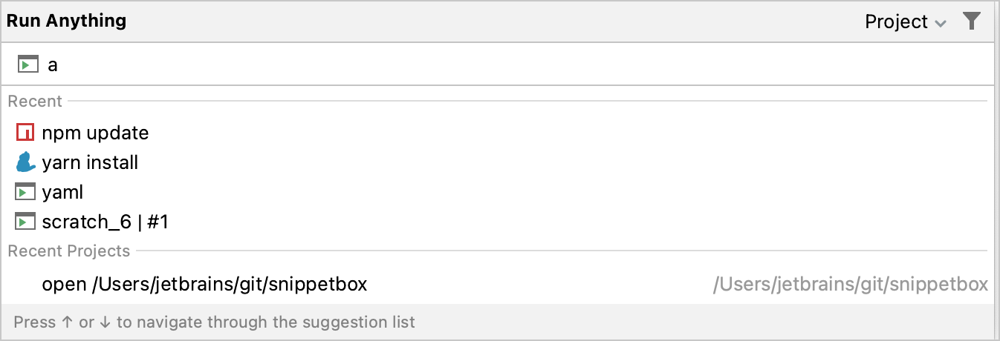
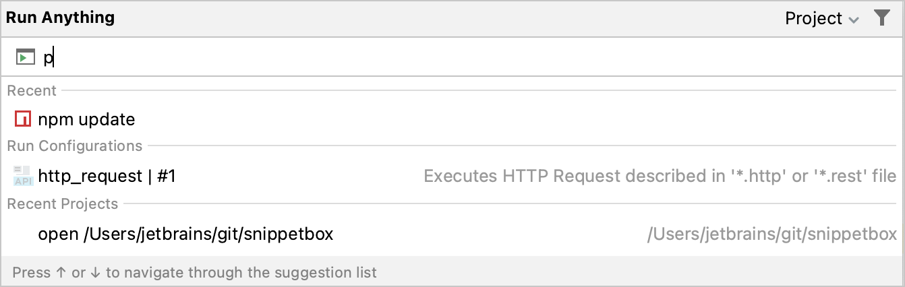
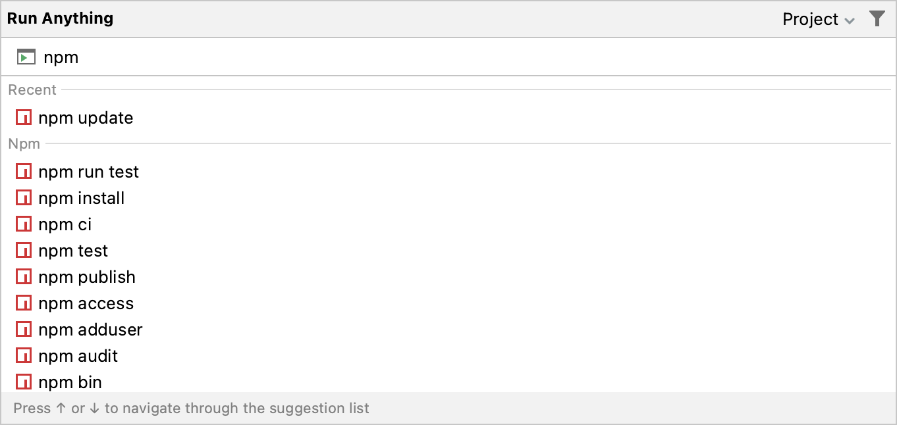
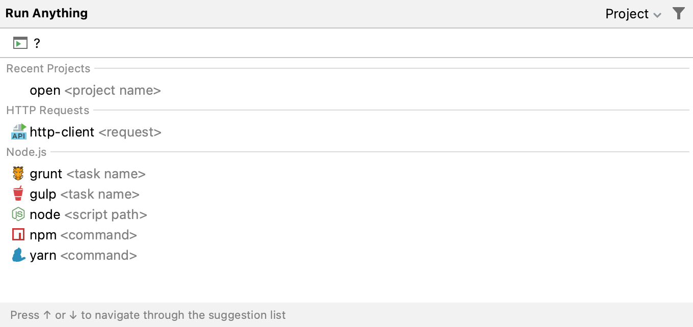
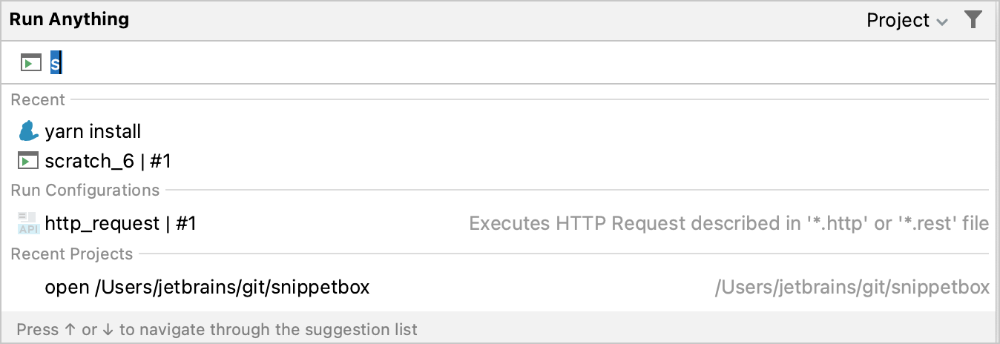
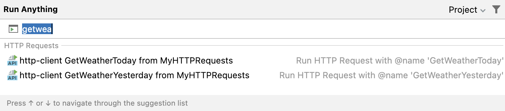
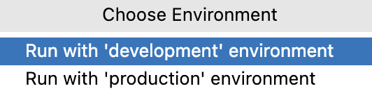

+++
title = "运行任何内容"
weight = 20
date = 2023-06-19T11:20:58+08:00
type = "docs"
description = ""
isCJKLanguage = true
draft = false

+++
# Run anything - 运行任何内容

https://www.jetbrains.com/help/go/running-anything.html

Last modified: 09 November 2022

上次修改日期：2022年11月9日

Double Ctrl

​	Run Anything是一种快速启动运行/调试配置、应用程序、脚本、命令、任务以及打开最近项目的方式。它还通过在输入时生成建议来帮助您使用正确的命令语法。当您调用一个命令时，Run Anything会将进一步的工作委托给相应的工具。

## 打开 Run Anything 弹出窗口

- 按两次 Ctrl 键。

  或者，单击工具栏上的。

  > ​	若要禁用此操作的双 Ctrl 键映射，请在IDE设置的高级设置页面中选择"禁用双修饰键快捷键"（Ctrl+Alt+S）。

  ​	该图标默认是隐藏的。要将该图标添加到工具栏中，打开设置对话框（Ctrl+Alt+S），转到外观和行为 | 菜单和工具栏，展开"主工具栏"节点，添加Run Anything操作，例如在"全局搜索"下方。有关详细信息，请参见[菜单和工具栏](https://www.jetbrains.com/help/go/customize-actions-menus-and-toolbars.html)。

## 启动运行/调试配置

1. 开始输入运行/调试配置的名称，并从建议列表中选择它。

   

3. 若要对运行配置进行[调试](https://www.jetbrains.com/help/go/debugging-code.html)，在启动时按住 Shift 键。

## 运行命令 

- 开始输入命令名称，并使用箭头键浏览建议列表。按下空格键时，您接受当前建议，并获得与该命令特定的进一步建议。

  

- 要获取可用命令的列表，请键入 `?`。命令列表取决于已安装/启用的插件。如果一个命令不在建议列表中，它将在终端中执行。

  

## 打开最近项目

​	您还可以从 Run Anything 弹出窗口快速重新打开[最近的项目](https://www.jetbrains.com/help/go/creating-and-managing-projects.html)。通过名称搜索项目，或者输入 `open` 来缩小建议列表的范围，然后从列表中选择所需的项目，按 Enter 键即可：

## 发送 HTTP 请求

如果在[编写 HTTP 请求](https://www.jetbrains.com/help/go/http-client-in-product-code-editor.html)时指定了其名称，您可以从 Run Anything 弹出窗口中找到并发送该 HTTP 请求。

1. 开始输入一个 HTTP 请求的名称，并从建议列表中选择它：

   

2. 如果您的请求包含[环境变量](https://www.jetbrains.com/help/go/exploring-http-syntax.html#environment-variables)，在选择请求时按住 Shift 键。这将打开弹出菜单，在其中您可以选择用于该请求的环境。

   
