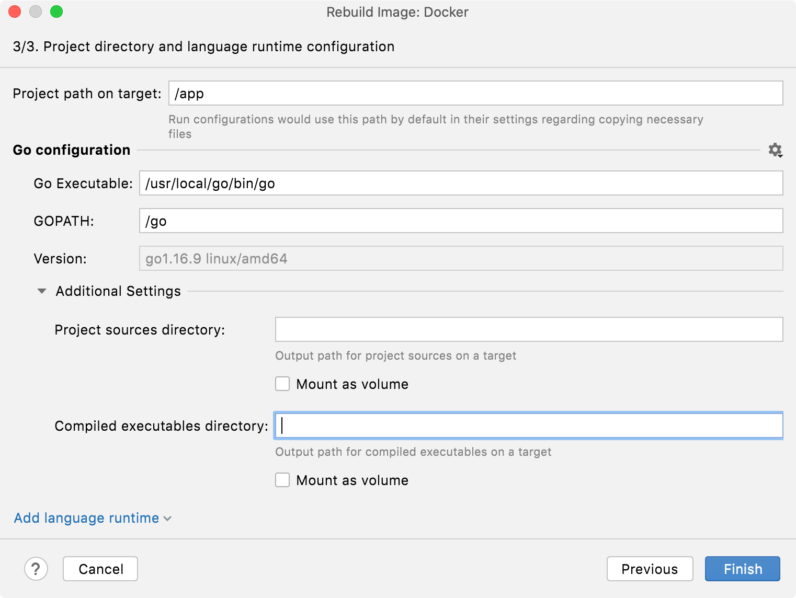

+++
title = "运行目标"
weight = 50
date = 2023-06-19T11:20:58+08:00
type = "docs"
description = ""
isCJKLanguage = true
draft = false

+++
# Run targets 运行目标

https://www.jetbrains.com/help/go/run-targets.html

Last modified: 03 April 2023

上次修改日期：2023年4月3日

​	您可以直接从GoLand中在另一个环境（如云端或Docker容器）中运行代码。

​	对于某些[运行/调试配置](https://www.jetbrains.com/help/go/run-debug-configuration.html)，您可以直接从GoLand中在另一个环境（如云端或[Docker](https://www.jetbrains.com/help/go/docker.html)容器）中运行代码。

​	这个功能允许您立即对变更进行测试，以确保应用程序在实际环境中运行时没有不兼容性。这在处理严重依赖于环境的代码时尤为重要。

​	直接在这样的环境中运行应用程序还可以省去部署和运行应用程序所需的额外操作，每次有变更时都要执行这些操作。

​	用于运行应用程序的环境称为目标。为了让GoLand在目标上运行代码，目标必须定义一种语言运行时，该运行时代表目标上可以被运行/调试配置用于运行代码的内容。

​	为了在目标上运行您的代码，您只需要在您通常用于本地运行的[运行/调试配置](https://www.jetbrains.com/help/go/run-debug-configuration.html)中定义目标执行环境。完成这一步后，将应用程序在目标上启动与在本地启动没有任何区别。

​	您可以在同一个目标上运行多个配置。还可以设置项目范围的默认运行目标。

### 设置项目的默认目标 

1. 点击Run | Manage Targets。

4. 从Project default target列表中选择要在项目中使用的目标。

   

## 支持的运行/调试配置类型

​	以下[运行/调试配置](https://www.jetbrains.com/help/go/run-debug-configuration.html)可以在远程目标上运行： 

- Go Build
- Go Test

## 创建运行/调试配置

1. 从主菜单中选择Run | Edit Configurations。或者，按下Alt+Shift+F10，然后按0。

3. 在[运行/调试配置](https://www.jetbrains.com/help/go/run-debug-configuration.html)对话框中，点击工具栏上的添加按钮，或者按下Alt+Insert。

4. 选择其中一种[支持的](https://www.jetbrains.com/help/go/run-targets.html#supported-rcs)运行/调试配置类型。

4. 如果您已经定义了目标，请从Run on菜单中选择它。否则，点击Manage targets…添加新的目标。有关配置特定目标类型的说明，请参考以下操作：

   - [SSH](https://www.jetbrains.com/help/go/run-targets.html#ssh)
   - [Docker](https://www.jetbrains.com/help/go/run-targets.html#docker)
   - [WSL](https://www.jetbrains.com/help/go/run-targets.html#wsl)

   

​	您还可以在运行/调试配置模板中配置运行目标，这样下次创建该类型的新配置时，其参数已经具有所需的值。更多信息，请参考[配置模板的默认值](https://www.jetbrains.com/help/go/run-debug-configuration.html#change-template)。

## 运行

​	在远程目标上运行应用程序的过程与在本地运行应用程序的过程相同： 

1. 在主工具栏上选择运行/调试配置。
3. 点击或按下Shift+F10。

​	GoLand构建构件，然后将其复制到目标上。然后，它使用指定的配置在目标上运行应用程序。

## 目标类型

​	目标描述了应用程序将运行的环境的配置。

​	创建远程目标时，GoLand会自动检测远程环境中可用的配置。如果需要，您可以手动配置其他配置。

### SSH

> ​	需要FTP/SFTP/WebDAV连接插件。

1. 选择是否要使用现有的SSH配置或创建新的配置：

   

   

   ​	从SSH列表中选择一个现有的SSH配置，然后点击下一步。有关如何配置SSH配置的说明，请参考[创建SSH配置](https://www.jetbrains.com/help/go/create-ssh-configurations.html)。

   

   

   1. 输入SSH服务器的IP地址、监听SSH连接的端口和服务器机器上的用户名称，您将代表该用户运行应用程序。然后点击“下一步”。

   2. 等待建立连接。如果存在具有凭据的代理程序，则不需要进行其他配置。否则，选择认证方法并提供所需的值：

      - 密码：输入密码。

      - 密钥对（OpenSSH或PuTTY）：要应用此认证方法，您必须在客户端机器上拥有私钥，在远程服务器上拥有公钥。GoLand支持使用OpenSSH工具生成的私钥。

        指定存储您的私钥的文件路径，并在相应字段中输入密语（如果有）。要让GoLand记住密语，请选中“保存密语”复选框。

      然后点击下一步。

      > See the [Generating a new SSH key and adding it to the ssh-agent](https://help.github.com/articles/generating-a-new-ssh-key-and-adding-it-to-the-ssh-agent/) tutorial for details on working with SSH keys.
      >
      > ​	有关使用SSH密钥的详细信息，请参阅生成新的SSH密钥并将其添加到ssh-agent教程。

   

   

   

2. 等待SSH服务器检查完成。在此步骤中，GoLand会尝试识别环境中可用的语言配置。点击下一步。

   

3. 配置以下属性：

   - 使用rsync（Use rsync）：切换此选项以使用[rsync](https://rsync.samba.org/)进行文件传输。这是推荐的，因为它通常可以加快文件复制的速度。
   - 目标上的项目路径（Project path on target）：服务器上用于存储项目文件的路径。

4. 添加语言配置设置。对于每个配置，请指定其版本和服务器上的路径。配置的设置将在选择此环境作为目标时显示在运行/调试配置的构建和运行部分。

   可用的配置设置如下：

   - Go Executable：Go可执行文件的路径（例如，**/usr/local/go/bin/go**）

   - GOPATH：定义工作空间根目录的路径。根目录必须包含**bin**、**pkg**和**src**子目录。（例如，**/home/goprojects**）

   - 版本：您的Go SDK版本号（例如，`go1.15.8 linux/amd64`）。GoLand通过运行`go version`自动检测此信息。

   - 附加设置：一组设置，允许您设置源代码文件和可执行文件的目录。

     要在目标上运行，GoLand需要上传以下实体：源代码文件、工作目录中的文件、编译的二进制文件和delve。如果您在附加设置中不指定路径，IDE将创建随机目录来存储上述文件。以下是用于源文件和可执行文件的随机生成目录的屏幕截图。

     

     您可以指定以下选项： 

     - 项目源目录（Project sources directory）：上传源代码文件的目标上的目录。
     - 编译的可执行文件目录（Compiled executables directory）：用于存储代码生成的可执行文件的目标上的目录。

   

### Docker

> ​	需要Docker插件。

1. 按照[启用Docker支持](https://www.jetbrains.com/help/go/docker.html#connect_to_docker)中的说明选择或配置Docker服务器。

3. 对于Windows和macOS，确保Docker可以访问工作流程中使用的所有文件夹，例如项目文件夹、**.maven**等。有关详细信息，请参考[官方Docker文档](https://docs.docker.com/desktop/)。

3. 选择是否要在本地构建镜像还是从Docker注册表中拉取镜像。

   

   

   - Dockerfile：用于构建镜像的Dockerfile。
   - 上下文文件夹（Context folder）：在构建期间Docker守护程序可以访问其内容的文件夹，以供稍后在镜像文件系统中使用。
   - 在运行代码之前自动重新构建镜像：当设置了此选项时，每次运行代码时都会重新构建镜像。否则，GoLand将使用已存在的镜像（如果有）。

   此外，您可以指定以下内容：

   - 镜像标签（Image tag）：为构建的镜像指定名称和标签。类似于使用`docker build`的`-t`选项。

   - 构建选项（Build options）：为`docker build`命令指定任意选项。

   - 构建参数（Build args）：[覆盖默认的构建时变量](https://docs.docker.com/engine/reference/commandline/build/#set-build-time-variables-build-arg)。类似于使用`docker build`的`--build-arg`选项。

   - 运行选项（Run options）：为`docker run`命令指定任意选项。

     > ​	并不是所有`docker run`选项都受支持。如果您希望请求对某些选项的支持，请在[IDEA-181088](https://youtrack.jetbrains.com/issue/IDEA-181088)中留下评论。

   

   

   

   - Image tag: specify the full coordinates for the image to be pulled from a registry. The default `:latest` tag will be used if only repository is specified.

   - 镜像标签（Image tag）：指定从注册表中拉取的镜像的完整坐标。如果仅指定仓库，则将使用默认的`:latest`标签。

   - 运行选项（Run options）：指定`docker run`命令的任意选项。

     - > 并非所有`docker run`选项都受支持。如果您希望请求某个选项的支持，请在[IDEA-181088](https://youtrack.jetbrains.com/issue/IDEA-181088)中留下评论。

   

   

   

7. 等待容器检查完成。在此步骤中，GoLand会尝试识别环境中可用的语言配置。点击下一步。

9. 配置Go设置。

   可用的配置设置如下：

   - 目标上的项目路径（Project path on target）：服务器上用于存储项目文件的路径。

   - Go Executable：Go可执行文件的路径（例如，**/usr/local/go/bin/go**）

   - GOPATH：定义工作空间根目录的路径。根目录必须包含**bin**、**pkg**和**src**子目录。（例如，**/home/goprojects**）

   - 版本：您的Go SDK版本号（例如，`go1.15.8 linux/amd64`）。GoLand通过运行`go version`自动检测此信息。

   - 附加设置：一组设置，允许您设置源代码文件和可执行文件的目录。

     要在目标上运行，GoLand需要上传以下实体：源代码文件、工作目录中的文件、编译的二进制文件和delve。如果您在附加设置中不指定路径，IDE将创建随机目录来存储上述文件。以下是用于源文件和可执行文件的随机生成目录的屏幕截图。

     

     您可以指定以下选项： 

     - 项目源目录（Project sources directory）：在目标上用于上传源代码文件的目录。
     - 编译的可执行文件目录（Compiled executables directory）：用于存储您的代码生成的可执行文件的目录。

   

### Docker Compose

​	您可以将单个Docker Compose服务用作运行目标。

> ​	需要Docker插件。

1. 按照[启用Docker支持](https://www.jetbrains.com/help/go/docker.html#connect_to_docker)中的说明选择或配置Docker服务器。

3. 对于Windows和macOS，请确保Docker可以访问工作流程中使用的所有文件夹，例如项目文件夹。有关详细信息，请参考[官方Docker文档](https://docs.docker.com/desktop/)。

5. 指定Docker Compose配置文件，选择所需的服务，并提供任何其他环境变量。点击下一步。

7. 等待Docker Compose服务检查完成。在此步骤中，GoLand会尝试识别环境中可用的语言配置。点击下一步。

9. 配置Go设置。

   可用的配置设置如下：

   - 目标上的项目路径（Project path on target）：服务器上用于存储项目文件的路径。

   - Go Executable：Go可执行文件的路径（例如，**/usr/local/go/bin/go**）

   - GOPATH：定义工作空间根目录的路径。根目录必须包含**bin**、**pkg**和**src**子目录。（例如，**/home/goprojects**）

   - 版本：您的Go SDK版本号（例如，`go1.15.8 linux/amd64`）。GoLand通过运行`go version`自动检测此信息。

   - 附加设置：一组设置，允许您设置源代码文件和可执行文件的目录。

     要在目标上运行，GoLand需要上传以下实体：源代码文件、工作目录中的文件、编译的二进制文件和delve。如果您在附加设置中不指定路径，IDE将创建随机目录来存储上述文件。以下是用于源文件和可执行文件的随机生成目录的屏幕截图。

     

     您可以指定以下选项： 

     - 项目源目录（Project sources directory）：在目标上用于上传源代码文件的目录。
     - 编译的可执行文件目录（Compiled executables directory）：用于存储您的代码生成的可执行文件的目录。

   

### WSL

1. 从主菜单中选择Run | Edit Configurations。或者按下Alt+Shift+F10，然后按0。

3. 在[运行/调试配置](https://www.jetbrains.com/help/go/run-debug-configuration.html)对话框中，点击工具栏上的，或按下Alt+Insert。

4. 从新建配置窗口中，选择要为运行目标创建的运行/调试配置类型，可以选择Go Build或Go Test。

4. 在运行目标菜单中，在新目标部分下，选择WSL以添加WSL目标。

   

5. 在新目标向导中，从Linux分发列表中选择您的Linux分发。如果分发被自动检测并通过内省，点击下一步。

   

6. 检查WSL的Go运行时配置是否正确检测，并点击完成。

   或者，自己输入设置。

   - Go Executable：Go可执行文件的路径（例如，**/usr/local/go/bin/go**）

   - GOPATH：定义工作空间根目录的路径。根目录必须包含**bin**、**pkg**和**src**子目录。（例如，**/home/goprojects**）

   - 版本：您的Go SDK版本号（例如，`go1.15.8 linux/amd64`）。GoLand通过运行`go version`自动检测此信息。

   - 附加设置：一组设置，允许您设置源代码文件和可执行文件的目录。

     要在目标上运行，GoLand需要上传以下实体：源代码文件、工作目录中的文件、编译的二进制文件和delve。如果您在附加设置中不指定路径，IDE将创建随机目录来存储上述文件。以下是用于源文件和可执行文件的随机生成目录的屏幕截图。

     

     您可以指定以下选项： 

     - 项目源目录（Project sources directory）：在目标上用于上传源代码文件的目录。
     - 编译的可执行文件目录（Compiled executables directory）：用于存储您的代码生成的可执行文件的目录。

   

7. 从主菜单中点击Run，并选择所需的运行配置，或按下(Shift+F10)来运行您的代码，并在运行工具窗口中检查输出。

   
