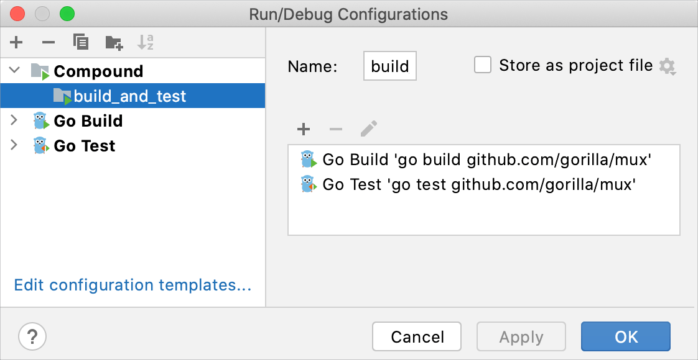

+++
title = "Run/debug multiple targets"
weight = 30
date = 2023-06-19T11:20:58+08:00
type = "docs"
description = ""
isCJKLanguage = true
draft = false
+++
# Run/debug multiple targets

https://www.jetbrains.com/help/go/run-debug-multiple.html#before_launch

Last modified: 09 November 2022

GoLand provides several ways to run/debug multiple things at once, for example, a client-server app or a complex test, which requires launching several different processes or tasks. The first step in any case would be to [create run configurations](https://www.jetbrains.com/help/go/run-debug-configuration.html#createExplicitly) for each of the tasks or processes that need to be launched. Once all necessary configurations are in place, you have several options of launching them:

- [Launch multiple configurations in parallel](https://www.jetbrains.com/help/go/run-debug-multiple.html#compound-configs) using a compound run configuration
- [Launch multiple configurations in sequence](https://www.jetbrains.com/help/go/run-debug-multiple.html#before_launch) using the Before Launch tasks

When multiple configurations are launched at once, each will be available in a separate tab in the Run or Debug tool window.

## Parallel launch with a compound run/debug configuration

A Compound run configuration lets you launch several run/debug configurations simultaneously.

> The exact order of launching different configurations within the compound configuration is not guaranteed.

### Create a compound run/debug configuration

1. [Create a run/debug configuration](https://www.jetbrains.com/help/go/run-debug-configuration.html#createExplicitly) for each app and/or process that should be launched in your session.

2. From the main menu, select Run | Edit Configurations. Alternatively, press Alt+Shift+F10, then 0.

3. In the Run/Debug Configurations dialog, click  or press Alt+Insert, then select Compound.

4. Specify the run/debug configuration name in the Name field. This name will be shown in the list of the available run/debug configurations.

5. Select Store as project file to make this run/debug configuration available to other team members.

6. To include a new run/debug configuration into the compound configuration , click Add  and select the desired one from the list.

7. Apply changes and close the dialog.

   

Once you set up the compound configuration, you can launch it with or without debugging.

## Sequential launch with the Before Launch task

You can use run/debug configuration's Before Launch tasks [for many different things](https://www.jetbrains.com/help/go/run-debug-configuration.html), and one of them is to launch other run/debug configurations.

### Configure 'Before Launch' tasks

1. [Create a run/debug configuration](https://www.jetbrains.com/help/go/run-debug-configuration.html#createExplicitly) for each app and/or process that should be launched in your session.
2. From the main menu, select Run | Edit Configurations. Alternatively, press Alt+Shift+F10, then 0.
3. In the Run/Debug Configuration dialog, select the configuration that should be launched last.
4. Expand the Before Launch section in the configuration settings.
5. Click  Add, then  Run Another Configuration, and then select the desired configuration.
6. Make sure that all necessary configurations are added. Use the  Up Alt+Up and  Down Alt+Down to arrange the launch order (configurations at the top will be launched first).
7. Apply the changes and close the dialog.

Once you set up Before Launch tasks in the configuration that should be started last, you can launch it with or without debugging.