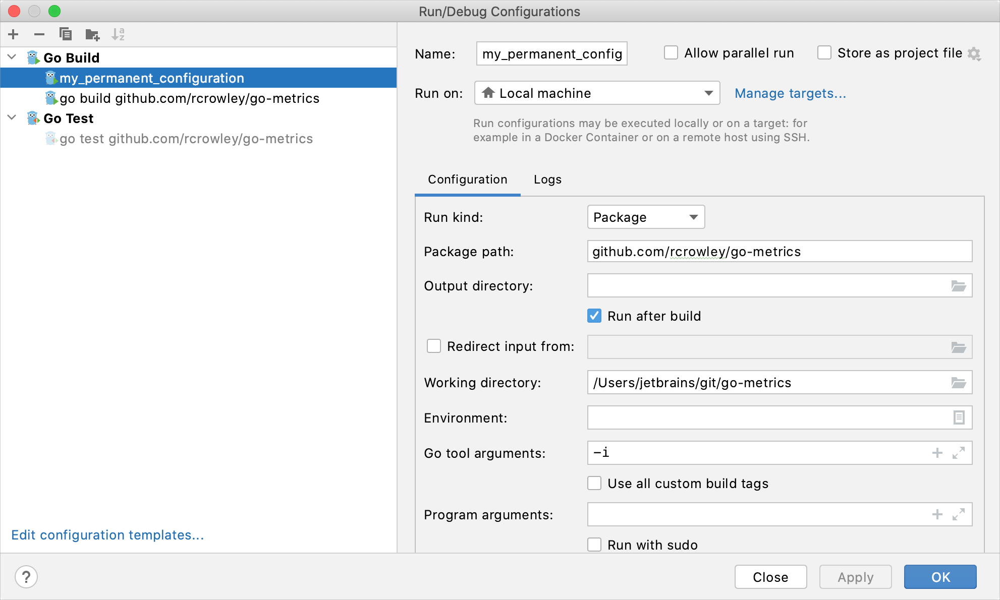
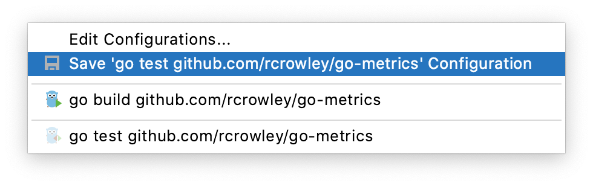
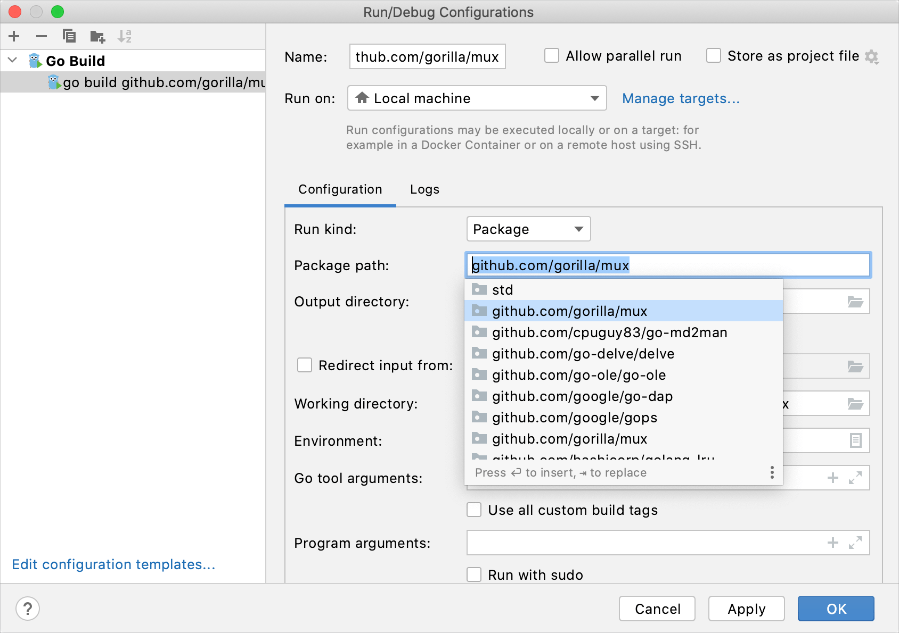
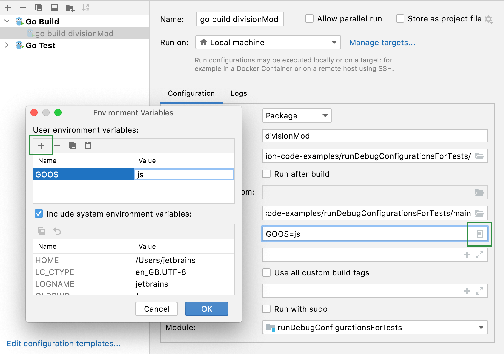
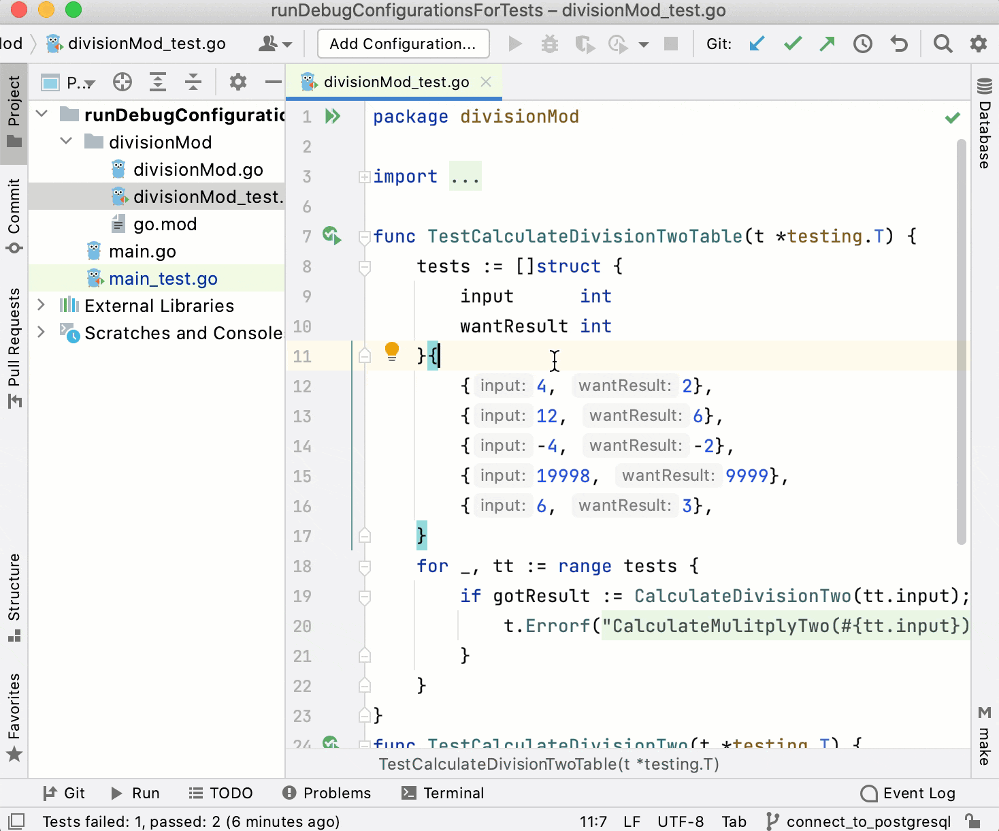
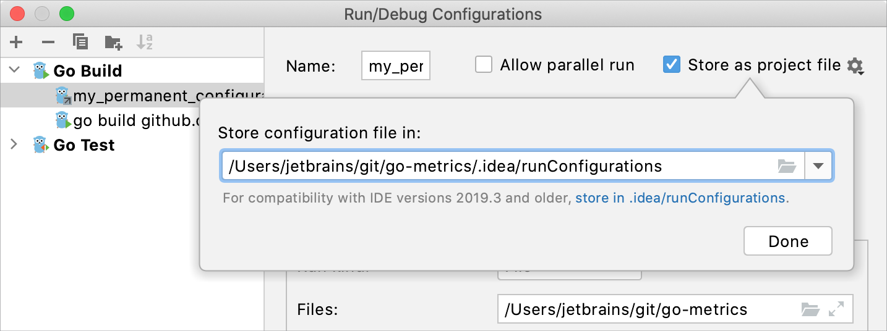
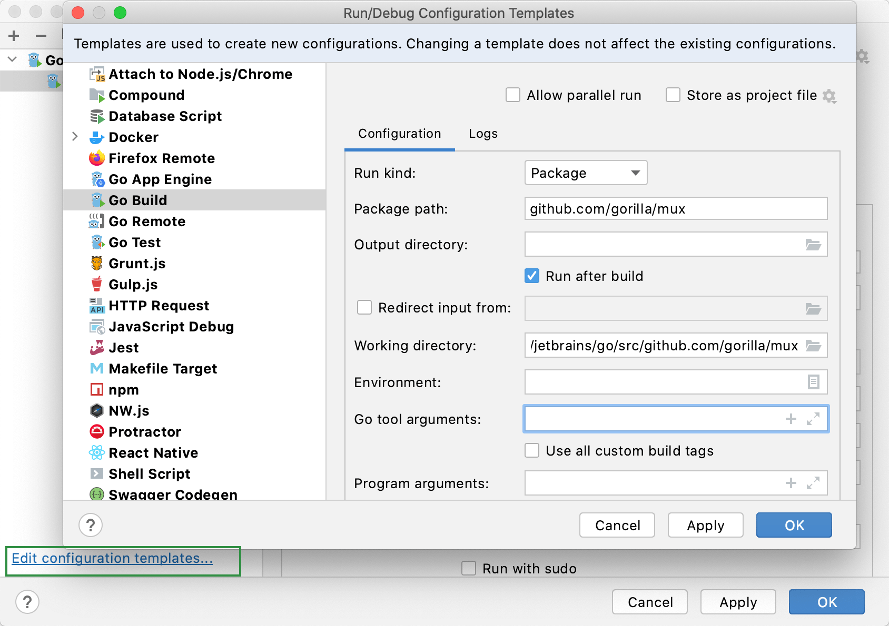

+++
title = "运行/调试配置"
weight = 10
date = 2023-06-19T11:20:58+08:00
type = "docs"
description = ""
isCJKLanguage = true
draft = false

+++
# Run/debug configurations - 运行/调试配置

https://www.jetbrains.com/help/go/run-debug-configuration.html#config-folders

Last modified: 04 May 2023

最后修改：2023年5月4日

Configure: Run | Edit Configurations

​	GoLand使用运行/调试配置来运行、调试和测试您的代码。每个配置都是一组命名的启动属性，用于定义要执行的内容、使用的参数和环境。

​	有两种类型的运行/调试配置： 

- 临时配置（Temporary ） —— 每次运行或调试函数或测试时都会创建。
- 永久配置（Permanent ） —— 通过从模板创建或保存临时配置来显式创建。永久配置将作为项目的一部分存在，直到您将其删除。

​	因此，每当您运行/调试或测试代码时，GoLand要么使用现有的永久运行/调试配置，要么创建一个新的临时配置。

​	永久配置具有不透明的图标，而临时配置的图标是半透明的。

​	临时配置的最大数量为5。当添加新配置时，旧的配置将自动删除。如果需要，您可以在Settings | Advanced Settings | IDE | Temporary configurations limit中增加此限制。



## 创建永久运行/调试配置

​	GoLand提供以下方法来创建永久运行/调试配置： 

- [将临时运行/调试配置另存为永久配置](https://www.jetbrains.com/help/go/run-debug-configuration.html#save-as-permanent)。
- [从模板创建](https://www.jetbrains.com/help/go/run-debug-configuration.html#createExplicitly)或复制现有配置。

### 将临时配置另存为永久配置

- 在运行/调试配置切换器中选择临时配置，然后点击Save Configuration。

  

- 或者，在"运行/调试配置"对话框中选择临时配置，然后在工具栏上点击。

​	GoLand为不同的语言、工具和框架提供运行/调试配置[模板](https://www.jetbrains.com/help/go/run-debug-configuration.html#templates)。可用模板的列表取决于安装和启用的[插件](https://www.jetbrains.com/help/go/managing-plugins.html)。

### 从模板创建运行/调试配置

1. 从主菜单中选择Run | Edit Configurations。或者按Alt+Shift+F10，然后按0。

3. 在Run/Debug Configuration对话框中，点击工具栏上的或按Alt+Insert。列表中显示运行/调试配置模板。选择"Go build"。

4. 在"名称"字段中指定运行/调试配置的名称。此名称将显示在可用的运行/调试配置列表中。

4. 在Configuration 选项卡上，您可以设置以下选项：

   - 运行类型（Run kind:）：应用程序的构建范围。文件和包范围在测试和编译/运行配置中的工作方式类似（就其覆盖的范围而言）。

     - 目录（Directory）：在指定的目录中将应用程序作为包进行构建，而不处理任何子目录。

       对于测试配置，GoLand会运行指定目录及其所有子目录中的所有测试。

     - 文件（File）：从在"文件"字段中指定的文件构建应用程序。要传递多个文件路径，请使用竖线(`|`)作为分隔符。当您从头开始运行程序时，会自动选择此配置。

     - 软件包（Package）：构建一个带有所有依赖项的单个包。在"包路径"字段中指定要构建的包的完整导入路径（例如，`github.com/gorilla/mux`）。当您使用gutter中的运行应用程序图标（)运行"main"函数或单独的测试时，会自动选择此配置。

   - 包路径（Package path）：要编译的包的完整导入路径（例如，`github.com/gorilla/mux`）。仅当选择 Package 运行类型时，此字段可用。

     您可以按Ctrl+Space键查看可用包的列表。

     

   - 输出目录（Output directory）：要输出可执行文件的路径。

   - 构建后运行（Run after build）：在构建后执行应用程序。

   - 重定向输入自（Redirect input from）：从文件中读取输入。

   - 工作目录（Working directory）：用于构建应用程序的目录。如果您有任何创建相对文件或目录的代码，它们将相对于此目录。

   - 环境（Environment）：应用程序的环境变量。

     要编辑环境变量，请点击字段末尾的"浏览"按钮。在"环境变量"对话框中，点击"添加"按钮并添加所需的环境变量。

     

   - Go工具参数（Go tool arguments）：go工具的参数（例如，`-o`）。您还可以在此字段中使用宏。

   - 使用所有自定义构建标签（Use all custom build tags）：在构建过程中应用的所有标签。标签在设置（Ctrl+Alt+S）下的Go | 构建标签和供应商中列出。

   - 程序实参（Program arguments）：构建应用程序的参数。您也可以在此字段中使用宏。

   - 使用sudo运行（Run with sudo）：以提升的权限运行应用程序。

   - 模块（Module）：当前模块的名称。

   - 在启动前（Before launch）：添加要在选择的运行/调试配置启动之前启动的任务。点击"添加"按钮（Alt+Insert），然后选择要添加的工具。

   - 存储为项目文件（Store as project file）：启用此选项将运行/调试配置保存为项目文件，并通过[VCS](https://www.jetbrains.com/help/go/version-control-integration.html)与团队成员共享。

8. 在启动前（Before launch）部分，定义在启动应用程序之前是否要执行任何特定操作，例如，在运行之前启动[外部工具](https://www.jetbrains.com/help/go/configuring-third-party-tools.html)或另一个构建配置。要跳过构建阶段，请从"启动前"列表中删除"构建"。

10. 应用更改并关闭对话框。


### 测试和基准测试的模板

​	Go测试的模板与Go应用程序的模板（Go Build）相同。但是，您应该选择Go Test而不是Go Build。

### 用于测试的运行/调试配置模板 

1. 导航到Run | Edit Configurations。

3. 在Run/Debug Configurations对话框中，点击Add New Configuration（Alt+Insert），然后选择Go Test。

3. 在"测试类型"列表中，选择要运行测试的范围：

   - 目录（Directory）：运行指定目录中的所有测试。在"目录"字段中，指定包括应用程序文件和测试文件的目录的路径（例如，**applicationFolder/**，其中包括**main.go**和**main_test.go**）。

   - 软件包（Package）：运行属于某个包的所有测试。在"包路径"字段中，选择要运行测试的包的路径（例如，`github.com/rcrowley/go-metrics`）。

     要启用包测试，请按Ctrl+Alt+S打开设置，导航到Go | Go模块，然后选中"启用Go模块集成"复选框。

   - 文件（File）：运行测试文件中的所有测试。在"文件"字段中输入测试文件的路径。

     确保Files 字段不包含其他路径。

4. （可选）您还可以指定以下设置：

   - 模式：定义要运行的测试的正则表达式。GoLand将仅运行与正则表达式匹配的测试、示例和模糊测试。对于测试，正则表达式通过未加括号的斜杠（/）字符分隔为一系列正则表达式，如果有的话，测试标识符的每个部分必须与序列中的相应元素匹配。

   - 工作目录：用于构建应用程序的目录。如果您的代码中有创建相对文件或目录的代码，它们将相对于此目录。

   - 输出目录：存储测试结果的目录（如果有）。

   - 构建后运行：构建后执行测试。

   - 重定向输入自：用于读取程序输入的文件路径。

   - 工作目录：用于构建应用程序的目录。如果您的代码中有创建相对文件或目录的代码，它们将相对于此目录。

   - 环境：运行测试所需的环境变量。

     要编辑环境变量，请点击字段末尾的"浏览"按钮。在"环境变量"对话框中，点击"添加"按钮，然后添加所需的环境变量。

     

   - Go工具实参：go工具的实参（例如，`-tags`）。

   - 使用所有自定义构建标签：构建过程中使用的所有标签。标签在设置（Ctrl+Alt+S）下的Go | Build Tags & Vendoring中列出。

   - 程序实参：测试的实参。

   - 使用sudo运行：授予测试sudo权限。

   - 在启动前：激活工具窗口：添加要在选择的运行/调试配置启动之前启动的任务。点击"添加"按钮（Alt+Insert），然后选择要添加的工具。

9. 点击 Apply.

   

## 共享运行/调试配置

​	如果您在团队中工作，可能希望共享您的运行/调试配置，以便您的团队成员可以使用相同的配置运行应用程序，或者使他们能够远程连接到您正在运行的进程。

​	为此，GoLand提供了一种机制，可以将运行/调试配置存储为项目文件，并通过VCS进行共享。当您想将配置作为文件发送给其他人时，也可以使用相同的机制。这样可以节省很多时间，因为运行/调试配置有时会变得复杂，手动保持它们的同步将很繁琐且容易出错。

1. 从主菜单中选择Run | Edit Configurations。或者按Alt+Shift+F10，然后按0。

2. 选择要共享的运行/调试配置，启用Store as project file选项，并指定配置文件的存储位置。

   如果需要与GoLand 2019.3及更早版本兼容，将文件存储在默认位置。

   

3. （可选）如果已将**.idea**目录添加到VCS的忽略文件中，则**.idea/runConfigurations**子文件夹也将被忽略。如果您使用的是git作为VCS，您可以按照以下步骤进行操作：

   ```none
   /.idea/*
   !/.idea/runConfigurations
   ```

   


> ​	启用"存储为项目文件"选项不会自动提交到版本控制系统（VCS）。为了使运行/调试配置进入共享的存储库，您需要像其他版本化文件一样将它们进行提交。
>
> ​	要了解如何从VCS导入运行/调试配置，请参考[版本控制](https://www.jetbrains.com/help/go/version-control-integration.html)部分。

## 运行/调试配置模板

​	所有运行/调试配置都基于模板，模板实现了启动逻辑，定义了参数列表及其默认值。[可用模板列表](https://www.jetbrains.com/help/go/list-of-run-debug-configurations.html)在安装过程中预定义，并且只能通过[插件](https://www.jetbrains.com/help/go/managing-plugins.html)进行扩展。但是，您可以编辑每个模板中的默认参数值，以简化新运行/调试配置的设置。


> ​	更改模板的默认值不会影响已存在的运行/调试配置。

### 配置模板的默认值

1. 从主菜单中选择Run | Edit Configurations。或者按Alt+Shift+F10，然后按0。

6. 在运行/调试配置对话框的左侧窗格中，点击Edit configuration templates…。

7. 在打开的Run/Debug Configuration Templates对话框中，选择配置类型。

8. 指定所需的默认参数，并点击OK 保存模板。

   

## 运行/调试配置文件夹

​	当存在多个相同类型的运行/调试配置时，您可以将它们分组到文件夹中，以便更容易在视觉上区分。

​	一旦分组，运行/调试配置将显示在相应文件夹下的列表中。

### 创建运行/调试配置文件夹

1. 从主菜单中选择Run | Edit Configurations。或者按Alt+Shift+F10，然后按0。
2. 在Run/Debug Configurations对话框中，选择配置类型，并点击工具栏上的将创建一个新的空文件夹。
3. 在右侧的文本字段中指定文件夹名称，或接受默认名称。
4. 选择所需的运行/调试配置，并将它们移动到目标文件夹下。
5. 应用更改。如果文件夹为空，则不会保存该文件夹。

​	当您不再需要一个文件夹时，可以删除它。分组在该文件夹下的运行/调试配置将移动到相应运行/调试配置类型的根目录下。