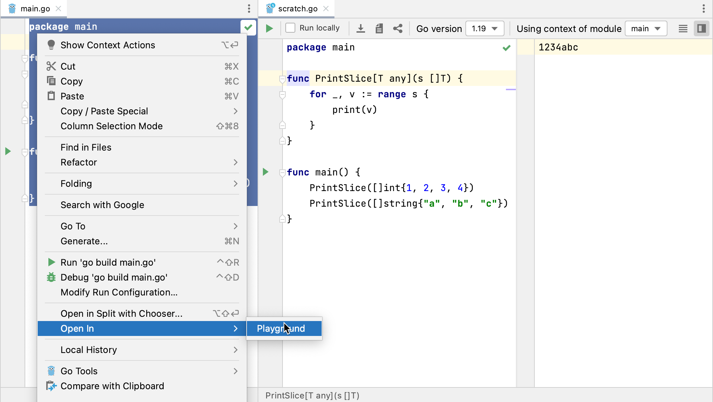

+++
title = "在Go Playground中运行应用程序"
weight = 60
date = 2023-06-19T11:20:58+08:00
type = "docs"
description = ""
isCJKLanguage = true
draft = false

+++
# Running applications in Go Playground 在Go Playground中运行应用程序

https://www.jetbrains.com/help/go/running-applications-in-go-playground.html

Last modified: 23 February 2023

最后修改日期：2023年2月23日

You can run your Go code in GoLand by using the Go playground server to process it. When you use the Open in | Playground action, GoLand creates a scratch file with your code and displays a toolbar that contains the same options that you see in the Go playground.

您可以通过使用Go Playground服务器在GoLand中运行您的Go代码。当您使用“Open in | Playground”操作时，GoLand会创建一个临时文件来存储您的代码，并显示一个包含与Go Playground相同选项的工具栏。

You can format and share your code, change the Go version, run your code by using the Go playground server, or run it locally.

您可以格式化和分享您的代码，更改Go版本，通过使用Go Playground服务器运行代码，或在本地运行代码。

GoLand displays a toolbar with the Go Playground controls for Go scratch files.

GoLand在Go临时文件的工具栏中显示Go Playground的控制选项。

### 在Go Playground中运行您的代码 Running your code in the Go Playground

1. Select code that you want to run in the Go Playground.

2. 选择您想要在Go Playground中运行的代码。

3. Right-click the selection and navigate to Open In | Playground.

4. 右键单击选择内容，导航到“Open In | Playground”。

5. Click the Run icon ( 在工具栏上，点击运行图标（) on the toolbar. )。

   Note: if you run your code from the context menu or from the gutter, GoLand runs your code locally. Also, you can run your code locally by selecting the Run locally.

   注意：如果您从上下文菜单或gutter中运行代码，GoLand会在本地运行您的代码。此外，您还可以通过选择“Run locally”在本地运行代码。

   

   

### 从文件或URL加载代码 Load code from file or URL

1. From the main menu, select File | New | Scratch File or press Ctrl+Alt+Shift+Insert.

2. 从主菜单中选择File | New | Scratch File，或按下Ctrl+Alt+Shift+Insert。

3. From the New Scratch File window, select Go.

4. 在新的临时文件窗口中，选择Go。

5. On the toolbar, click the Load icon ( 在工具栏上，点击加载图标（).)。

6. In the dialog, select the source of your code: File or URL.

7. 在对话框中，选择代码的来源：文件或URL。

8. Click OK.

9. 点击OK。

   

### 使用Go Playground格式化代码 Format code with the Go Playground formatter

1. Open your code in a scratch file. For more information about scratch files, see [Scratch files](https://www.jetbrains.com/help/go/scratches.html).

2. 在一个临时文件中打开您的代码。有关临时文件的更多信息，请参阅[临时文件](https://www.jetbrains.com/help/go/scratches.html)。

   To create a new file, select File | New | Scratch File from the main menu or press Ctrl+Alt+Shift+Insert.

   要创建一个新文件，请从主菜单中选择File | New | Scratch File，或按下Ctrl+Alt+Shift+Insert。

3. On the toolbar, click the Format icon (在工具栏上，点击格式化图标（).)。

   

### 在Go Playground中分享临时文件中的代码Share code in the Go Playground from scratch files

1. Open your code in a scratch file. For more information about scratch files, see [Scratch files](https://www.jetbrains.com/help/go/scratches.html).

2. 在一个临时文件中打开您的代码。有关临时文件的更多信息，请参阅[临时文件](https://www.jetbrains.com/help/go/scratches.html)。

   To create a new file, select File | New | Scratch File from the main menu or press Ctrl+Alt+Shift+Insert.

   要创建一个新文件，请从主菜单中选择File | New | Scratch File，或按下Ctrl+Alt+Shift+Insert。

3. On the toolbar, click the Format icon (在工具栏上，点击格式化图标（).)。

   Depending on the selected version, GoLand adds a version parameter to the generated link to the Go Playground.

   根据所选择的版本，GoLand会将版本参数添加到生成的链接中，用于在Go Playground中分享代码。

   

### 选择Go版本 Selecting Go version

1. Open your code in a scratch file. For more information about scratch files, see [Scratch files](https://www.jetbrains.com/help/go/scratches.html).

2. 在一个临时文件中打开您的代码。有关临时文件的更多信息，请参阅[临时文件](https://www.jetbrains.com/help/go/scratches.html)。

   To create a new file, select File | New | Scratch File from the main menu or press Ctrl+Alt+Shift+Insert.

   要创建一个新文件，请从主菜单中选择File | New | Scratch File，或按下Ctrl+Alt+Shift+Insert。

3. From the Go version drop-down, select the version that you want.

4. 在Go版本下拉菜单中，选择您想要的版本。

   Depending on the selected version, GoLand adds a version parameter to the generated link to the Go Playground.

   根据所选择的版本，GoLand会将版本参数添加到生成的链接中，用于在Go Playground中分享代码。

### 选择模块的上下文 Selecting context of a module

1. Open your code in a scratch file. For more information about scratch files, see [Scratch files](https://www.jetbrains.com/help/go/scratches.html).

2. 在一个临时文件中打开您的代码。有关临时文件的更多信息，请参阅[临时文件](https://www.jetbrains.com/help/go/scratches.html)。

   To create a new file, select File | New | Scratch File from the main menu or press Ctrl+Alt+Shift+Insert.

   要创建一个新文件，请从主菜单中选择File | New | Scratch File，或按下Ctrl+Alt+Shift+Insert。

3. From the Go version drop-down, select the version that you want.

4. 在Go版本下拉菜单中，选择您想要的版本。
