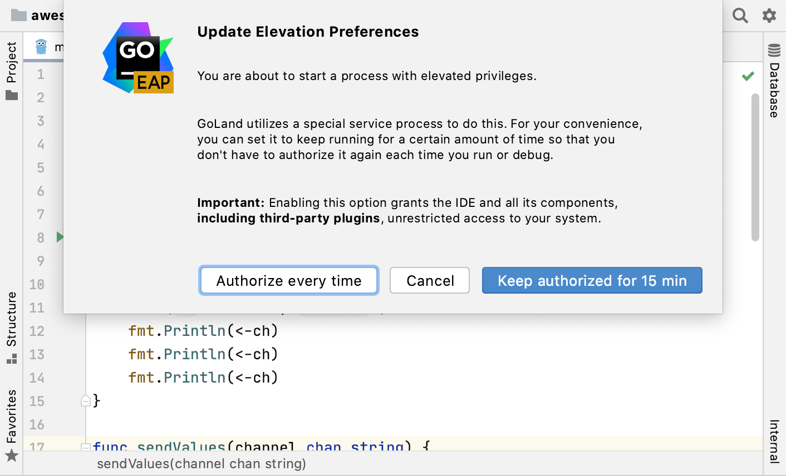
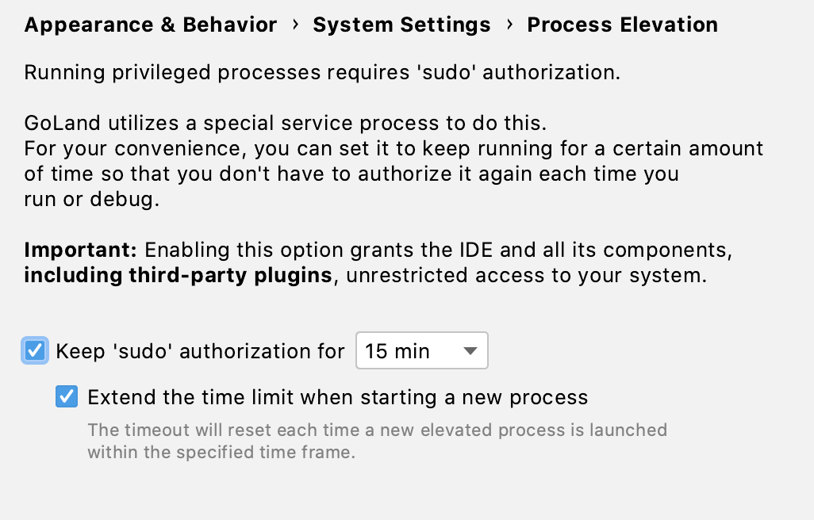

+++
title = "以提升的权限运行应用程序"
weight = 30
date = 2023-06-19T11:20:58+08:00
type = "docs"
description = ""
isCJKLanguage = true
draft = false

+++
# Running applications with elevated privileges 以提升的权限运行应用程序

https://www.jetbrains.com/help/go/debug-as-root.html

Last modified: 16 January 2023

上次修改日期：2023年1月16日

> Before running or debugging the application with elevated privileges, ensure that this application is not malicious.
>
> 在以提升的权限运行或调试应用程序之前，请确保该应用程序没有恶意行为。

Elevated privileges are roles or permissions for some accounts in your operating system that grant the ability to do more than a standard user. A standard user here means someone that has no administrative privileges in any capacity.

提升的权限是指操作系统中某些帐户的角色或权限，使其能够执行比标准用户更多的操作。标准用户指的是没有任何管理权限的用户。

In different operating systems, accounts with elevated privileges can be a root user, a superuser, an administrator, a user with sudo privileges. This user account is usually used for administrative purposes, and typically has the highest access rights on the system. This means it can read and write any files on the system, perform operations as any user, or change system configuration.

​	在不同的操作系统中，具有提升权限的帐户可以是根用户、超级用户、管理员或具有sudo权限的用户。这个用户帐户通常用于管理目的，并且通常具有系统上最高的访问权限。这意味着它可以读取和写入系统上的任何文件，以任何用户身份执行操作，或者更改系统配置。

## 配置授权时间 Configure authorization time

If do not want to authorize each time you run or debug an application with elevated privileges, you can configure the amount of time the authorization is kept. This is similar to how the `sudo` command-line program works by default.

​	如果您不希望在每次以提升的权限运行或调试应用程序时都进行授权，您可以配置授权的持续时间。这类似于`sudo`命令行程序的默认工作方式。

When you run or debug with elevated privileges for the first time, you will be prompted to choose whether to authorize every time or grant authorization for the configured period. You will always be able to change this [in the settings](https://www.jetbrains.com/help/go/debug-as-root.html#authorize-settings).

​	当您首次以提升的权限运行或调试时，您将被提示选择是每次都授权还是授权一定时间。您始终可以在[设置中进行更改](https://www.jetbrains.com/help/go/debug-as-root.html#authorize-settings)。

Note that GoLand will not have access to any passwords - the authorization is carried out via a system dialog. After the configured time runs out, the already running processes with root privileges will continue to run, but no new elevated process will be able to start until you authorize that again.

​	请注意，GoLand不会访问任何密码-授权是通过系统对话框进行的。在配置的时间到期后，已经以根权限运行的进程将继续运行，但是在您再次授权之前，将无法启动新的提升进程。

### 在设置中设置授权持续时间 Set the authorization period in the settings

You can also configure the time the authorization is kept in the settings.

​	您还可以在设置中配置授权的持续时间。

1. Go to Settings | Appearance & Behavior | System Settings | Process Elevation.

2. 转到 设置 | 外观和行为 | 系统设置 | 进程提升。

3. 选中“保持'sudo'授权时间”（或“保持UAC授权时间”）复选框，并指定值。默认值为15分钟。

4. Set the Keep 'sudo' authorization for (Keep UAC authorization for) checkbox and specify the value. The default is 15 minutes.

   