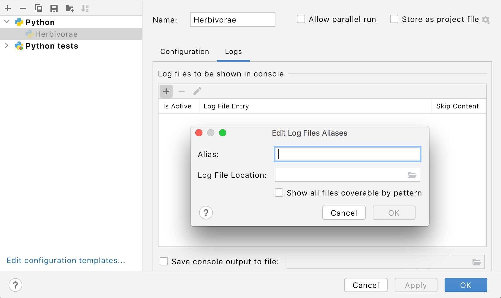
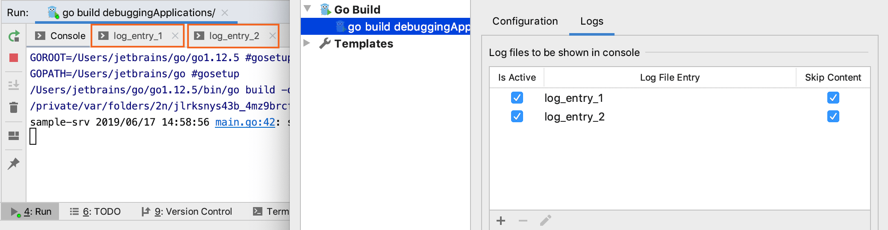

+++
title = "Setting log options"
weight = 40
date = 2023-06-19T11:20:58+08:00
type = "docs"
description = ""
isCJKLanguage = true
draft = false
+++
# Setting log options

https://www.jetbrains.com/help/go/setting-log-options.html

Last modified: 01 November 2022

Use Logs tab in the Run/Debug Configuration dialogs to configure the way log files, generated by an application or server, are displayed in the console.

If your application or server generates log files, the default entries will be automatically added to the log file list in the Run/Debug Configuration dialog.

### Configure options for logs

1. Select Edit Configurations from the list of the run/debug configurations.

2. In the [Run/Debug Configuration](https://www.jetbrains.com/help/go/run-debug-configurations-dialog.html) dialog, click the Logs tab.

   

   The Edit Log Files Aliases table displays the list of log files.

3. Click the Add button.

4. In the Alias field, type the alias for the log entry.

5. In the Log File Location field, specify the log files to display during running or debugging. You can specify the files by using two options:

   - Specify the full path to a specific file. Type the path manually or click the Browse button  and select the file.
   - Specify the base directory and add an [Ant pattern](http://ant.apache.org/manual/dirtasks.html#patterns) that defines the [fileset](http://ant.apache.org/manual/Types/fileset.html) to be displayed.

6. (Optional) Select the Show All Files Coverable by Pattern checkbox to open a separate tab for each log file that matches the specified Ant pattern.

7. Click OK.

8. In the Edit Log Files Aliases table, select the Is Active checkbox to have the log entries displayed in the corresponding tabs in the Run tool window or Debug tool window.

9. To skip the previous content of the selected log, select the checkbox in the Skip Content column.

