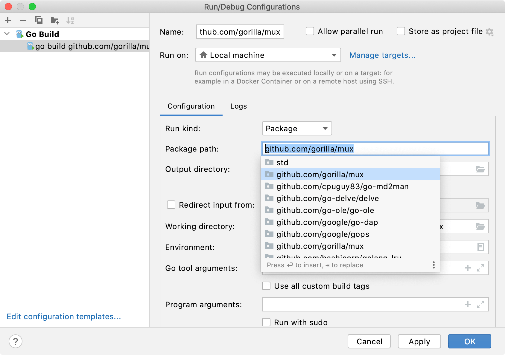
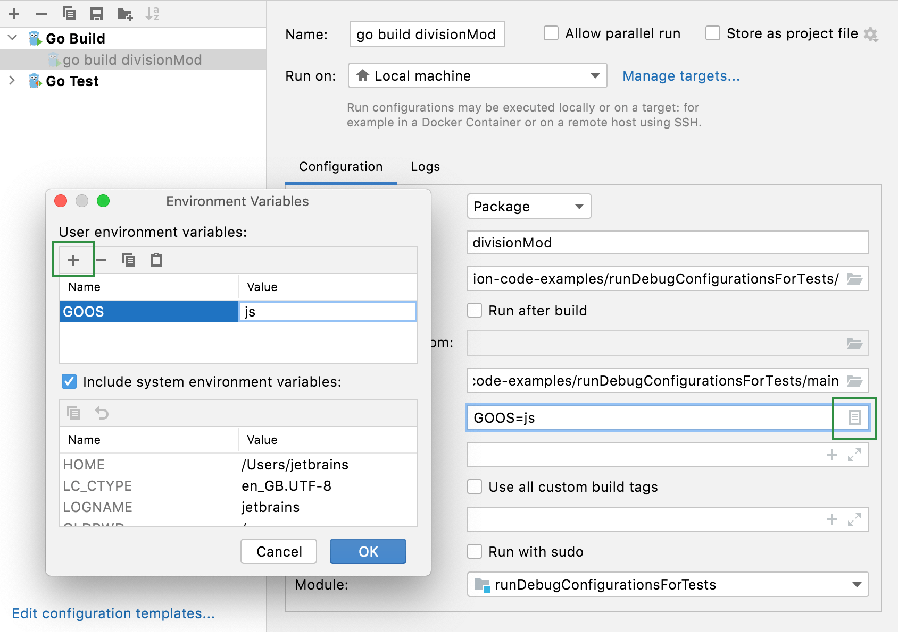
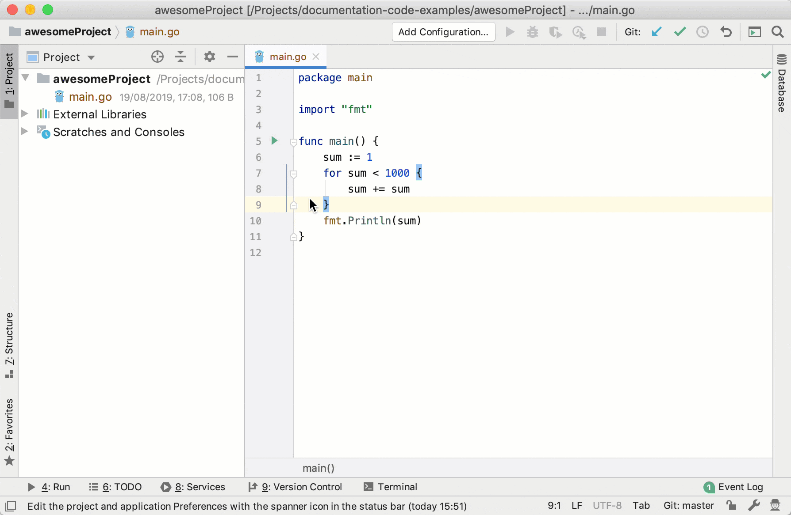
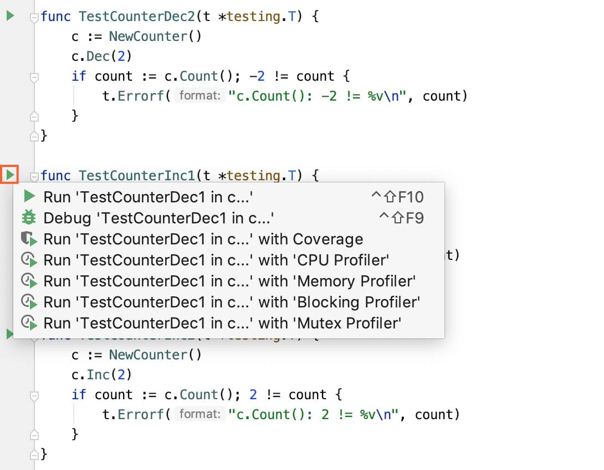
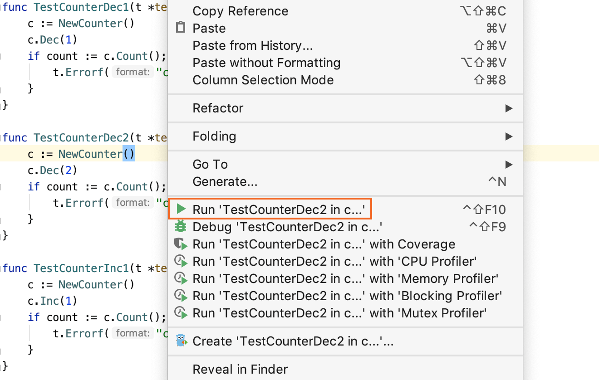
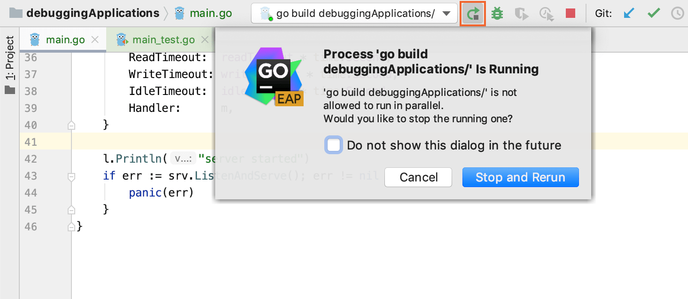
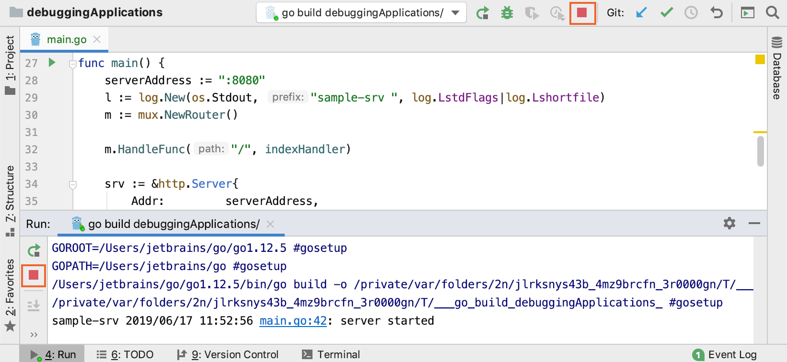
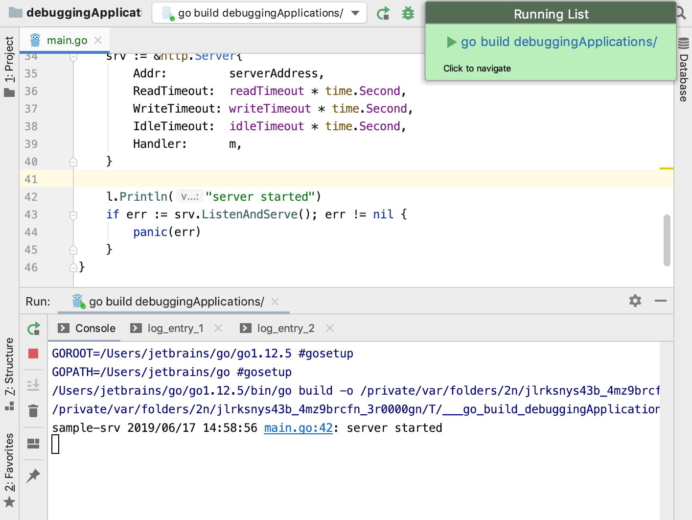
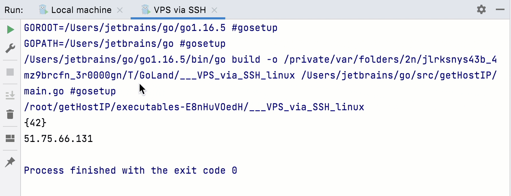

+++
title = "运行"
linkTitle = "运行"
date = 2023-06-19T11:20:58+08:00
type = "docs"
description = ""
isCJKLanguage = true
draft = false
[menu.main]
    weight = 10
+++
# Running

https://www.jetbrains.com/help/go/running-applications.html#split_tabs_in_the_run_tool_window

Last modified: 25 April 2023

When you run, debug, or test your code, GoLand creates a temporary run/debug configuration. This configuration includes all the details of how you want to perform the operation. Usually, a temporary configuration is enough to run or debug your code. You can use the temporary configuration to run your application one time, or save it for future use.

​	当你运行、调试或测试你的代码时，GoLand 会创建一个临时的运行和调试配置。这个配置包括了你想要执行操作的所有细节，通常情况下，一个临时的配置就足以运行或调试你的代码。你可以使用这个临时的配置运行你的程序一次或者保存它以备将来使用。  

Depending on your purposes, you can edit existing or create new configurations. For more information about editing you configurations, see [Run/debug configurations](https://www.jetbrains.com/help/go/run-debug-configuration.html).

​	根据你的需要，你可以编辑现有的配置或者创建新的配置。要了解有关编辑配置的更多信息，请参见[运行/调试配置](https://www.jetbrains.com/help/go/run-debug-configuration.html)。 

> If the options that launch tools before running were enabled in a [Run/Debug configuration](https://www.jetbrains.com/help/go/run-debug-configurations-dialog.html), GoLand runs the tools, and after success will run the application. Otherwise, the program will start immediately.
>
> ​	如果在[运行/调试配置](https://www.jetbrains.com/help/go/run-debug-configurations-dialog.html)中启用了在运行之前启动工具的选项，GoLand 会运行这些工具，在成功运行后再运行你的应用程序。否则，程序会立即启动。  

### 创建运行/调试配置 

1. Open the Run/Debug Configuration dialog in one of the following ways:

2. 按以下任意一种方式打开运行/调试配置对话框：  

   - Select Run | Edit Configurations from the main menu.
   - 从主菜单中选择 **运行 | 编辑配置**。 
   - With the [Navigation bar](https://www.jetbrains.com/help/go/guided-tour-around-the-user-interface.html#navigation-bar) visible (View | Appearance | Navigation Bar), choose Edit Configurations from the run/debug configuration selector.
   - 在[导航栏](https://www.jetbrains.com/help/go/guided-tour-around-the-user-interface.html#navigation-bar)（View | Appearance | Navigation Bar）中选择 **编辑配置**。  
   - Press Alt+Shift+F10 and then press 0.
   - 按 `Alt+Shift+F10`，然后按 `0`。

3. In the [Run/Debug Configuration](https://www.jetbrains.com/help/go/run-debug-configurations-dialog.html) dialog, click the Add New Configuration icon () on the toolbar or press Alt+Insert. The list shows the default run/debug configurations. Select the desired configuration type (for example, Go build).

4. 在[运行/调试配置](https://www.jetbrains.com/help/go/run-debug-configurations-dialog.html) 对话框中，单击工具栏上的**Add New Configuration**图标（），或按`Alt+Insert`。列表显示了默认的运行/调试配置。选择所需的配置类型（例如，Go build)。

   The fields that appear in the right-hand pane display the default settings for the selected configuration type.

   在右侧面板中显示出所选配置类型的默认设置。 

   - Run kind: a building scope for your application. File and Package scopes work similarly in tests and compilation/running configurations (in terms of the scope they cover).

   - 运行类型：应用程序的构建范围。在测试和编译/运行配置中，文件（File）和软件包（Package）范围的工作方式类似（就其覆盖范围而言）。 

     - Directory: build an application in the specified directory as a package, without processing any subdirectories.

     - 目录：在指定的目录中构建应用程序作为一个包，而不处理任何子目录。 

       For test configurations, GoLand runs all the tests in the specified directory and all its subdirectories.

       对于测试配置，GoLand 运行指定目录及其所有子目录中的所有测试。

     - File: build an application from files specified in the Files field. To pass multiple file paths, use the vertical bar (`|`) as a delimiter. This configuration is automatically selected when you run your program from scratch files.

     - 文件（File）：从指定 Files 字段中的文件中构建应用程序。要传递多个文件路径，请使用竖线（`|`）作为分隔符。当你从头开始运行程序时，这个配置会被自动选择。 

     - 软件包（Package）: build a single package with all its dependencies. Specify a full import path to the package that you want to build in the Package path field (for example, `github.com/gorilla/mux`). This configuration is automatically selected when you run the `main` function or a separate test by using the Run icon () in the gutter.

     - 软件包：构建一个包及其所有依赖项。在软件包路径（Package path）字段中指定要构建的包的完整导入路径（例如，`github.com/gorilla/mux`）。当你使用 Gutter 中的 Run 图标（)运行`main`函数或单独的测试时，这个配置也会被自动选择。 

   - Package path: a full import path of the package that you want to compile (for example, `github.com/gorilla/mux`). This field is available only when you select the Package run kind.

   - 软件包路径：要编译的软件包的完整导入路径（例如，`github.com/gorilla/mux`）。只有在选择**软件包运行类型**时才可用。 

     You can press Ctrl+Space to see a list of available packages.

     ​     您可以按`Ctrl+Space`查看可用软件包列表。  

     

     

   - Output directory: a directory for the executable file.

   - 输出目录：可执行文件的目录。 

   - Run after build: execute the application after the build.

   - 编译后运行：在构建后运行该应用程序。

   - Working directory: a directory that is used for the built application. If you have any code that creates relative files or directories, they will be relative to this directory.

   - 工作目录：用于构建应用程序的目录。如果有任何创建相对文件或目录的代码，则它们将相对于此目录。 

   - Environment: environment variables for your application.

   - 环境：应用程序的环境变量。 

     To edit environment variables, click the Browse button at the end of the field. In the Environment Variables dialog, click the Add button and add the environment variables that you need.

     ​     要编辑环境变量，请单击字段末尾的 Browse 按钮。在**环境变量**对话框中，单击**Add**按钮并添加所需的环境变量。  

     

   - Go tool arguments: arguments for the go tool (for example, `-o`). Also, you can use macros in this field.

   - Go 工具实参：go 工具的实参（例如，`-o`）。此字段中也可以使用宏。

   - Use all custom build tags: all tags that are applied during the build. Tags are listed in settings Ctrl+Alt+S under Go | Build Tags & Vendoring.

   - 使用所有自定义构建标记：应用于该构建的所有标记。在设置（`Ctrl+Alt+S`）下，**Go | Build Tags & Vendoring**中列出了这些标记。 

   - Program arguments: arguments for the built application. Also, you can use macros in this field.

   - 程序实参：该构建应用程序的实参。此字段中也可以使用宏。 

   - Run with sudo: grant sudo privileges for the application.

   - 使用 sudo 运行：为该应用程序授予sudo权限。 

   - Module: name of the current module.

   - 模块：当前模块的名称。 

   - Before launch: add tasks that you want to launch before the launch of the selected run/debug configuration. To add a task click the Add button Alt+Insert and select the tool that you want to add.

   - 在启动之前：添加你想要在选定的运行/调试配置启动之前启动的任务。要添加任务，请单击 Add 按钮`Alt+Insert`并选择要添加的工具。 

   - Store as project file: Enable this option to save your configuration as a project file and share it with team members through [VCS](https://www.jetbrains.com/help/go/version-control-integration.html).

   - 存储为项目文件：启用此选项以将你的配置保存为项目文件，并通过[VCS](https://www.jetbrains.com/help/go/version-control-integration.html)与团队成员共享。 

5. Apply the changes and close the dialog.

6. **应用**更改并关闭对话框。

   

### Using the icon in the left gutter

In the left gutter of the editor, click the Run application icon  and select Run <method_name> in <file_name>.

​	在编辑器左边的符号栏中，点击**Run Application**图标 ，然后选择 `Run <method_name> in <file_name>`即可运行应用程序。  

### Using the context menu

Right-click the opened file or a method in the editor and select Run <method_name> in <file_name> Ctrl+Shift+F10.

​	你也可以右键单击编辑器中的文件或方法，然后选择`Run <method_name> in <file_name> Ctrl+Shift+F10` 来运行应用程序。  

### Rerun an application

You can re-run an application if its tab is still opened in the [Run](https://www.jetbrains.com/help/go/run-tool-window.html) window. The program re-runs with the initial settings.

​	如果应用程序的选项卡仍然在运行窗口中打开，请按Ctrl+F5或点击工具栏中的“Rerun”按钮 重新运行应用程序。如果你希望重新运行应用程序，但不失去正在编辑的标签页的焦点，请按Shift+F10。  

1. In the Run window, select the tab where the desired application is opened.
2. In the toolbar, click the Rerun button , or press Ctrl+F5.
3. In the notification dialog, click Stop and rerun.

> If you want to re-run without loosing focus in the editor tab you are working in, press Shift+F10.
>
> 

### Stop an application

- In the toolbar, click click the Stop button  on the toolbar, or press Ctrl+F2. Also, the Stop button is available in the Run tool window.

- 要停止应用程序，请点击工具栏上的“Stop”按钮  或按Ctrl+F2。你也可以在运行工具窗口中单击“Stop”按钮。  

  

### View running applications

- You can list all running applications by selecting Run | Show Running List. If no applications are active, the command is greyed out.

- 你可以选择“Run” | “Show Running List”查看当前正在运行的应用程序列表。如果没有应用程序处于活动状态，则这个命令是灰色的。  

  

### Split tabs in the Run tool window

- If you have several configurations running simultaneously and you need to see the results of all these runs, you can split the window by dragging and dropping the tabs to the highlighted area inside the Run tool window. To unsplit the window again, right-click the top pane and select Unsplit from the context menu.

- 如果你有多个配置同时运行并且需要查看所有这些运行的结果，你可以通过将选项卡拖放到运行工具窗口内部的突出显示区域来拆分窗口。要取消拆分窗口，请右键单击顶部窗格并从上下文菜单中选择“取消拆分”。

  