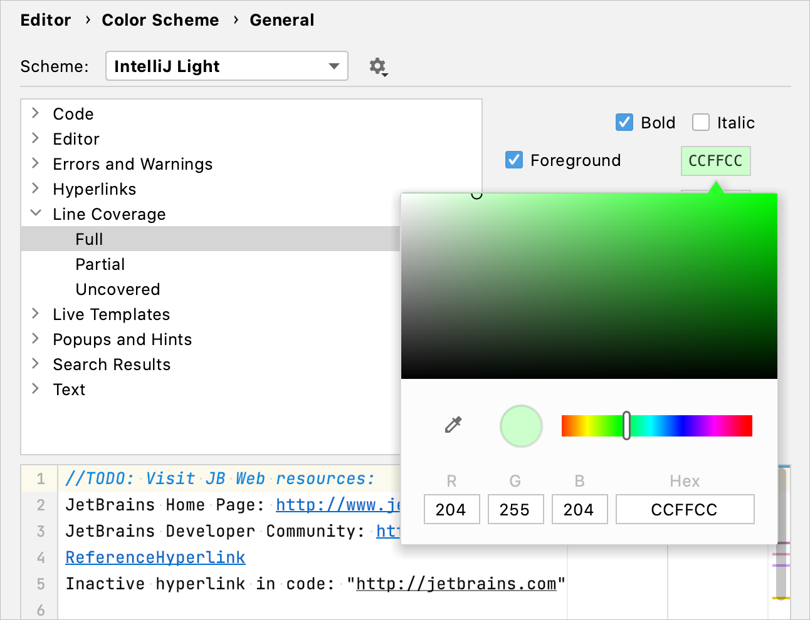

+++
title = "Configuring code coverage measurement"
weight = 10
date = 2023-06-19T11:20:58+08:00
type = "docs"
description = ""
isCJKLanguage = true
draft = false
+++
# Configuring code coverage measurement 配置代码覆盖率测量

https://www.jetbrains.com/help/go/configuring-code-coverage-measurement.html

Last modified: 03 May 2023

最后修改日期：2023年5月3日

### 配置代码覆盖率行为  Configure code coverage behavior

1. Press Ctrl+Alt+S to open the IDE settings and select Build, Execution, Deployment | Coverage.
2. 按下Ctrl+Alt+S打开IDE设置，选择Build, Execution, Deployment | Coverage。
3. Define how the collected coverage data will be processed:
4. 定义如何处理收集的覆盖率数据：
   - Show options before applying coverage to the editor: show the Code Coverage dialog every time you run a new run configuration with code coverage.
   - 在将覆盖率应用于编辑器之前显示选项：每次使用代码覆盖率运行新的运行配置时都显示代码覆盖率对话框。
   - Do not apply collected coverage: discard the new code coverage results.
   - 不应用收集的覆盖率：丢弃新的代码覆盖率结果。
   - Replace active suites with the new one: discard the active suites and use the new one every time you launch a new run configuration with code coverage.
   - 使用新的套件替换活动套件：每次使用代码覆盖率运行新的运行配置时，丢弃活动套件并使用新的套件。
   - Add to the active suites: add new code coverage suites to the active suites every time you launch a new run configuration with code coverage.
   - 将新的覆盖率套件添加到活动套件中：每次使用代码覆盖率运行新的运行配置时，将新的代码覆盖率套件添加到活动套件中。
5. Select the Activate Coverage View checkbox to open the [Coverage](https://www.jetbrains.com/help/go/coverage-tool-window.html) tool window automatically.
6. 选中“激活覆盖率视图”复选框，以自动打开[覆盖率](https://www.jetbrains.com/help/go/coverage-tool-window.html)工具窗口。

### 更改覆盖率高亮的颜色 Change colors of the coverage highlighting

1. Press Ctrl+Alt+S to open the IDE settings and select Editor | Color Scheme | General.
2. 按下Ctrl+Alt+S打开IDE设置，选择Editor | Color Scheme | General。
3. Alternatively, click 或者，单击在边距中点击覆盖率指示线时弹出的窗口中的 in the popup that opens on clicking the coverage indication line in the gutter.
4. In the list of components, expand the Line Coverage node and select a type of coverage: for example, Full, Partial or Uncovered.
5. 在组件列表中，展开“Line Coverage”节点，然后选择一种覆盖率类型，例如Full（全部覆盖）、Partial（部分覆盖）或Uncovered（未覆盖）。
6. Click the Foreground field to open the Select Color dialog.
7. 单击前景色字段以打开“选择颜色”对话框。
8. Select a color, apply the changes, and close the dialog.
9. 选择一种颜色，应用更改，并关闭对话框。

