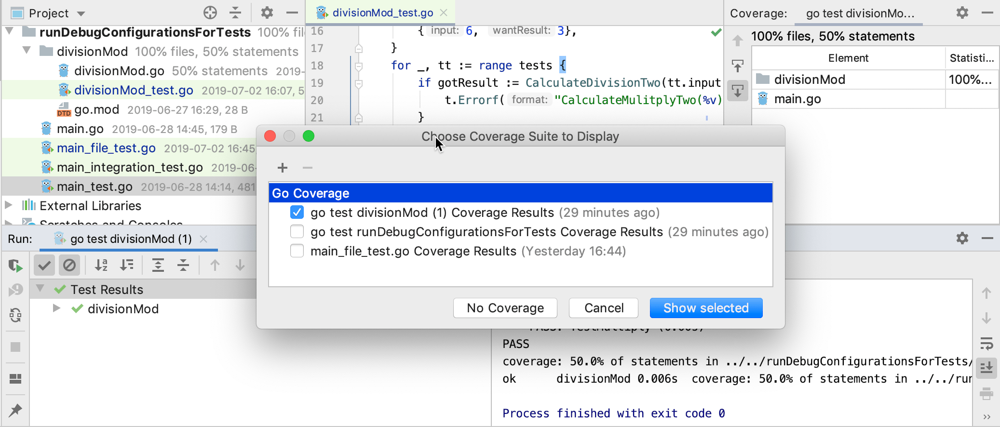

+++
title = "管理代码覆盖套件"
weight = 30
date = 2023-06-19T11:20:58+08:00
type = "docs"
description = ""
isCJKLanguage = true
draft = false

+++
# Managing code coverage suites 管理代码覆盖套件

https://www.jetbrains.com/help/go/switching-between-code-coverage-suites.html

Last modified: 21 April 2023

最后修改日期：2023年4月21日

GoLand provides a tool to select coverage suites for showing or hiding, adding, and removing suites.

​	GoLand提供了一个工具，用于选择要显示、隐藏、添加和删除覆盖套件。

### 选择覆盖套件 Select a coverage suite

The list of coverage suites becomes available after you run at least one test with [coverage](https://www.jetbrains.com/help/go/running-test-with-coverage.html).

​	只有在至少运行一个带有[覆盖率](https://www.jetbrains.com/help/go/running-test-with-coverage.html)的测试后，覆盖套件列表才会可用。 

1. From the main menu, select Run | Show Coverage Data (Ctrl+Alt+F6).
2. 从主菜单中选择“运行 | 显示覆盖率数据”（Ctrl+Alt+F6）。
3. Click Show selected. The dialog closes. In the editor, GoLand opens test coverage results for the selected test suites.
4. 单击“显示选定”。对话框关闭。在编辑器中，GoLand会为选定的测试套件打开测试覆盖结果。
5. To hide the coverage results, select the checkboxes next to the necessary classes and click No Coverage.
6. 要隐藏覆盖结果，请选择所需类旁边的复选框，然后单击“无覆盖”。

### 上传或删除覆盖套件 Upload or remove a coverage suite

Consider a situation when a file that contains code coverage information has been obtained from the build server. You can load this file from the disk and examine it in GoLand. Also, you can open the coverage data that has been generated by the IDE some time ago.

​	考虑以下情况：从构建服务器获取了包含代码覆盖信息的文件。您可以从磁盘加载此文件并在GoLand中查看它。此外，您还可以打开IDE之前生成的覆盖率数据。

1. From the main menu, select Run | Show Coverage Data (Ctrl+Alt+F6).

2. 从主菜单中选择“运行 | 显示覆盖率数据”（Ctrl+Alt+F6）。

3. 单击 and select the necessary **.ic** file in the dialog that opens.，然后在打开的对话框中选择所需的**.ic**文件。

   The files with coverage data generated by GoLand are saved to the **coverage** folder in the IDE [system directory](https://www.jetbrains.com/help/go/directories-used-by-the-ide-to-store-settings-caches-plugins-and-logs.html#system-directory) by default.

   由GoLand生成的覆盖率数据文件默认保存在IDE的[系统目录](https://www.jetbrains.com/help/go/directories-used-by-the-ide-to-store-settings-caches-plugins-and-logs.html#system-directory)的**coverage**文件夹中。

4. To remove a suite from the list and from the storage, select it in the list and click 要从列表和存储中删除套件，请在列表中选择它，然后单击.