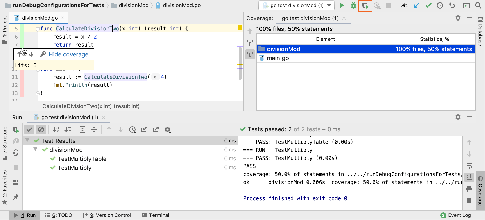

+++
title = "使用覆盖率运行"
weight = 20
date = 2023-06-19T11:20:58+08:00
type = "docs"
description = ""
isCJKLanguage = true
draft = false

+++
# Running with coverage 使用覆盖率运行

https://www.jetbrains.com/help/go/running-test-with-coverage.html

Last modified: 03 March 2023

最后修改日期：2023年3月3日

GoLand provides a dedicated action that allows you to run tests with code coverage measurement. The code coverage data is processed according to the option selected on the [Coverage](https://www.jetbrains.com/help/go/coverage-settings.html) page of the Settings dialog (Ctrl+Alt+S).

​	GoLand提供了一个专门的操作，允许您使用代码覆盖率测量来运行测试。代码覆盖率数据将根据设置对话框（Ctrl+Alt+S）中[覆盖率](https://www.jetbrains.com/help/go/coverage-settings.html)页面上选择的选项进行处理。

### 运行带有代码覆盖率的测试 Run a test with code coverage

1. Do one of the following:

2. 执行以下操作之一：

   - Open the desired file in the editor, and choose Run <name> with Coverage from the context menu. When running tests with coverage, note that you can run the entire test class, or each individual test method, depending on the caret location.
   - 在编辑器中打开所需的文件，然后从上下文菜单中选择“使用覆盖运行 <名称>”。在运行带有覆盖率的测试时，请注意可以根据插入符位置运行整个测试类或每个单独的测试方法。
   - Open the desired file in the Project tool window and choose Run <name> with Coverage from the context menu. You can also select a directory with test files and choose the corresponding command from the context menu to run several tests with coverage.
   - 在“项目”工具窗口中打开所需的文件，然后从上下文菜单中选择“使用覆盖运行 <名称>”。您还可以选择包含测试文件的目录，并选择相应的命令从上下文菜单中运行多个带有覆盖率的测试。
   - Select the desired run/debug configuration, and then from the main menu choose Run | Run <run/debug configuration name> with coverage.
   - 选择所需的运行/调试配置，然后从主菜单中选择“运行 | 使用覆盖运行 <运行/调试配置名称>”。
   - On the main toolbar, click the Run <run/debug configuration name> with Coverage button 在主工具栏中，单击“使用覆盖运行 <运行/调试配置名称>”按钮. This will launch the selected run/debug configuration.。这将启动所选的运行/调试配置。

3. If the Show options before applying coverage to the editor checkbox has been selected on the [Coverage](https://www.jetbrains.com/help/go/coverage-settings.html) page of the Settings dialog (Ctrl+Alt+S), a dialog appears where you can choose whether you want to replace the active coverage suites, add the collected data to the active suites, or not to apply coverage data. You can also opt to skip this dialog in the future.

4. 如果在设置对话框（Ctrl+Alt+S）的[覆盖率](https://www.jetbrains.com/help/go/coverage-settings.html)页面上选择了“在将覆盖应用于编辑器之前显示选项”复选框，将出现一个对话框，您可以在其中选择是否要替换活动覆盖套件、将收集的数据添加到活动覆盖套件中，或者不应用覆盖数据。您还可以选择以后跳过此对话框。

   In case any other option has been selected, the respective action will be performed silently.

   如果选择了其他选项，则将静默执行相应的操作。

5. [Explore the collected coverage data](https://www.jetbrains.com/help/go/switching-between-code-coverage-suites.html) in the [Coverage Tool Window](https://www.jetbrains.com/help/go/coverage-tool-window.html).

6. 在[覆盖工具窗口](https://www.jetbrains.com/help/go/coverage-tool-window.html)中[查看收集的覆盖率数据](https://www.jetbrains.com/help/go/switching-between-code-coverage-suites.html)。

