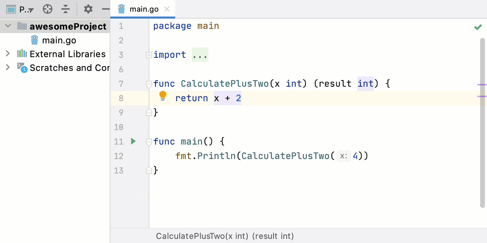
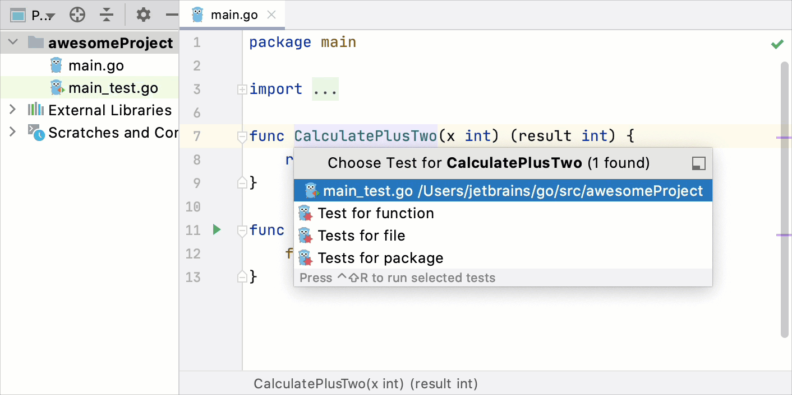

+++
title = "Create tests"
weight = 20
date = 2023-06-19T11:20:58+08:00
type = "docs"
description = ""
isCJKLanguage = true
draft = false
+++
# Create tests

https://www.jetbrains.com/help/go/create-tests.html

Last modified: 11 January 2023

The simplest way of creating a new test file in GoLand is by using a dedicated shortcut that you can invoke from your source code. In this case, the IDE creates a new test file and generates test code for this file, package, or function.

### Generate test files

1. In the code editor, navigate to Code | Generate or press Alt+Insert.

2. Select what kind of a test you want to generate and press Enter. You can create test files for the following scopes:

   - Empty test file
   - Test for function
   - Tests for file
   - Tests for package

   

## Navigate between tests and production code

In GoLand, you can jump between test classes and production code.

- In the editor, place the caret at the test class or at the test subject in the source code and press Ctrl+Shift+T (Navigate | Test Subject or Navigate | Test).

If there's only one test for this class, the IDE will navigate you to it right away. Otherwise, you will be prompted to select the necessary test from a popup or [create a new test](https://www.jetbrains.com/help/go/create-tests.html#create-test).

