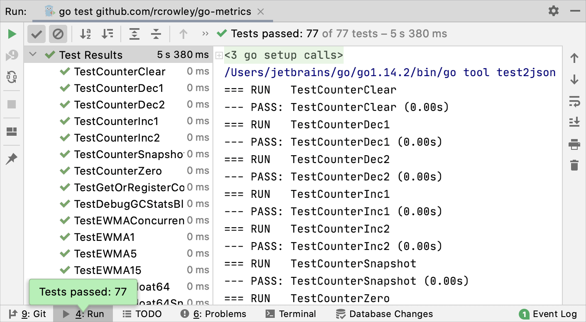
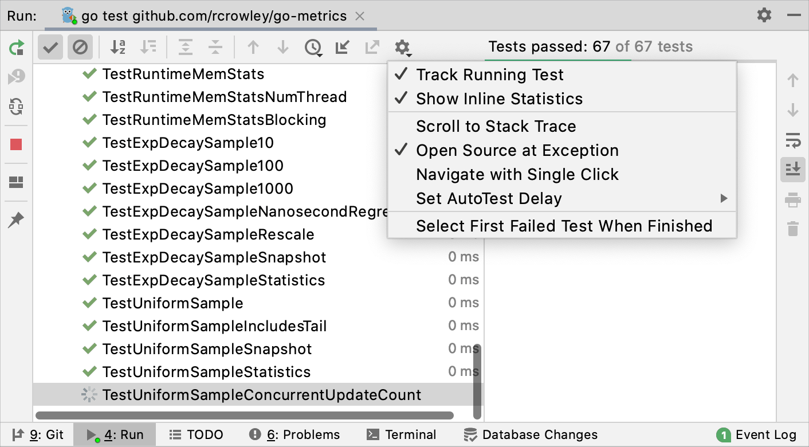
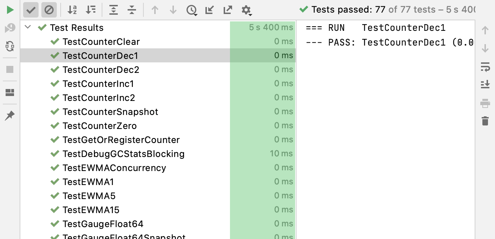
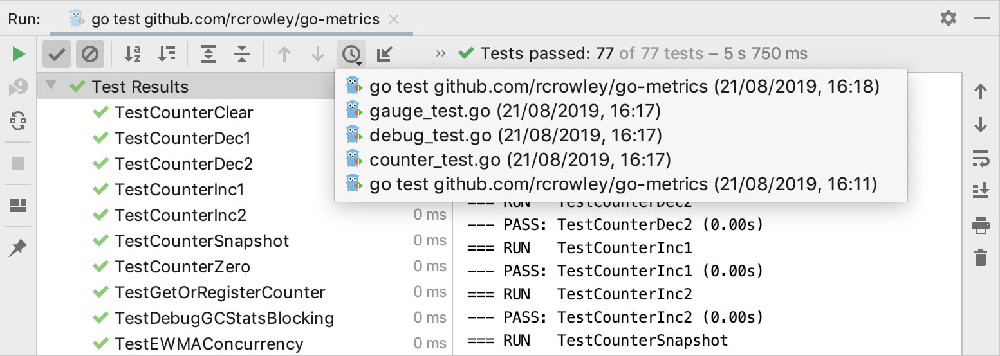
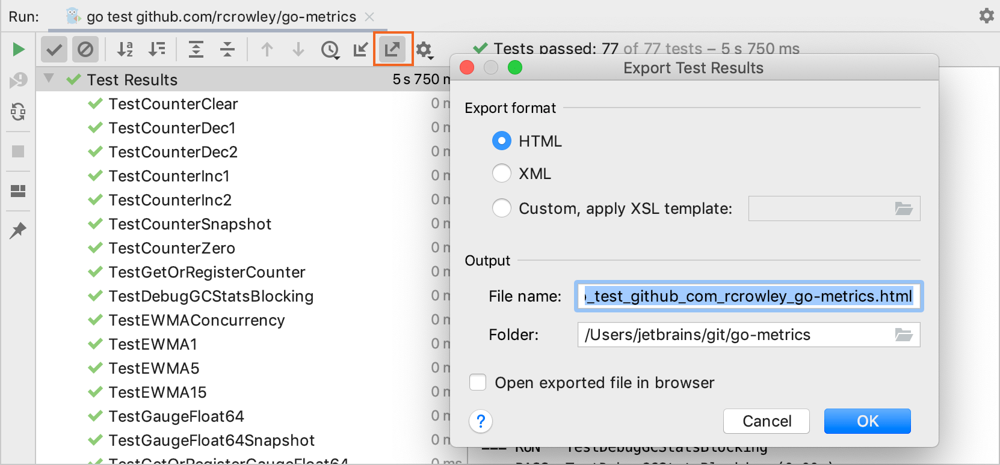

+++
title = "Explore test results"
weight = 40
date = 2023-06-19T11:20:58+08:00
type = "docs"
description = ""
isCJKLanguage = true
draft = false
+++
# Explore test results

https://www.jetbrains.com/help/go/viewing-and-exploring-test-results.html#import-test-results

Last modified: 24 April 2023

Open the Run tool window: View | Tool Windows | Run (Alt+4)

After GoLand finishes running your tests, it shows the results in the Run tool window on the Test Runner tab.

The console on the right shows the output of the current test session. It allows you to see the detailed information on the test execution and why your tests failed or were ignored.

The Test Runner toolbar located above the list of test results allows you to [show and hide](https://www.jetbrains.com/help/go/viewing-and-exploring-test-results.html#sort-test-results) successful and ignored tests, [display how much time](https://www.jetbrains.com/help/go/viewing-and-exploring-test-results.html#stats) it took to run each test, [export](https://www.jetbrains.com/help/go/viewing-and-exploring-test-results.html#export), [import](https://www.jetbrains.com/help/go/viewing-and-exploring-test-results.html#import-test-results), and [sort](https://www.jetbrains.com/help/go/viewing-and-exploring-test-results.html#sort-test-results) test results.

Next to each test on the Test Runner tab, the IDE displays an icon that marks the test status:

| Icon                                                         | Description                                                  |
| ------------------------------------------------------------ | ------------------------------------------------------------ |
|  | Test error. This status is assigned to tests that caused an exception from the tested source code. |
|  | Test failed. If at least one child test fails, all its parent tests are marked as failed. |
|  | Test ignored.                                                |
|  | Test in progress.                                            |
|  | Test passed successfully.                                    |
|  | Test terminated. This status is assigned to tests that were stopped.If at least one test receives this status, then all unfinished tests and their parent tests are marked as terminated. |

### Sort and filter test results

Use the following options on the Test Runner toolbar if you want to focus only on the failed tests or if you want to reorganize test results:

- Disable the  Show Passed option to hide successful tests.
- Disable the  Show Ignored option to hide ignored tests.
- Click  to sort test results alphabetically.
- Click  to sort test results by duration.

### Track test execution

In GoLand, you can monitor execution of the current test. If a test suite contains multiple tests, the list of tests expands to show test methods as they run one by one.

- To monitor test execution, click  on the Test Runner toolbar and enable the Track Running Test option.

  

### Manage test results

- Click  on the Test Runner toolbar and enable the following options:
  - [Track Running Test](https://www.jetbrains.com/help/go/viewing-and-exploring-test-results.html#track-test-execution): monitor execution of the current test.
  - [Show Inline Statistics](https://www.jetbrains.com/help/go/viewing-and-exploring-test-results.html#stats): view the execution time for tests.
  - Suites Always on Top: always place test nodes on top of the list when you apply sorting.
  - Scroll to Stack Trace: if a test produced a lot of output (for example, logging) before failing, this option automatically scrolls the output console to the assertion failure once you select the test on the Test Runner tab.
  - Navigate with Single Click: open the code for the selected test automatically in the editor.
  - Set Auto Test Delay: point to this node to reveal the list of available delays between file saving and rerunning tests. The selected value gets the check mark.
  - Select First Failed Test When Finished: automatically select the first failed test in the list upon completing the test session.

### View statistics

- To view the execution time for tests, click  on the Test Runner toolbar and enable the Show Inline Statistics option.

  

### Jump to test declaration

- Select the necessary test from the list on the Test Runner tab and press F4.

> To make navigation even faster, use the [Navigate with Single Click](https://www.jetbrains.com/help/go/viewing-and-exploring-test-results.html#manage-test-results) option.

### View results of previous tests

GoLand automatically saves results of the last 10 tests. To open the list of recent tests:

- Click the  icon on the Test Runner toolbar and select the necessary test from the list.

  For each test, the list displays the [run configuration](https://www.jetbrains.com/help/go/run-debug-configuration.html) name and a time stamp:

  

  You can also [export](https://www.jetbrains.com/help/go/viewing-and-exploring-test-results.html#export) test results to a file if you want to keep them or share with your team.

## Export and import test results

### Export test results to a file

1. Click  on the Test Runner toolbar.

2. Select the format in which you want to save the file:

   - HTML: generate an HTML file from a pre-defined template.
   - XML: use this format if you want to import this file later to GoLand.
   - Custom, apply XSL template: use your custom [XSL](https://www.w3schools.com/xml/xsl_intro.asp) template to generate an HTML file from the raw XML output. Click  next to this option and select the ***.xsl** code style definition file.

3. Specify the name of the output file and its location.

4. If you want to open the file in your browser after you export it, select the Open exported file in browser checkbox. Click OK.

   

### Import test results

1. To load a previously exported file, click  on the Test Runner toolbar.

   If you haven't run any tests yet, and the tool window with the Test Runner toolbar is not available, press Ctrl+Shift+A and type `Import Tests from File`.

2. In the dialog that opens, select the **.xml** file with test results and click Open.