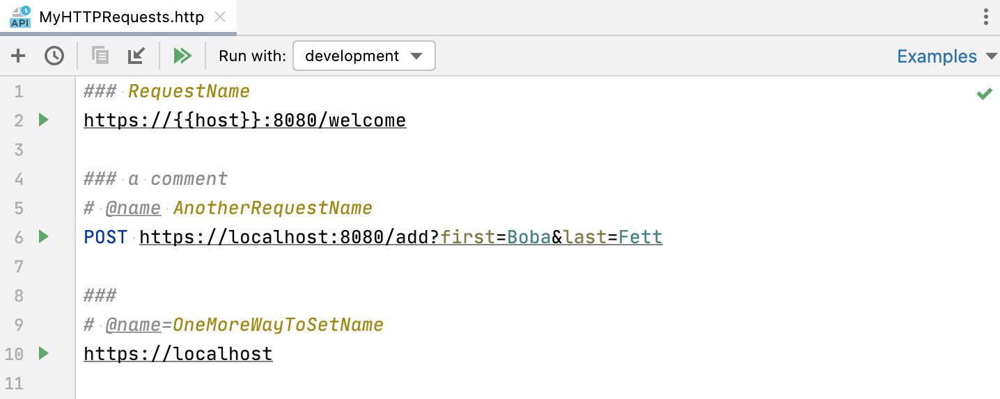
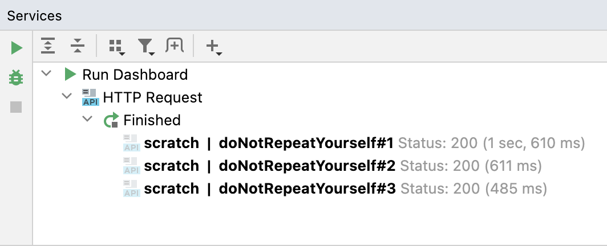
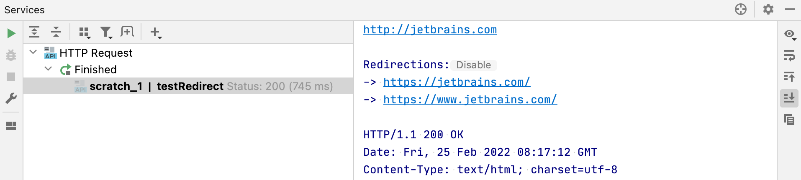
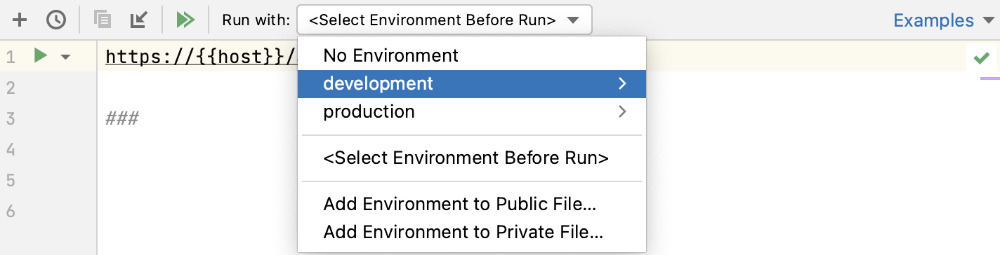
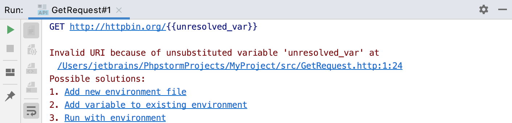
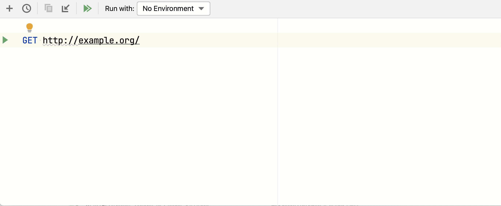

+++
title = "探索HTTP请求语法"
weight = 10
date = 2023-06-19T11:20:58+08:00
type = "docs"
description = ""
isCJKLanguage = true
draft = false

+++
# Exploring the HTTP request syntax - 探索HTTP请求语法

https://www.jetbrains.com/help/go/exploring-http-syntax.html#response-redirect

Last modified: 21 April 2023

上次修改日期：2023年4月21日

This section describes the HTTP request format. For details on sending HTTP requests and viewing HTTP responses, see [HTTP Client](https://www.jetbrains.com/help/go/http-client-in-product-code-editor.html).

​	本节介绍了HTTP请求的格式。有关发送HTTP请求和查看HTTP响应的详细信息，请参阅[HTTP Client](https://www.jetbrains.com/help/go/http-client-in-product-code-editor.html)。

To compose an HTTP request in the GoLand code editor, use the following general syntax:

​	要在GoLand代码编辑器中组合HTTP请求，请使用以下通用语法：

```http
Method Request-URI HTTP-Version
Header-field: Header-value

Request-Body
```


### 在HTTP请求中使用注释 Use comments in HTTP requests

- Within a request, start any line with `//` or `#` to make it a comment line.

- 在请求中，以`//`或`#`开头的任何行都视为注释行。

  ```shell
  // A basic request
  GET http://example.com/a/
  ```

  

### 为HTTP请求设置名称 Set names for HTTP requests

To quickly find your request in [run/debug configurations](https://www.jetbrains.com/help/go/http-client-in-product-code-editor.html#http-request-run-debug-configurations), [Search Everywhere](https://www.jetbrains.com/help/go/searching-everywhere.html), and [Run Anything](https://www.jetbrains.com/help/go/running-anything.html#send_http_requests), you can give it a name.

​	为了在[运行/调试配置](https://www.jetbrains.com/help/go/http-client-in-product-code-editor.html#http-request-run-debug-configurations)、[全局搜索](https://www.jetbrains.com/help/go/searching-everywhere.html)和[Run Anything](https://www.jetbrains.com/help/go/running-anything.html#send_http_requests)中快速找到您的请求，您可以给它一个名称。 

- Type a name above the request next to `###`, `# @name`, or `# @name =`.
- 在请求上方的`###`、`# @name`或`# @name =`旁边输入名称。



If a request does not have a name, GoLand will use its position in the request file, such as `#1`, as the request name. If a request file contains multiple requests with the same name, GoLand will append the request position number to each of the names. This will make each request name unique so that you can easily find the needed one in the Services tool window, run/debug configurations, and so on.

​	如果请求没有名称，GoLand将使用请求文件中的位置作为请求名称，例如`#1`。如果请求文件包含多个具有相同名称的请求，GoLand将在每个名称后附加请求位置号码。这样每个请求名称都是唯一的，您可以轻松找到所需的请求，无论是在“Services”工具窗口、运行/调试配置等位置。



### 使用简写形式的GET请求 Use short form for GET requests

- For GET requests, you can omit the request method and only specify the URI.

- 对于GET请求，可以省略请求方法，只需指定URI即可。

  ```shell
  // A basic request 一个基本的请求
  http://example.com/a/
  ```

  

### 在单个文件中组合多个请求 Compose several requests in a single file

1. Mark the end of a request by typing the `###` separator below it.

2. 使用`###`分隔符在请求下方标记请求的结束。

   ```shell
   // A basic request 一个基本的请求
   http://example.com/a/
   
   ###
   ```

   

3. Compose another request below the separator.

4. 在分隔符下方组合另一个请求。

   ```shell
   // A basic request 一个基本的请求
   http://example.com/a/
   
   ###
   
   // A second request using the GET method 使用GET方法的第二个请求
   http://example.com:8080/api/html/get?id=123&value=content
   ```

   


### 将长请求拆分为多行 Break long requests into several lines

- Indent all query string lines but the first one.

- 缩进查询字符串的所有行，除了第一行。

  ```http
  // Using line breaks with indent 使用换行和缩进
  GET http://example.com:8080
      /api
      /html
      /get
      ?id=123
      &value=content
  ```

  

  > The indent size for the URL parts is configured in Settings | Editor | Code Style | HTTP Request | Tabs and Indents | URL parts indent.
  >
  > ​	URL部分的缩进大小在“设置” | “编辑器” | “代码样式” | “HTTP请求” | “制表符和缩进” | “URL部分缩进”中配置。
  
- If the URL is too long because of the query string, you can use the dedicated context action to put each query parameter on a new line. Place the caret on the query string part, press Alt+Enter, and select Put query parameters on separate lines.

- 如果由于查询字符串而导致URL过长，可以使用专用的上下文操作将每个查询参数放在新行中。将光标放在查询字符串部分上，按Alt+Enter，然后选择“将查询参数放在单独的行上”。

  #### Before 之前

  ```http
  GET http://example.com:8080/api/get/html?firstname=John&lastname=Doe&planet=Tatooine&town=Freetown
  ```

  

  #### After 之后

  ```http
  GET http://example.com:8080/api/get/html?
      firstname=John&
      lastname=Doe&
      planet=Tatooine&
      town=Freetown
  ```

  

  > You can enforce the consistent wrapping of query parameters using the HTTP Client code style in Settings | Editor | Code Style | HTTP Request | Wrapping and Braces | Query parameters wrap.
  >
  > ​	您可以使用“设置” | “编辑器” | “代码样式” | “HTTP请求” | “换行和括号” | “查询参数换行”中的HTTP客户端代码样式来强制进行一致的查询参数换行。

### 访问带有身份验证的Web服务 Access a web service with authentication

- Depending on the web service you are accessing, provide the [basic](https://en.wikipedia.org/wiki/Basic_access_authentication) or [digest](https://en.wikipedia.org/wiki/Digest_access_authentication) Authorization header.

- 根据您访问的Web服务，提供[基本](https://en.wikipedia.org/wiki/Basic_access_authentication)或[摘要](https://en.wikipedia.org/wiki/Digest_access_authentication)身份验证头。

  ```http
  // Basic authentication 基本身份验证
  GET http://example.com
  Authorization: Basic username password
  
  ###
  
  // Digest authentication 摘要身份验证
  GET http://example.com
  Authorization: Digest username password
  ```

  


> Similarly to other HTTP request elements, the provided `username` and `password` can be parameterized by means of [environment variables](https://www.jetbrains.com/help/go/exploring-http-syntax.html#using_request_vars).
>
> ​	与其他HTTP请求元素类似，提供的`用户名`和`密码`可以通过[环境变量](https://www.jetbrains.com/help/go/exploring-http-syntax.html#using_request_vars)进行参数化。

### 提供请求消息体 Provide the request message body

Inside the request, prepend the request body with a blank line and do one of the following:

​	在请求中，在请求体之前添加一个空行，并执行以下操作之一：

- Type the request body in place:

- 在原地键入请求体：

  ```shell
  // The request body is provided in place 在原地提供请求体
  POST http://example.com:8080/api/html/post HTTP/1.1
  Content-Type: application/json
  Cookie: key=first-value
  
  { "key" : "value", "list": [1, 2, 3] }
  ```

  

  If you set the Content-Type header field value to one of the languages supported by GoLand, then the corresponding language fragment will be [auto-injected](https://www.jetbrains.com/help/go/using-language-injections.html) into the HTTP request message body. If Content-Type is not specified, you can inject a language fragment manually.

  如果将Content-Type头字段值设置为GoLand支持的语言之一，则对应的语言片段将自动注入到HTTP请求消息体中。如果未指定Content-Type，可以手动注入语言片段。

- To read the request body from a file, type the `<` symbol followed by the path to the file.

- 要从文件中读取请求体，请键入`<`符号，然后输入文件的路径。

  ```shell
  // The request body is read from a file 从文件中读取请求体
  POST http://example.com:8080/api/html/post
  Content-Type: application/json
  
  < ./input.json
  ```

  
  

### 使用multipart/form-data内容类型 Use multipart/form-data content type

- Set the request's Content-Type to multipart/form-data. To send a file as part of the multipart/form-data message, include the `filename` parameter in the Content-Disposition header.

- 将请求的Content-Type设置为multipart/form-data。要将文件作为multipart/form-data消息的一部分发送，请在Content-Disposition头中包含`filename`参数。

  ```shell
  POST http://example.com/api/upload HTTP/1.1
  Content-Type: multipart/form-data; boundary=boundary
  
  --boundary
  Content-Disposition: form-data; name="first"; filename="input.txt"
  
  // The 'input.txt' file will be uploaded 将上传'input.txt'文件
  < ./input.txt
  
  --boundary
  Content-Disposition: form-data; name="second"; filename="input-second.txt"
  
  // A temporary 'input-second.txt' file with the 'Text' content will be created and uploaded 将创建临时的具有“Text”内容的'input-second.txt'文件并上传
  Text
  Text
  --boundary
  Content-Disposition: form-data; name="third";
  
  // The 'input.txt' file contents will be sent as plain text. 以纯文本形式发送'input.txt'文件内容。
  < ./input.txt --boundary--
  ```
  
  
  
  > To speed up creating a multipart/form-data request, use the mptr [live template](https://www.jetbrains.com/help/go/using-live-templates.html).
  >
  > ​	要加速创建multipart/form-data请求，可以使用mptr [代码模板](https://www.jetbrains.com/help/go/using-live-templates.html)。

### 禁用重定向跟随 Disable following redirects

When an HTTP request is redirected (a 3xx status code is received), the redirected page response is returned. In the Services tool window, you can view the redirected page response as well as all redirections that happened during the request.

​	当HTTP请求重定向（收到3xx状态码）时，将返回重定向的页面响应。在服务工具窗口中，您可以查看重定向的页面响应以及请求期间发生的所有重定向。

You may want to disable following redirects. In this case, the actual redirect response header (such as 301 or 302) is returned.

​	您可能想要禁用重定向跟随。在这种情况下，将返回实际的重定向响应头（例如301或302）。

- Before the request, add a comment line with the `@no-redirect` tag.

- 在请求之前，添加一个以`@no-redirect`标签开头的注释行。

  ```shell
  // @no-redirect
  example.com/status/301
  ```

  

If you already have a redirected request, you can click Disable next to the `Redirections` list in the Services tool window. This will add the `@no-redirect` tag to the initial request.

​	如果已经有一个重定向的请求，可以在服务工具窗口的“重定向”列表旁边点击“禁用”。这将向初始请求添加`@no-redirect`标签。



### 禁用将请求保存到请求历史记录 Disable saving requests to requests history

If necessary, you can prevent saving a request to the [requests history](https://www.jetbrains.com/help/go/http-client-in-product-code-editor.html#requests_history). This can be helpful in case a request contains some sensitive data, and you don't want to log it.

​	如果需要，您可以阻止将请求保存到[请求历史记录](https://www.jetbrains.com/help/go/http-client-in-product-code-editor.html#requests_history)。这在请求中包含某些敏感数据并且不想记录它时非常有用。

- Before the request, add a comment line with the `@no-log` tag.

- 在请求之前，添加一个以`@no-log`标签开头的注释行。

  ```http
  // @no-log
  GET example.com/api
  ```

  

### 禁用将接收到的Cookie保存到Cookie jar Disable saving received cookies to the cookies jar

If necessary, you can prevent saving the received cookie [to the cookies jar](https://www.jetbrains.com/help/go/http-client-in-product-code-editor.html#manage_cookies). This way you will avoid removing the unwanted cookies from the **http-client.cookies** file manually.

​	如果需要，可以阻止将接收到的Cookie保存到[Cookie jar](https://www.jetbrains.com/help/go/http-client-in-product-code-editor.html#manage_cookies)。这样，您就可以避免手动从**http-client.cookies**文件中删除不需要的Cookie。

- Before the request, add a comment line with the `@no-cookie-jar` tag.

- 在请求之前，添加一个以`@no-cookie-jar`标签开头的注释行。

  ```http
  // @no-cookie-jar
  GET example.com/api
  ```

  

## 使用变量 Use variables

When composing an HTTP request, you can parametrize its elements by using variables. A variable can hold the values for the request's host, port, and path, query parameter or value, header value, or arbitrary values used inside the request body or in an external file.

​	在组成HTTP请求时，您可以使用变量来参数化其元素。变量可以保存请求的主机、端口和路径、查询参数或值、标头值或请求体内部或外部文件中使用的任意值。

### 在请求中提供变量 Provide a variable inside the request

- Enclose the variable in double curly braces as `{{variable}}`.
- 将变量括在双花括号中，例如`{{variable}}`。

The variable's name may only contain letters, digits, the underscore symbols `_`, or the hyphen symbols `-`. The variables' values can be any of the following:

​	变量的名称只能包含字母、数字、下划线符号 `_` 或连字符 `-`。变量的值可以是以下任意一种形式： 

- Provided explicitly per environment by means of the [environment variables](https://www.jetbrains.com/help/go/exploring-http-syntax.html#environment-variables)
- Generated dynamically by means of the predefined [dynamic variables](https://www.jetbrains.com/help/go/exploring-http-syntax.html#dynamic-variables)
- Defined programmatically in [response handler scripts](https://www.jetbrains.com/help/go/http-client-in-product-code-editor.html#using-response-handler-scripts) by means of the `client.global.set` method or [right before the request](https://www.jetbrains.com/help/go/exploring-http-syntax.html#per_request_variables) by means of the `request.variables.set` method.
- 通过[环境变量](https://www.jetbrains.com/help/go/exploring-http-syntax.html#environment-variables)在每个环境中明确提供。
- 通过预定义的[动态变量](https://www.jetbrains.com/help/go/exploring-http-syntax.html#dynamic-variables)在运行时生成。
- 通过在[响应处理器脚本](https://www.jetbrains.com/help/go/http-client-in-product-code-editor.html#using-response-handler-scripts)中使用`client.global.set`方法或在请求之前使用`request.variables.set`方法进行编程定义。

### 环境变量 Environment variables

Environment variables let you store a set of environment definitions inside your project. For example, instead of providing a hostname in your request explicitly, you can create the `{{host}}` variable in different environments: a local hostname in the development environment and a public hostname in the production environment. You can then use the Run with list on the top of the current .http file editor to select an environment:

​	环境变量允许您在项目中存储一组环境定义。例如，您可以在不同的环境中创建`{{host}}`变量，而不是在请求中显式提供主机名：在开发环境中使用本地主机名，在生产环境中使用公共主机名。然后，您可以使用当前`.http`文件编辑器顶部的“以...运行”列表选择一个环境：

 

- No Environment: if this option is selected, no environment will be used when you run requests in the current file. Select it if your request does not contain any variables.
- 没有环境：如果选择了此选项，运行当前文件中的请求时将不使用任何环境。如果您的请求不包含任何变量，请选择此选项。
- Environment name (such as production or development): the selected environment will be used for all requests in the current file, and you won't need to select it when you click 环境名称（如production或development）：选择的环境将用于当前文件中的所有请求，当您点击. This can be helpful if you want to run multiple requests with the same environment and don't want to select it each time you run a request.时，无需选择它。如果您想要使用相同的环境运行多个请求，并且不想每次运行请求时都选择它，这将非常有用。
- `<Select Environment Before Run>`: with this option selected, you'll have to choose an environment each time you click <在运行前选择环境>：选择此选项后，每次点击. This can be convenient if you often switch environments and want to explicitly select them for each run to make sure you execute requests with the needed environments.时，您都必须选择一个环境。如果您经常切换环境并希望为每次运行明确选择环境以确保使用所需的环境执行请求，这将非常方便。



The selected environment will be used as the default one when [Viewing a structure](https://www.jetbrains.com/help/go/viewing-structure-of-a-source-file.html) of the request, [opening the request in the browser](https://www.jetbrains.com/help/go/http-client-in-product-code-editor.html#open_in_browser), [executing the request](https://www.jetbrains.com/help/go/http-client-in-product-code-editor.html#execute_request_procedure), and [creating a run/debug configuration](https://www.jetbrains.com/help/go/http-client-in-product-code-editor.html#http-request-run-debug-configurations) for it.

​	所选环境将用作在[查看结构](https://www.jetbrains.com/help/go/viewing-structure-of-a-source-file.html)请求、[在浏览器中打开请求](https://www.jetbrains.com/help/go/http-client-in-product-code-editor.html#open_in_browser)、[执行请求](https://www.jetbrains.com/help/go/http-client-in-product-code-editor.html#execute_request_procedure)和[创建运行/调试配置](https://www.jetbrains.com/help/go/http-client-in-product-code-editor.html#http-request-run-debug-configurations)时的默认环境。

### 定义环境变量 Define environment variables

Environment variables are defined in the environment files.

​	环境变量是在环境文件中定义的。

1. On top of the request's editor panel, in the Run with list, select where you want to add an environment:

2. 在请求的编辑器面板顶部的“以...运行”列表中，选择要添加环境的位置：

   - Select Add Environment to Public File… if you want the environment to be public. This will add the environment to the **http-client.env.json** file. This file can contain common variables such as host name, port, or query parameters, and is meant to be distributed together with your project.
   - 如果要创建公共环境，请选择“添加到公共文件...”。这将把环境添加到**http-client.env.json**文件中。该文件可以包含诸如主机名、端口或查询参数之类的公共变量，并且应与项目一起分发。
   - Select Add Environment to Private File… if you want the environment to be private. This will add the environment to the **http-client.private.env.json** file. This file might include passwords, tokens, certificates, and other sensitive information. The values of variables that are specified in the **http-client.private.env.json** file override the values in the public environment file.
   - 如果要创建私有环境，请选择“添加到私有文件...”。这将把环境添加到**http-client.private.env.json**文件中。该文件可能包括密码、令牌、证书和其他敏感信息。在**http-client.private.env.json**文件中指定的变量值将覆盖公共环境文件中的值。

   > If necessary, you can create these files manually.
   >
   > 如果需要，您可以手动创建这些文件。

3. Populate the created files with the desired variables.

4. 使用所需的变量填充创建的文件。

   The following sample **http-client.env.json** environment file defines two environments: development and production. The additional **http-client.private.env.json** file holds the sensitive authorization data.

   下面是一个示例**http-client.env.json**环境文件，定义了两个环境：development和production。额外的**http-client.private.env.json**文件包含敏感的授权数据。

   

   

   ```json
   {
       "development": {
           "host": "localhost",
           "id-value": 12345,
           "username": "",
           "password": "",
           "my-var": "my-dev-value"
       },
   
       "production": {
           "host": "example.com",
           "id-value": 6789,
           "username": "",
           "password": "",
           "my-var": "my-prod-value"
       }
   }
   ```

   

   

   ```json
   {
       "development": {
           "username": "dev-user",
           "password": "dev-password"
       },
   
       "production": {
           "username": "user",
           "password": "password"
       }
   }
   ```

   

   

   

   The example HTTP request is as follows:

   示例HTTP请求如下：

   ```http
   GET http://{{host}}/api/json/get?id={{id-value}}
   Authorization: Basic {{username}} {{password}}
   Content-Type: application/json
   
   {
       "key": "{{my-var}}"
   }
   ```

   

   Before you execute the request, GoLand lets you choose an execution environment using the Run with list on top of the request's editor panel.

   ​	在执行请求之前，GoLand允许您使用请求的编辑器面板顶部的“以...运行”列表选择执行环境。

   Depending on your choice, the resulting request will be one of the following:

   ​	根据您的选择，生成的请求将是以下之一：

   

   

   ```http
   GET http://localhost/api/json/get?id=12345
   Authorization: Basic dev-user dev-password
   Content-Type: application/json
   
   {
       "key": "my-dev-value"
   }
   ```

   

   

   ```http
   GET http://example.com/api/json/get?id=6789
   Authorization: Basic user password
   Content-Type: application/json
   
   {
       "key": "my-prod-value"
   }
   ```

   

   

If a variable is unresolved when executing a request, GoLand displays a notification letting you quickly create, update, or choose a different execution environment.

​	如果在执行请求时存在未解析的变量，GoLand将显示通知，以便您可以快速创建、更新或选择其他执行环境。




> If you use Git in IDEA, the **http-client.private.env.json** file is not tracked by Git. However, it is not added to the **.gitignore** file. If you commit your changes using third-party tools or via a terminal, you may need to manually add **http-client.private.env.json** to **.gitignore** to avoid sharing confidential information: Right-click the file and select Git | Add to .gitignore.
>
> ​	如果在IDEA中使用Git，**http-client.private.env.json**文件不会被Git跟踪。但是，它也不会添加到**.gitignore**文件中。如果您使用第三方工具或终端提交更改，您可能需要手动将**http-client.private.env.json**添加到**.gitignore**中，以避免共享机密信息：右键单击文件，选择Git | 添加到 .gitignore。

### 每请求变量 Per-request variables

You can use the `request.variables.set(variableName, variableValue)` method to set values of variables used in HTTP requests. Write it in a pre-request script wrapped in `` above your HTTP request. For example:

​	您可以使用`request.variables.set(variableName, variableValue)`方法设置在HTTP请求中使用的变量的值。将其编写在HTTP请求之前的预请求脚本中，脚本需要用``包装起来。例如：

```http
< 
GET http://example.org/{{firstname}}
```


Variables defined in a pre-request script are available only within a single request that follows the script.

​	预请求脚本中定义的变量仅在该脚本后的单个请求中可用。

To quickly insert the variable, use the Initialize variable context action:

​	要快速插入变量，可以使用“初始化变量”上下文操作：



In pre-request scripts, you can also use [HTTP Client Crypto API](https://www.jetbrains.com/help/go/http-client-crypto-api-reference.html) to generate HTTP signatures based on cryptographic hash functions, such as SHA-1, SHA-256, SHA-512, MD5, and pass them as variable to your requests. For example:

​	在预请求脚本中，您还可以使用[HTTP客户端加密API](https://www.jetbrains.com/help/go/http-client-crypto-api-reference.html)基于加密哈希函数（如SHA-1、SHA-256、SHA-512、MD5）生成HTTP签名，并将其作为变量传递给请求。例如：

```http
< 
POST https://httpbin.org/post
X-My-Signature: {{signature}}
X-My-Hash: {{hash}}
Content-Type: application/json
```


### 动态变量 Dynamic variables

Dynamic variables generate a value each time you run a request. Their names start with `$`:

​	动态变量在每次运行请求时生成一个值。它们的名称以`$`开头： 

- `$uuid` or `$random.uuid`: generates a universally unique identifier (UUID-v4)
- `$uuid`或`$random.uuid`：生成一个通用唯一标识符（UUID-v4）。
- `$timestamp`: generates the current UNIX timestamp
- `$timestamp`：生成当前的UNIX时间戳。
- `$isoTimestamp`: generates the current timestamp in ISO-8601 format for the UTC timezone.
- `$isoTimestamp`：生成ISO-8601格式的当前时间戳，用于UTC时区。
- `$randomInt`: generates a random integer between 0 and 1000.
- `$randomInt`：生成0到1000之间的随机整数。
- `$random.integer(from, to)`: generates a random integer between `from` (inclusive) and `to` (exclusive), for example random.integer(100, 500). If you provide no parameters, it generates a random integer between 0 and 1000.
- `$random.integer(from, to)`：生成`from`（包含）和`to`（不包含）之间的随机整数，例如`random.integer(100, 500)`。如果不提供参数，它将生成0到1000之间的随机整数。
- `$random.float(from, to)`: generates a random floating point number between `from` (inclusive) and `to` (exclusive), for example random.float(10.5, 20.3). If you provide no parameters, it generates a random float between 0 and 1000.
- `$random.float(from, to)`：生成`from`（包含）和`to`（不包含）之间的随机浮点数，例如`random.float(10.5, 20.3)`。如果不提供参数，它将生成0到1000之间的随机浮点数。
- `$random.alphabetic(length)`: generates a sequence of uppercase and lowercase letters of length `length` (must be greater than 0).
- `$random.alphabetic(length)`：生成长度为`length`（必须大于0）的大写和小写字母序列。
- `$random.alphanumeric(length)`: generates a sequence of uppercase and lowercase letters, digits, and underscores of length `length` (must be greater than 0).
- `$random.alphanumeric(length)`：生成长度为`length`（必须大于0）的大写和小写字母、数字和下划线序列。
- `$random.hexadecimal(length)`: generates a random hexadecimal string of length `length` (must be greater than 0).
- `$random.hexadecimal(length)`：生成长度为`length`（必须大于0）的随机十六进制字符串。
- `$random.email`: generates a random email address.
- `$random.email`：生成一个随机的电子邮件地址。
- `$exampleServer`: is replaced with the GoLand built-in web server, which can be accessed using HTTP Client only. The variable is used in GraphQL and WebSocket [examples](https://www.jetbrains.com/help/go/http-client-in-product-code-editor.html#open-requests-collection).
- `$exampleServer`：被GoLand内置的Web服务器替代，只能通过HTTP Client访问。该变量在GraphQL和WebSocket的示例中使用。

For example:

例如：

```http
GET http://localhost/api/get?id={{$uuid}}
```


## 处理响应 Handle the response

You can handle the response using JavaScript. Type the `>` character after the request and specify the path and name of the JavaScript file or put the response handler script code wrapped in ``.

​	您可以使用JavaScript处理响应。在请求后面键入`>`字符，然后指定JavaScript文件的路径和名称，或者将响应处理程序脚本代码放在``中。

```http
GET https://httpbin.org/get

> /path/to/responseHandler.js
```


```http
GET https://httpbin.org/get

> 
```


For more information, see [HTTP Response handling API reference](https://www.jetbrains.com/help/go/http-response-handling-api-reference.html).

​	有关更多信息，请参阅[HTTP响应处理API参考](https://www.jetbrains.com/help/go/http-response-handling-api-reference.html)。

## 重定向响应 Redirect the response

You can redirect a response to a file. Use `>>` to create a new file with a suffix if it already exists and `>>!` to rewrite the file if it exists. You can specify an absolute path or relative to the current HTTP Request file. You can also use variables in paths, including environment variables and the following predefined variables:

​	您可以将响应重定向到文件中。使用`>>`创建一个新文件（如果已存在则添加后缀），使用`>>!`覆盖现有文件。您可以指定绝对路径或相对于当前HTTP请求文件的路径。您还可以在路径中使用变量，包括环境变量和以下预定义变量： 

- `{{$projectRoot}}` points to the project root directory
- `{{$historyFolder}}` points to **.idea/httpRequests/**
- `{{$projectRoot}}`：指向项目根目录
- `{{$historyFolder}}`：指向**.idea/httpRequests/**目录

The following example HTTP request creates **myFile.json** in **myFolder** next to the HTTP Request file and redirects the response to it. If the file already exists, it creates **myFile-1.json**.

以下示例HTTP请求在HTTP请求文件旁边的**myFolder**中创建**myFile.json**文件，并将响应重定向到该文件。如果文件已存在，则创建**myFile-1.json**。

```http
POST https://httpbin.org/post
Content-Type: application/json

{
  "id": 999,
  "value": "content"
}

>> myFolder/myFile.json
```


The following example HTTP request creates **myFile.json** in **.idea/httpRequests/**. If the file already exists, it overwrites the file. It also [handles the response](https://www.jetbrains.com/help/go/exploring-http-syntax.html#response-handling) with the **handler.js** script that resides in the project root.

​	以下示例HTTP请求在**.idea/httpRequests/**目录中创建**myFile.json**文件。如果文件已存在，则覆盖该文件。它还使用位于项目根目录的**handler.js**脚本来[处理响应](https://www.jetbrains.com/help/go/exploring-http-syntax.html#response-handling)。

```http
POST https://httpbin.org/post
Content-Type: application/json

{
  "id": 999,
  "value": "content"
}

> {{$projectRoot}}/handler.js

>>! {{$historyFolder}}/myFile.json
```


> For Windows, specify paths with the backslash `\`.
>
> ​	对于Windows，请使用反斜杠`\`指定路径。