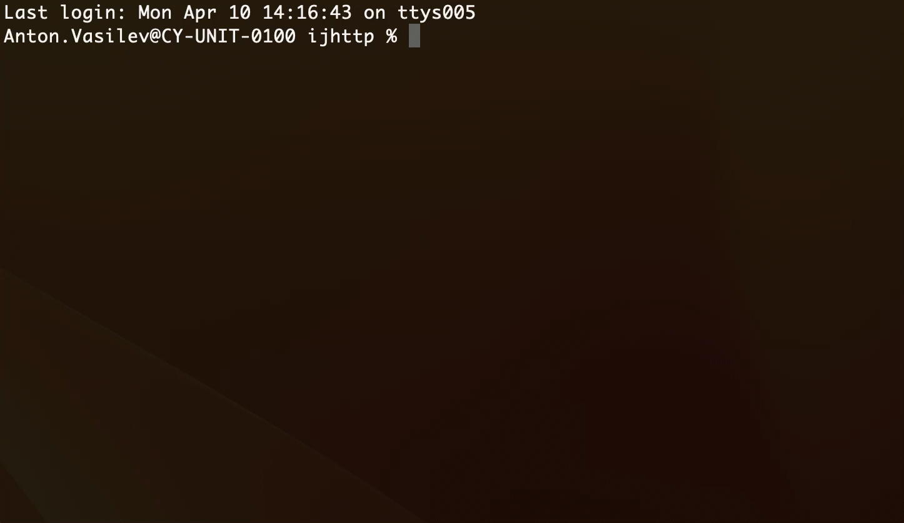

+++
title = "HTTP Client CLI"
weight = 30
date = 2023-06-19T11:20:58+08:00
type = "docs"
description = ""
isCJKLanguage = true
draft = false
+++
# HTTP Client CLI

https://www.jetbrains.com/help/go/http-client-cli.html#test-requests

Last modified: 21 April 2023

In addition to the GoLand plugin, the HTTP Client is also available as a CLI tool. It allows you to run HTTP requests from a terminal, without the IDE, or include HTTP request testing in your CI workflow.


### Install HTTP Client CLI

You can get the HTTP Client CLI as a [Docker image](https://hub.docker.com/r/jetbrains/intellij-http-client) or as a ZIP archive.

- To get the HTTP Client CLI as a Docker image, pull the image:

  `docker pull jetbrains/intellij-http-client`

- To get a ZIP archive, use cURL:

  `curl -f -L -o ijhttp.zip "https://jb.gg/ijhttp/latest"`

  > ### 
  >
  > 
  >
  > The ZIP distribution requires JDK 17 to be installed.

When the HTTP Client CLI is downloaded, you can run `./ijhttp` to get the list of available arguments. Run `./ijhttp --version` to check the version of the HTTP Client CLI.

### Run HTTP request

1. [Create an .http request file](https://www.jetbrains.com/help/go/http-client-in-product-code-editor.html#composing-http-requests). Your file can contain multiple HTTP requests if you want to run all of them at once.

   > ### 
   >
   > 
   >
   > Support for gRPC, WebSocket, and GraphQL requests will be added to HTTP Client CLI version 2023.2.

2. Run HTTP Client CLI:

   

   On host machine

   In Docker

   

   

   Pass the file name to the `./ijhttp` command, for example:

   `./ijhttp myrequest.http`

The command output contains information about the requests that have been sent, test statuses, and [environment variables](https://www.jetbrains.com/help/go/http-client-cli.html#environment-variables).



### Change log level

By default, the HTTP Client CLI outputs only the information about the requests that have been sent and the environment variables. You can change the log level by using the `-L` option.

- Use `-L HEADERS` to log information on the request and response headers.
- Or use `-L VERBOSE` to log information on the request and response headers and body.

### Save response to file

- If you want to save an HTTP response to a separate file, add `>>` or `>>!` in your `.http` file (see also [Redirect the response](https://www.jetbrains.com/help/go/exploring-http-syntax.html#response-redirect)). For example:

  ```none
  GET https://example.org/get
  
  >> myFolder/myFile.json
  ```

  

- If you want to save output from HTTP Client CLI, use standard terminal commands, such as `>`. For example:

  `./ijhttp rest-api.http > yourFile.txt`

  The level of detail in the saved HTTP Client CLI output depends on the specified [log level](https://www.jetbrains.com/help/go/http-client-cli.html#change-log-level).

### Resolve localhost in Docker

If you have a server running on your host machine, and you run HTTP requests in the Docker container, you may need to resolve `localhost` to the localhost of your host machine.

- Use the `-D` option, for example:

  `docker run --rm -i -t -v $PWD:/workdir jetbrains/intellij-http-client -D run.http`

  > ### 
  >
  > 
  >
  > If you use Docker-for-Linux 20.10.0+, you should also add the `--add-host host.docker.internal:host-gateway` option to the command:
  >
  > ```none
  > docker run --rm -i -t -v $PWD:/workdir --add-host host.docker.internal:host-gateway jetbrains/intellij-http-client -D run.http
  > ```
  >
  > 

This way, requests intended for `localhost` will be sent to the localhost of your host machine.

## Environment variables

Just like in the GoLand HTTP Client, you can use [environment variables](https://www.jetbrains.com/help/go/exploring-http-syntax.html#using_request_vars) in your HTTP requests. You use variables from HTTP environment files, or you can pass variable values directly in the CLI command.

### Use public environment variables

- Use the `--env-file` option to specify a path to the variable file and `--env` to specify the name of an environment. For example:

  `./ijhttp --env-file http-client.env.json --env dev rest-api.http`

- Alternatively, pass the variable value in the `-V` option. If you want to pass multiple variables, repeat the `-V` option:

  `ijhttp -V host=localhost:8080 -V planet=tatooine rest-api.http`

You can combine both options:

```
./ijhttp --env-file http-client.env.json --env dev -V host=localhost:8080 rest-api.http
```

### Use private environment variables

- Use the `--private-env-file` option to specify a path to the variable file and `--env` to specify the name of an environment. For example:

  `./ijhttp --private-env-file http-client.private.env.json --env dev rest-api.http`

- You can also pass the variable value in the `-P` option. If you want to pass multiple variables, repeat the `-P` option:

  `ijhttp -P password=mypassword123 -P user=johndoe rest-api.http`

You can combine both options:

```
./ijhttp --private-env-file http-client.private.env.json --env dev -P password=mypassword123 rest-api.http
```

## Test requests

Just like in the HTTP Client plugin, your `.http` file may contain a [response handler script](https://www.jetbrains.com/help/go/exploring-http-syntax.html#response-handling) written in JavaScript ES6. You can use it to test HTTP requests with the [client.assert](https://www.jetbrains.com/help/go/http-client-reference.html) method.

### Use response handler script

- In your `.http` file, skip one line from the request and write your response handler script enclosed in `> `. For example:

  ```javascript
  GET https://httpbin.org/get
  
  > 
  ```

  

  > ### 
  >
  > 
  >
  > Use GoLand to get syntax highlighting and completion for the response handler script.

You can also include a test from a separate file. The path to the file can be either absolute or relative to your `.http` file:

```none
GET https://httpbin.org/get

> /path/to/responseHandler.js
```


### Save test report in JUnit XML format

The HTTP Client can provide output in the JUnit XML format.

- Add the `--report` argument to the `ijhttp` command, for example:

  `./ijhttp test.http --report`

The HTTP Client CLI saves the report in the **report.xml** file under the **reports** directory.