+++
title = "HTTP 客户端"
weight = 50
date = 2023-06-19T11:20:58+08:00
type = "docs"
description = ""
isCJKLanguage = true
draft = false

+++
# HTTP Client - HTTP 客户端

https://www.jetbrains.com/help/go/http-client-in-product-code-editor.html

Last modified: 03 May 2023

最后修改日期：2023年5月3日

With the HTTP Client plugin, you can create, edit, and execute HTTP requests directly in the GoLand [code editor](https://www.jetbrains.com/help/go/using-code-editor.html).

​	使用 HTTP 客户端插件，您可以直接在 GoLand 的[代码编辑器](https://www.jetbrains.com/help/go/using-code-editor.html)中创建、编辑和执行 HTTP 请求。

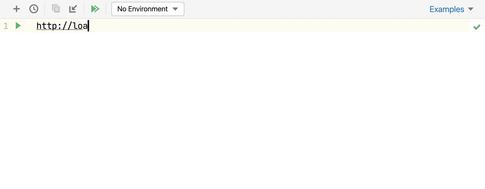

There are two main use cases when you need to compose and run HTTP requests:

​	在以下两种主要情况下，您需要组合和运行 HTTP 请求： 

- When you are developing a RESTful web service and want to make sure it works as expected, is accessible in compliance with the specification, and responds correctly.
- When you are developing an application that addresses a RESTful web service. In this case, it is helpful to investigate the access to the service and the required input data before you start the development. During the development, you may also call this web service from outside your application. This may help locate errors when your application results in unexpected output while no logical errors are detected in your code and you suspect that the bottleneck is the interaction with the web service.
- 当您开发一个符合规范、可访问且正确响应的 RESTful Web 服务，并希望确保其按预期工作时。
- 当您开发一个与 RESTful Web 服务进行交互的应用程序时。在这种情况下，在开始开发之前，了解访问该服务和所需的输入数据是很有帮助的。在开发过程中，您还可以从应用程序外部调用此 Web 服务。当应用程序的输出结果与代码中未检测到逻辑错误时，您可以怀疑瓶颈是与 Web 服务的交互。因此，调用该 Web 服务可能有助于定位错误。

HTTP requests are stored in **.http** and **.rest** files and are marked with the HTTP 请求存储在**.http**和**.rest**文件中，并标有 icon.图标。

Support for HTTP files includes the following features:

​	对于 HTTP 文件，支持以下功能： 

- [Code highlighting](https://www.jetbrains.com/help/go/configuring-colors-and-fonts.html)
- [Code completion](https://www.jetbrains.com/help/go/auto-completing-code.html) for hosts, method types, header fields, and endpoints defined via OpenAPI
- [Code folding](https://www.jetbrains.com/help/go/working-with-source-code.html#code_folding) for requests, their parts, and response handler scripts
- [Reformat](https://www.jetbrains.com/help/go/reformat-and-rearrange-code.html) requests according to your HTTP Request code style.
- [Inline documentation](https://www.jetbrains.com/help/go/viewing-reference-information.html) for request header fields and doc tags
- [Viewing a structure](https://www.jetbrains.com/help/go/viewing-structure-of-a-source-file.html) of HTTP requests
- [Language injections in Web languages](https://www.jetbrains.com/help/go/using-language-injections.html) inside the request message body
- [Live templates](https://www.jetbrains.com/help/go/using-live-templates.html)
- [代码高亮](https://www.jetbrains.com/help/go/configuring-colors-and-fonts.html)
- [代码自动完成](https://www.jetbrains.com/help/go/auto-completing-code.html)，支持主机、方法类型、头字段和通过 OpenAPI 定义的端点
- [代码折叠](https://www.jetbrains.com/help/go/working-with-source-code.html#code_folding)，支持请求、请求部分和响应处理脚本
- 根据您的 HTTP 请求代码样式进行[重新格式化](https://www.jetbrains.com/help/go/reformat-and-rearrange-code.html)请求。
- 请求头字段和文档标签的[内联文档](https://www.jetbrains.com/help/go/viewing-reference-information.html)
- 查看 HTTP 请求的[结构](https://www.jetbrains.com/help/go/viewing-structure-of-a-source-file.html)
- 在请求消息体中进行 Web 语言的[语言注入](https://www.jetbrains.com/help/go/using-language-injections.html)
- [Live templates](https://www.jetbrains.com/help/go/using-live-templates.html)

If necessary, before you begin, [configure the Proxy settings](https://www.jetbrains.com/help/go/http-client-in-product-code-editor.html#configureProxy) on the [HTTP Proxy](https://www.jetbrains.com/help/go/settings-http-proxy.html) page of the Settings dialog (Ctrl+Alt+S).

​	如果需要，在开始之前，您可以在设置对话框（Ctrl+Alt+S）的[HTTP 代理](https://www.jetbrains.com/help/go/settings-http-proxy.html)页面上[配置代理设置](https://www.jetbrains.com/help/go/http-client-in-product-code-editor.html#configureProxy)。

## 创建 HTTP 请求文件 Create HTTP request files

You can work with HTTP requests either from scratch files or from physical files of the HTTP Request type. Each file can contain multiple requests, and you can create as many files as needed.

​	您可以从头文件或者物理文件中使用 HTTP 请求。每个文件可以包含多个请求，您可以根据需要创建多个文件。

[Scratch files](https://www.jetbrains.com/help/go/scratches.html) can be used to test HTTP requests during development. Scratch files are not stored inside a project, so GoLand can modify them and add additional information about the request. When an HTTP request is executed from a scratch file, the link to the response output file is added below the request and at the top of the [requests history](https://www.jetbrains.com/help/go/http-client-in-product-code-editor.html#requests_history) file.

​	[头文件](https://www.jetbrains.com/help/go/scratches.html)可用于在开发过程中测试 HTTP 请求。头文件不会存储在项目内部，因此 GoLand 可以修改它们并添加有关请求的其他信息。当从头文件执行 HTTP 请求时，响应输出文件的链接将添加到请求下方，并添加到[请求历史记录](https://www.jetbrains.com/help/go/http-client-in-product-code-editor.html#requests_history)文件的顶部。

### 创建 HTTP 请求头文件 Create an HTTP request scratch file

- Press Ctrl+Alt+Shift+Insert and select HTTP Request.
- 按下 Ctrl+Alt+Shift+Insert，并选择 HTTP 请求。

Physical files can be used for documenting, testing, and validating HTTP requests. Physical files are stored inside your project, and GoLand will not modify them. When an HTTP request is executed from a physical file, this file is not modified. Information about the executed request with the link to the response output file is added to the top of the [requests history](https://www.jetbrains.com/help/go/http-client-in-product-code-editor.html#requests_history) file.

​	物理文件可用于记录、测试和验证 HTTP 请求。物理文件存储在项目内部，GoLand 不会对其进行修改。当从物理文件执行 HTTP 请求时，不会修改该文件。关于执行的请求的信息以及指向响应输出文件的链接将添加到[请求历史记录](https://www.jetbrains.com/help/go/http-client-in-product-code-editor.html#requests_history)文件的顶部。

### 创建物理 HTTP 请求文件  Create a physical HTTP request file

- In the File menu, point to New, and then click HTTP Request.
- 在文件菜单中，指向新建，然后单击 HTTP 请求。

### 移动 HTTP 请求 Move an HTTP request

You can use the [Move](https://www.jetbrains.com/help/go/move-refactorings.html) refactoring F6 to move HTTP requests from scratches to physical files, as well as between physical files.

​	您可以使用[移动](https://www.jetbrains.com/help/go/move-refactorings.html)重构（F6）将 HTTP 请求从头文件移动到物理文件，或者在物理文件之间移动。

1. In the editor, position the caret at the request to be moved and do one of the following:

2. 在编辑器中，将光标定位到要移动的请求上，并执行以下操作之一：

   - From the main menu or the context menu, select Refactor | Move.
   - 从主菜单或上下文菜单中，选择重构 | 移动。
   - Press Alt+Enter and select the Move HTTP Requests [intention action](https://www.jetbrains.com/help/go/intention-actions.html).
   - 按下 Alt+Enter 并选择移动 HTTP 请求[intention action](https://www.jetbrains.com/help/go/intention-actions.html)。
   - Press F6.
   - 按下 F6。

3. In the Move HTTP Requests dialog that opens, do the following:

4. 在打开的移动 HTTP 请求对话框中，执行以下操作：

   1. In the Path field, choose one of the existing **.http** files from the list or click 在路径字段中，选择列表中的一个现有**.http**文件，或单击 to locate the file.以定位文件。

      You can also type the full path to the file manually. If you specify the name of a non-existing file, a new file with the provided name will be created automatically.

      您也可以手动输入文件的完整路径。如果指定的文件名不存在，将自动创建具有提供的名称的新文件。

   2. In the Requests list, select the checkboxes next to the requests you want to move.

   3. 在请求列表中，选择要移动的请求旁边的复选框。


## 组合 HTTP 请求 Compose HTTP requests

GoLand uses the HTTP request in Editor format, which provides a simple way to create, execute, and store information about HTTP requests. You can type them directly in the [created HTTP request files](https://www.jetbrains.com/help/go/http-client-in-product-code-editor.html#creating-http-request-files) using the following general syntax:

​	GoLand 使用编辑器格式的 HTTP 请求，提供了一种简单的方式来创建、执行和存储有关 HTTP 请求的信息。您可以在[创建的 HTTP 请求文件](https://www.jetbrains.com/help/go/http-client-in-product-code-editor.html#creating-http-request-files)中直接输入它们，使用以下通用语法：

```
###
Method Request-URI HTTP-Version
Header-field: Header-value

Request-Body
```

After the `###` separator, you can enter any comments preceded by `#` or `//`.

​	在`###`分隔符之后，您可以输入以`#`或`//`开头的任何注释。


> To quickly find your request in run/debug configurations, Search Everywhere, and Run Anything, you can [give it a name](https://www.jetbrains.com/help/go/exploring-http-syntax.html#http_request_names).
>
> ​	为了在运行/调试配置、全局搜索和运行命令等场景中快速找到您的请求，您可以为其[指定一个名称](https://www.jetbrains.com/help/go/exploring-http-syntax.html#http_request_names)。


> You can use the Editor | Color Scheme | HTTP Request settings to [customize colors and style](https://www.jetbrains.com/help/go/configuring-colors-and-fonts.html#customize-color-scheme) for highlighting request syntax (name, comments, parameters, headers, and so on).
>
> 您可以使用编辑器 | 颜色方案 | HTTP 请求设置来[自定义颜色和样式](https://www.jetbrains.com/help/go/configuring-colors-and-fonts.html#customize-color-scheme)，以突出显示请求的语法（名称、注释、参数、头部等）。

To speed up composing HTTP requests, you can:

​	为了加快组合 HTTP 请求的速度，您可以：

- Click Tools | HTTP Client | Create Request in HTTP Client. If a request file is opened in the editor, this will add a request template to the opened file. Otherwise, this will create a new **.http** scratch file.

- 点击工具栏的工具 | HTTP 客户端 | 在 HTTP 客户端中创建请求。如果编辑器中打开了请求文件，这将在打开的文件中添加请求模板。否则，将创建一个新的**.http**头文件。

- Click 单击请求编辑面板顶部的 on top of the request's editor panel. In the popup menu, choose the type of the request to add.图标。在弹出菜单中，选择要添加的请求类型。

  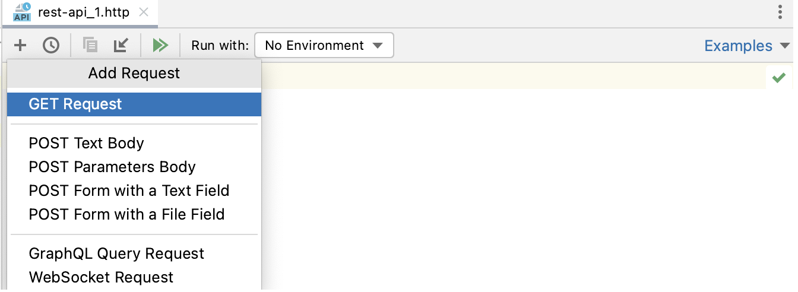

Alternatively, use [live templates](https://www.jetbrains.com/help/go/using-live-templates.html). In the editor, you can press Ctrl+J to view the list of available templates. For example, gtr expands to a simple GET request; mptr expands to a `multipart/form-data` POST request.

​	或者，使用[Live Templates](https://www.jetbrains.com/help/go/using-live-templates.html)。在编辑器中，可以按下 Ctrl+J 查看可用模板的列表。例如，gtr 将展开为一个简单的 GET 请求；mptr 将展开为一个`multipart/form-data` POST 请求。

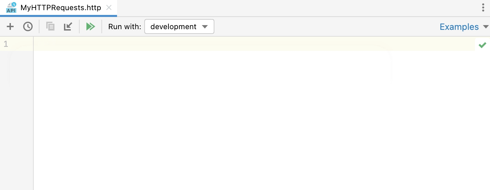

To get an overview of the HTTP Client possibilities, you can explore the HTTP Requests Collection, which is a handful selection of composed requests.

​	获取 HTTP 客户端功能的概述，您可以探索 HTTP 请求集合，这是一组精选的组合请求。

### 打开 HTTP 请求集合中的请求 Open a request from the HTTP Requests Collection

1. Click the Examples shortcut link on top of the request's editor panel.

2. 点击请求编辑面板顶部的示例快捷链接。

3. In the popup menu, choose the HTTP Requests collection you wish to open:

4. 在弹出菜单中，选择要打开的 HTTP 请求集合：

   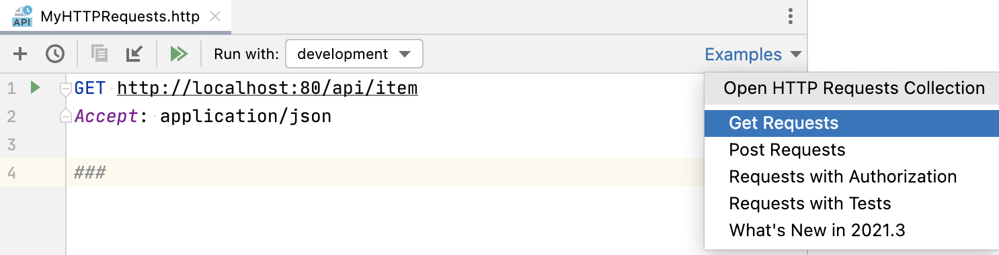


> See [Exploring the HTTP request syntax](https://www.jetbrains.com/help/go/exploring-http-syntax.html) for the syntax and capabilities overview, and [HTTP request in Editor specification](https://github.com/JetBrains/http-request-in-editor-spec/blob/master/spec.md) for the full format description.
>
> ​	有关语法和功能概述，请参阅[探索 HTTP 请求语法](https://www.jetbrains.com/help/go/exploring-http-syntax.html)，有关完整格式说明，请参阅[编辑器中的 HTTP 请求规范](https://github.com/JetBrains/http-request-in-editor-spec/blob/master/spec.md)。

### 转换 cURL 请求 Convert cURL requests

If you are working with [cURL](https://curl.haxx.se/) requests, you can convert between cURL requests and the HTTP request in Editor format.

​	如果您使用 [cURL](https://curl.haxx.se/) 请求，您可以在 cURL 请求和 HTTP 请求编辑器格式之间进行转换。

### 将 cURL 转换为 HTTP 请求 Convert cURL to HTTP request

- Paste the cURL request into an HTTP request file. GoLand will convert it to the HTTP request format and leave the original cURL request commented out for later reference.

- 将 cURL 请求粘贴到一个 HTTP 请求文件中。GoLand 将把它转换为 HTTP 请求格式，并将原始的 cURL 请求注释起来，以供以后参考。

  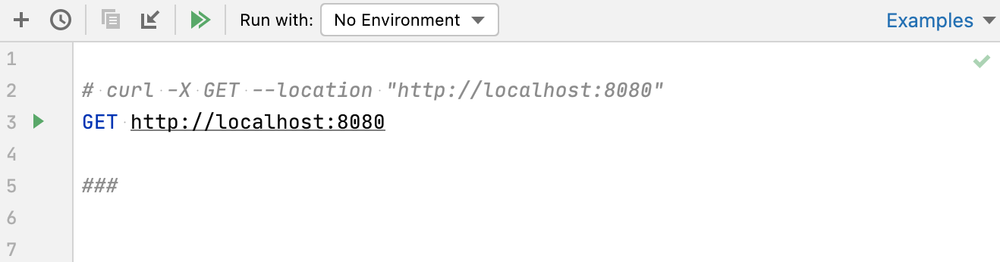

- Alternatively, click 或者，在 HTTP 请求编辑面板顶部点击  on top of the HTTP request editor panel and select Convert cURL to HTTP Request.，然后选择转换 cURL 为 HTTP 请求。

  In the Convert cURL to HTTP Request dialog, type or paste the cURL request that you want to convert.

  在转换 cURL 为 HTTP 请求对话框中，键入或粘贴要转换的 cURL 请求。
  
  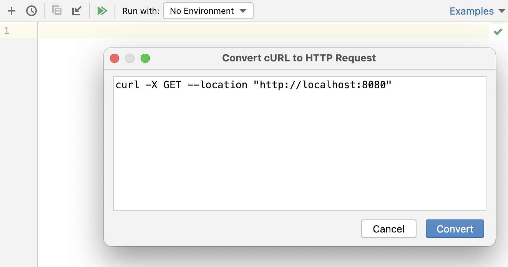

Consider the following example cURL request:

​	考虑以下示例 cURL 请求：

```bash
curl 'http://httpbin.org/' -H 'Connection: keep-alive' -H 'Accept: text/html' -H 'Accept-Encoding: gzip, deflate' -H 'Accept-Language: en-US,en;q=0.9,es;q=0.8'
```


GoLand will convert it to the following:

​	GoLand 将将其转换为以下格式：

```http
# curl 'http://httpbin.org/' -H 'Connection: keep-alive' -H 'Accept: text/html' -H 'Accept-Encoding: gzip, deflate' -H 'Accept-Language: en-US,en;q=0.9,es;q=0.8'
GET http://httpbin.org/
Connection: keep-alive
Accept: text/html
Accept-Encoding: gzip, deflate
Accept-Language: en-US,en;q=0.9,es;q=0.8

###
```


The converter supports the following cURL options:

​	转换器支持以下 cURL 选项：

| 选项                                                         | 描述                                                       |
| ------------------------------------------------------------ | ---------------------------------------------------------- |
| [-X, --request](https://curl.haxx.se/docs/manpage.html#-X)   | 请求使用的方法。                                           |
| [-H, --header](https://curl.haxx.se/docs/manpage.html#-H)    | 包含在请求中的请求头。                                     |
| [-u, --user](https://curl.haxx.se/docs/manpage.html#-u)[--basic](https://curl.haxx.se/docs/manpage.html#--basic)[--digest](https://curl.haxx.se/docs/manpage.html#--digest) | 要提供给请求的用户凭证，以及要使用的授权方法。             |
| [-d, --data, --data-ascii](https://curl.haxx.se/docs/manpage.html#-d)[--data-binary](https://curl.haxx.se/docs/manpage.html#--data-binary)[--data-raw](https://curl.haxx.se/docs/manpage.html#--data-raw)[--data-urlencode](https://curl.haxx.se/docs/manpage.html#--data-urlencode) | 要在 POST 请求中发送的数据。                               |
| [-F, --form](https://curl.haxx.se/docs/manpage.html#-F)      | 要在 POST 请求中发送的 multipart/form-data 消息。          |
| [--url](https://curl.haxx.se/docs/manpage.html#--url)        | 要获取的 URL（主要用于在配置文件中指定 URL 时）。          |
| [-i, --include](https://curl.haxx.se/docs/manpage.html#-i)   | 定义是否在输出中包含 HTTP 响应头。                         |
| [-v, --verbose](https://curl.haxx.se/docs/manpage.html#-v)   | 启用详细操作模式。                                         |
| [-L, --location](https://curl.haxx.se/docs/manpage.html#-L)  | 在所请求的页面已移动到不同位置的情况下，启用重新发送请求。 |

### 将 HTTP 请求转换为 cURL Convert HTTP request to cURL

1. Put the caret at the HTTP request that you want to convert to cURL format.

2. 将插入符放在要转换为 cURL 格式的 HTTP 请求上。

3. Click Alt+Enter and select Convert to cURL and copy to clipboard.

4. 单击 Alt+Enter，然后选择 Convert to cURL and copy to clipboard（转换为 cURL 并复制到剪贴板）。

   Alternatively, you can click the Convert shortcut link on top of the HTTP request editor panel and select Convert HTTP Request Under Caret to cURL and Copy.

   或者，您可以在 HTTP 请求编辑面板顶部单击 Convert 快捷链接，然后选择 Convert HTTP Request Under Caret to cURL and Copy（转换光标下的 HTTP 请求为 cURL 并复制）。

This will generate a cURL request based on the HTTP request and copy it to the clipboard.

​	这将根据 HTTP 请求生成一个 cURL 请求，并将其复制到剪贴板。

### 使用上下文操作生成请求 Generate requests using context action

You can quickly generate an HTTP request if you have a URL starting with `http` or `https` in your code string literals or in JSON, YAML, TOML, and Properties files.

​	如果您的代码字符串文字或 JSON、YAML、TOML 和 Properties 文件中包含以 `http` 或 `https` 开头的 URL，您可以快速生成一个 HTTP 请求。

1. Click a URL and press Alt+Enter.

2. 单击一个 URL，然后按下 Alt+Enter。

3. In the context menu that opens, click Generate request in HTTP Client.

4. 在打开的上下文菜单中，单击 Generate request in HTTP Client（在 HTTP 客户端中生成请求）。

   This will create a new GET HTTP request to the specified URL in the **generated-requests.http** scratch file.

   这将在 **generated-requests.http** 临时文件中创建一个新的 GET HTTP 请求，并指定的 URL。

   

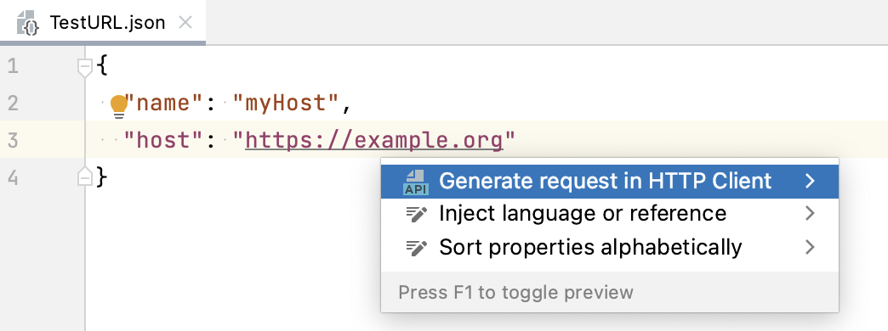

### 使用 OpenAPI 规范创建请求 Create requests from OpenAPI specifications

When working with OpenAPI Specification files, you can create HTTP requests to the specified endpoints.

​	在使用 OpenAPI 规范文件时，您可以创建指定端点的 HTTP 请求。

### 创建一个到端点的 HTTP 请求   Create an HTTP request to an endpoint

- In an OpenAPI specification file, click 在 OpenAPI 规范文件中，单击编辑器侧边栏中端点定义旁边的  in the editor gutter next to the endpoint definition.图标。
- Alternatively, open View | Tool Windows | Endpoints, right-click an endpoind, and select Generate Request in HTTP Client.
- 或者，打开 View | Tool Windows | Endpoints（视图 | 工具窗口 | 端点），右键单击一个端点，然后选择 Generate Request in HTTP Client（在 HTTP 客户端中生成请求）。

GoLand will create a new HTTP request and save it in the **generated-requests.http** [scratch file](https://www.jetbrains.com/help/go/http-client-in-product-code-editor.html#creating-http-request-files).

​	GoLand 将创建一个新的 HTTP 请求，并将其保存在 **generated-requests.http** [临时文件](https://www.jetbrains.com/help/go/http-client-in-product-code-editor.html#creating-http-request-files)中。

### 重命名端点及其使用 Rename an endpoint and its usages

Use the [Rename refactoring](https://www.jetbrains.com/help/go/rename-refactorings.html) to rename the defined endpoint and its usages in HTTP requests simultaneously.

​	使用 [重命名重构](https://www.jetbrains.com/help/go/rename-refactorings.html) 可以同时重命名已定义的端点及其在 HTTP 请求中的使用。 

1. Do any of the following:
2. 执行以下任一操作：
   - In an OpenAPI specification file, position the caret at the endpoint's definition you want to rename.
   - 在 OpenAPI 规范文件中，将插入符放在要重命名的端点定义上。
   - In an HTTP request file, position the caret at the URL path segment you want to rename.
   - 在 HTTP 请求文件中，将插入符放在要重命名的 URL 路径片段上。
3. Select Refactor | Rename from the main menu or the context menu, or press Shift+F6.
4. 从主菜单或上下文菜单中选择 Refactor | Rename（重构 | 重命名），或按 Shift+F6。
5. In the Rename dialog that opens, specify the new endpoint's name.
6. 在打开的重命名对话框中，指定新的端点名称。
7. Preview and apply changes.
8. 预览并应用更改。

GoLand will rename the endpoint and its usages.

​	GoLand 将重命名端点及其使用。

### 使用响应处理程序脚本 Use response handler scripts

With response handler scripts, you can programmatically react to a received HTTP response. By using these scripts, you can automatically process the received data as well as validate it against the conditions that you specify. Response handler scripts are provided as a part of the request within the HTTP request file and are executed as soon as a response is received. To view the response handling examples, open the Requests with Authorization or Requests with Tests [requests collections](https://www.jetbrains.com/help/go/http-client-in-product-code-editor.html#open-requests-collection).

​	使用响应处理程序脚本，您可以以编程方式对收到的 HTTP 响应做出反应。通过使用这些脚本，您可以自动处理收到的数据，并根据您指定的条件进行验证。响应处理程序脚本作为请求的一部分提供，并在接收到响应后立即执行。要查看响应处理的示例，请打开带有授权或测试的请求集合。

You can insert a response handler script into your request either in-place or by referring to an external file.

​	您可以将响应处理程序脚本直接插入到请求中，也可以引用外部文件中的脚本。

### 将脚本插入请求中 Insert the script into the request

- To insert the script in-place, prepend it with `>` and enclose it in ``:

- 要在请求中插入脚本，请在脚本前面添加 `>`，并用 `` 包裹起来：

  ```http
  GET host/api/test
  
  > 
  ```

  

- To insert the script from an external file, prepend it with `>`:

- 要从外部文件插入脚本，请在脚本前面添加 `>`：

  ```http
  GET host/api/test
  
  > scripts/my-script.js
  ```

  
  

Response handler scripts are written in JavaScript ECMAScript 6, with coding assistance and documentation handled by the bundled `HTTP Response Handler` library. For in-place scripts, this functionality is enabled automatically. For external scripts, you need to enable it manually.

​	响应处理程序脚本使用 JavaScript ECMAScript 6 编写，配有捆绑的 `HTTP Response Handler` 库提供编码辅助和文档支持。对于内联脚本，此功能会自动启用。对于外部脚本，您需要手动启用它。

### 启用响应处理程序脚本的 JavaScript 编码辅助  Enable JavaScript coding assistance for response handler scripts

1. Open the script file in the editor.
2. 在编辑器中打开脚本文件。
3. In the context menu, choose Use JavaScript Library | HTTP Response Handler.
4. 在上下文菜单中，选择 Use JavaScript Library | HTTP Response Handler（使用 JavaScript 库 | HTTP 响应处理程序）。

The `HTTP Response Handler` library exposes two objects to be used for composing response handler scripts:

​	`HTTP Response Handler` 库提供了两个对象，用于组成响应处理程序脚本： 

- The `client` object stores the session metadata, which can be modified inside the script. The `client` state is preserved until you close GoLand. Every variable saved in `client.global` as `variable_name` is accessible to subsequent HTTP requests as `{{variable_name}}`.
- `client` 对象存储会话元数据，可以在脚本内部进行修改。`client` 状态将保留，直到关闭 GoLand。在 `client.global` 中保存的每个变量作为 `{{variable_name}}` 可以在后续的 HTTP 请求中访问。
- `response` holds information about the received response: its content type, status, response body, and so on.
- `response` 包含接收到的响应的信息：内容类型、状态、响应正文等。

To open the HTTP Response Handler library in the editor, position the caret at the library object and press Ctrl+B.

​	要在编辑器中打开 HTTP Response Handler 库，将插入符置于库对象上，并按 Ctrl+B。

Response handler scripts can include tests, which lets you use the HTTP Client as a testing framework. To create a test, invoke the `client.test(testName, function)` method. Inside the test, you can assert a condition by invoking the `client.assert(condition, message)` method, for example:

​	响应处理程序脚本可以包括测试，使您可以将 HTTP 客户端用作测试框架。要创建测试，请调用 `client.test(testName, function)` 方法。在测试内部，您可以通过调用 `client.assert(condition, message)` 方法来断言条件，例如：

```javascript
GET https://httpbin.org/status/200

> 
```


## 执行 HTTP 请求  Execute HTTP requests

1. If you are going to test your own web service, make sure it is deployed and running.
2. 如果您要测试自己的 Web 服务，请确保其已部署并正在运行。
3. If you have [environments](https://www.jetbrains.com/help/go/exploring-http-syntax.html#environment-variables) defined, select an environment in the Run with list on top of the request's editor panel.
4. 如果您定义了[环境](https://www.jetbrains.com/help/go/exploring-http-syntax.html#environment-variables)，请选择要在请求的编辑器面板顶部的 Run with 列表中使用的环境。
5. In the gutter, click 在边栏中，单击请求旁边的  next to the request.

If you have multiple HTTP requests defined in an **.http** file, you can run all of them sequentially. To do this, click 如果在一个 **.http** 文件中定义了多个 HTTP 请求，您可以按顺序运行它们。要执行此操作，请单击请求的编辑器面板顶部的  on top of the request's editor panel.

When a request is executed, GoLand automatically creates a dedicated temporary [HTTP Request run/debug configuration](https://www.jetbrains.com/help/go/http-client-in-product-code-editor.html#http-request-run-debug-configurations) for it. You can [save it as a permanent run/debug configuration](https://www.jetbrains.com/help/go/http-client-in-product-code-editor.html#save-temporary-http-request-run-debug-configuration) if necessary.

​	执行请求时，GoLand 会自动为其创建一个专用的临时 [HTTP 请求运行/调试配置](https://www.jetbrains.com/help/go/http-client-in-product-code-editor.html#http-request-run-debug-configurations)。如有必要，您可以将其[保存为永久的运行/调试配置](https://www.jetbrains.com/help/go/http-client-in-product-code-editor.html#save-temporary-http-request-run-debug-configuration)。

### 在浏览器中打开请求 Open a request in the browser

You can open an HTTP request in the browser specified on the [Web Browsers and Preview](https://www.jetbrains.com/help/go/settings-tools-web-browsers.html) page of the Settings dialog (Ctrl+Alt+S).

​	您可以在设置对话框（Ctrl+Alt+S）的[Web 浏览器和预览](https://www.jetbrains.com/help/go/settings-tools-web-browsers.html)页面指定的浏览器中打开 HTTP 请求。 

- Press Alt+Enter and select the Open in web browser [intention action](https://www.jetbrains.com/help/go/intention-actions.html).
- 按下 Alt+Enter 并选择打开 web 浏览器意图操作。

### 使用 HTTP 请求运行/调试配置 Work with HTTP request run/debug configurations 

When you [execute an HTTP request from the editor](https://www.jetbrains.com/help/go/http-client-in-product-code-editor.html#execute_request_procedure), GoLand automatically creates a temporary run/debug configuration with the request parameters. A temporary run/debug configuration works the same way as a permanent run/debug configuration. You can change its settings using the [Run/Debug Configuration](https://www.jetbrains.com/help/go/run-debug-configurations-dialog.html) dialog and optionally save it as permanent.

​	当您从编辑器中[执行 HTTP 请求](https://www.jetbrains.com/help/go/http-client-in-product-code-editor.html#execute_request_procedure)时，GoLand 会自动创建一个临时的运行/调试配置，其中包含请求参数。临时的运行/调试配置与永久的运行/调试配置的工作方式相同。您可以使用[运行/调试配置](https://www.jetbrains.com/help/go/run-debug-configurations-dialog.html)对话框更改其设置，并可选择将其保存为永久配置。

### 修改 HTTP 请求运行/调试配置   Modify an HTTP Request run/debug configuration

1. Do any of the following:
2. 执行以下任一操作：
   - In the editor, right-click a request and in the context menu, select Modify Run Configuration.
   - 在编辑器中，右键单击请求，在上下文菜单中选择 Modify Run Configuration。
   - Alternatively, choose Run | Edit Configurations from the main menu, and select the needed run/debug configuration in the HTTP Request list.
   - 或者，从主菜单选择 Run | Edit Configurations，然后在 HTTP Request 列表中选择所需的运行/调试配置。
3. Change the needed configuration parameters:
4. 更改所需的配置参数：
   - In the Environment list, select an [environment](https://www.jetbrains.com/help/go/exploring-http-syntax.html#using_request_vars) that will define the set of environment variables used in the request.
   - 在 Environment 列表中，选择将在请求中使用的环境（[environment](https://www.jetbrains.com/help/go/exploring-http-syntax.html#using_request_vars)）集定义的一组环境变量。
   - In the File field, provide the path to the [HTTP request file](https://www.jetbrains.com/help/go/http-client-in-product-code-editor.html#creating-http-request-files). You can type the path manually and use path completion Ctrl+Space as you type, or click 在 File 字段中，提供到[HTTP 请求文件](https://www.jetbrains.com/help/go/http-client-in-product-code-editor.html#creating-http-request-files)的路径。您可以手动输入路径并在键入时使用路径完成 Ctrl+Space，或单击  and select the required folder in the dialog that opens.，然后在打开的对话框中选择所需的文件夹。
   - If your request file contains multiple requests, in the Request list, choose the name of the request to execute.
   - 如果请求文件包含多个请求，在 Request 列表中选择要执行的请求的名称。

### 保存临时的 HTTP 请求运行/调试配置  Save a temporary HTTP Request run/debug configuration

- In the Run/Debug Configuration selector, choose Save <configuration name>.
- 在运行/调试配置选择器中，选择 Save <configuration name>。
- In the Run/Debug Configuration dialog, select the configuration and click 在运行/调试配置对话框中，选择配置并单击 .

### 使用运行/调试配置执行请求  Execute a request using a run/debug configuration

- In the Run/Debug Configuration selector, select the desired run configuration. Then click 在运行/调试配置选择器中，选择所需的运行配置。然后，单击主工具栏上的  on the main toolbar or press Shift+F10. 或按 Shift+F10。
- Press Alt+Shift+F10, select the desired run configuration from the list, and press Enter.
- 按下 Alt+Shift+F10，从列表中选择所需的运行配置，然后按 Enter。

## 查看来自 Web 服务的响应 View responses from web services

When you execute an HTTP request, GoLand automatically saves the response into a separate file under the **.idea/httpRequests/** directory. You can view the 50 most recently stored responses and navigate to the corresponding files using the [requests history](https://www.jetbrains.com/help/go/http-client-in-product-code-editor.html#requests_history). If the request was executed from a scratch file, the link to its response output is also added below the original request:

​	当您执行 HTTP 请求时，GoLand 会自动将响应保存到 **.idea/httpRequests/** 目录下的单独文件中。您可以查看最近保存的 50 个响应，并使用[请求历史记录](https://www.jetbrains.com/help/go/http-client-in-product-code-editor.html#requests_history)导航到相应的文件。如果请求是从 scratch 文件执行的，则在原始请求下方还会添加到其响应输出的链接：

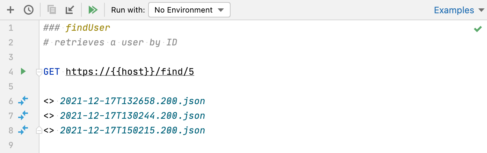

### 查看接收到的响应 View a received response

1. Switch to the [Services tool window](https://www.jetbrains.com/help/go/services-tool-window.html), which opens automatically as soon as a response is received.

2. 切换到 [Services 工具窗口](https://www.jetbrains.com/help/go/services-tool-window.html)，该窗口在接收到响应后会自动打开。

3. By default, the server response is shown in the format specified in the request header via the [content-type](http://www.w3.org/Protocols/rfc2616/rfc2616-sec14.html#sec14.17) field. To have the response converted into another format, click 默认情况下，服务器响应以请求头中通过 [content-type](http://www.w3.org/Protocols/rfc2616/rfc2616-sec14.html#sec14.17) 字段指定的格式显示。要将响应转换为其他格式，单击  and select Text, JSON, XML, or HTML.，然后选择 Text、JSON、XML 或 HTML。

   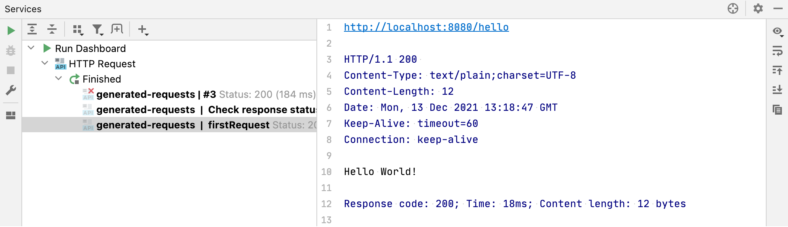

If the response contains a binary file, this file is also saved under the **.idea/httpRequests/** directory. If the response is an image, you can see its preview in the Services tool window.

​	如果响应包含二进制文件，该文件也会保存在 **.idea/httpRequests/** 目录下。如果响应是图像，则可以在 Services 工具窗口中预览它。

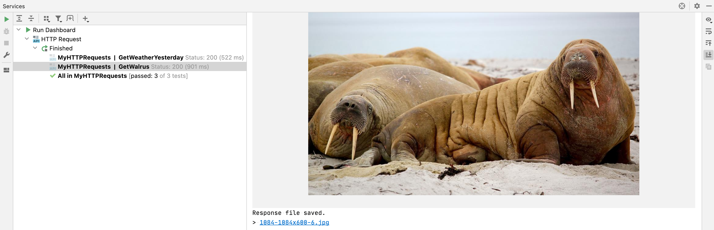

If you have a [response handler script](https://www.jetbrains.com/help/go/http-client-in-product-code-editor.html#using-response-handler-scripts), the results of the tests executed as part of this script are displayed on the Tests tab of the Services tool window. You can click each of the tests to quickly navigate to the test source code in the corresponding response handler script.

​	如果您有[响应处理程序脚本](https://www.jetbrains.com/help/go/http-client-in-product-code-editor.html#using-response-handler-scripts)，则作为脚本一部分执行的测试结果会显示在 Services 工具窗口的 Tests 选项卡中。您可以单击每个测试来快速导航到相应的响应处理程序脚本中的测试源代码。

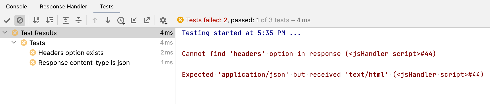

If you subscribe to an event stream, GoLand displays events in the Services tool window. Here, you can also view the status of the client-server connection and terminate it by clicking 如果您订阅了事件流，GoLand 会在 Services 工具窗口中显示事件。在此处，您还可以查看客户端-服务器连接的状态，并单击 . Depending on the content type (either `text/event-stream` or `application/x-ndjson`), the response will be formatted as plain text or newline-delimited JSON. You can write a response handler script to [process each line of the event stream](https://www.jetbrains.com/help/go/http-response-handling-examples.html#stream_scripting). 终止它。根据内容类型（`text/event-stream` 或 `application/x-ndjson`），响应将格式化为纯文本或换行符分隔的 JSON。您可以编写响应处理程序脚本来[处理事件流的每一行](https://www.jetbrains.com/help/go/http-response-handling-examples.html#stream_scripting)。

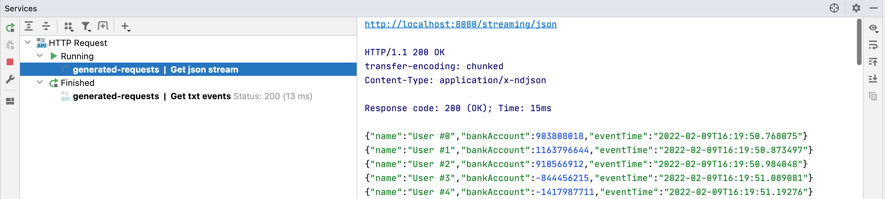

[Redirecting](https://www.jetbrains.com/help/go/exploring-http-syntax.html#response-redirect) stream events to a file is currently not supported.

当前不支持将重定向流事件到文件。

### 在编辑器中打开响应文件  Open a response file in the editor

1. Position the caret at the link to the response you want to open.
2. 将插入符置于要打开的响应链接处。
3. Choose View | Jump to Source from the main menu, or press Ctrl+B or F4
4. 从主菜单选择 View | Jump to Source，或按 Ctrl+B 或 F4

Alternatively, you can Ctrl+Click the response line:

或者，您可以按 Ctrl+单击响应行：

### 在 scratch 文件中比较响应 Compare responses in a scratch file

When a request is executed from a scratch file, the link to the response output file is added below the original request.

​	当从 scratch 文件执行请求时，会在原始请求下方添加响应输出文件的链接。 

- Do any of the following:

- 进行以下操作之一：

  - Position the caret at the link to the response file. Press Alt+Enter and select the Compare with <response name> intention action.

  - 将插入符置于响应文件的链接处。按下 Alt+Enter 并选择 `Compare with <response name>` 意图操作。

  - Click 在差异区中单击  in the gutter and select Compare with <response name> from the list: 并从列表中选择 `Compare with <response name>`：
  
    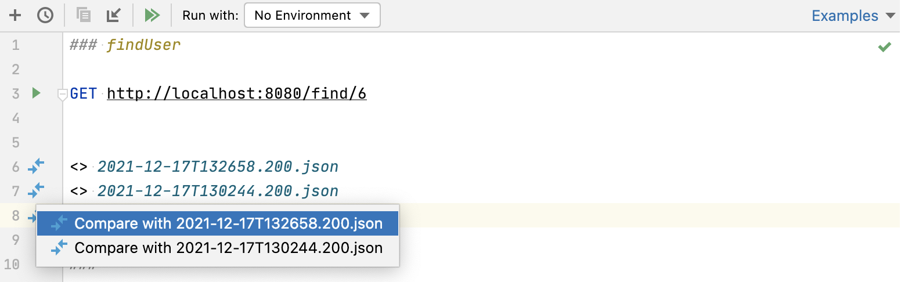

### 在请求历史记录中比较响应 Compare responses in the request history

When a request is executed from a physical file, the link to the response output is added to the [requests history](https://www.jetbrains.com/help/go/http-client-in-product-code-editor.html#requests_history).

​	当从实际文件执行请求时，响应输出的链接会添加到[请求历史记录](https://www.jetbrains.com/help/go/http-client-in-product-code-editor.html#requests_history)中。 

1. Position the caret at the link to the response file. Choose View | Jump to Source from the main menu, or press Ctrl+B or F4 to open this file in a new editor tab.
2. 将插入符置于响应文件的链接处。从主菜单选择 View | Jump to Source，或按下 Ctrl+B 或 F4，在新的编辑器选项卡中打开此文件。
3. Choose View | Compare With from the main menu, or press Ctrl+D. GoLand will prompt you to open a response file from the **httpRequests** folder.
4. 从主菜单选择 View | Compare With，或按下 Ctrl+D。GoLand 将提示您从 **httpRequests** 文件夹中打开一个响应文件。
5. Select the response file you would like to compare the current file with and click Open.
6. 选择要将当前文件与之比较的响应文件，然后单击打开。

The two response files will be opened in the [Differences viewer](https://www.jetbrains.com/help/go/differences-viewer.html) allowing you to compare their contents:

​	两个响应文件将在[差异查看器](https://www.jetbrains.com/help/go/differences-viewer.html)中打开，以便比较它们的内容：

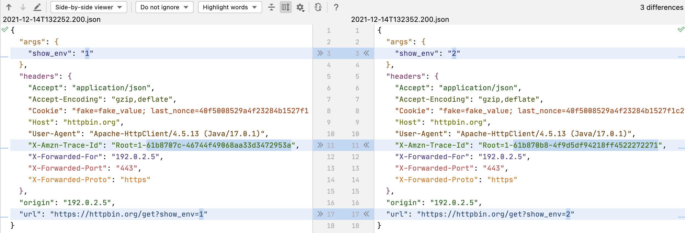

## 查看请求历史记录 View request history

GoLand automatically saves the 50 recently executed requests into the **http-requests-log.http** file, which is stored on the project level under the **.idea/httpRequests/** directory. With requests history, you can quickly navigate to a particular response as well as [issue any request again](https://www.jetbrains.com/help/go/http-client-in-product-code-editor.html#run_request). If a request is issued again from the request history, its execution information and the link to the response output are added to the top of the request history file.

​	GoLand 自动将最近执行的 50 个请求保存到项目级别的 **http-requests-log.http** 文件中，该文件存储在 **.idea/httpRequests/** 目录下。通过请求历史记录，您可以快速导航到特定的响应，以及[重新发出任何请求](https://www.jetbrains.com/help/go/http-client-in-product-code-editor.html#run_request)。如果从请求历史记录中重新发出请求，则其执行信息和响应输出的链接将添加到请求历史记录文件的顶部。


> To prevent saving a request to the request history, add a comment line with the [@no-log](https://www.jetbrains.com/help/go/exploring-http-syntax.html#enable-disable-saving-request) tag before the request. This can be helpful in case a request contains some sensitive data, and you don't want to log it.
>
> ​	要防止将请求保存到请求历史记录中，在请求之前添加一行以 [@no-log](https://www.jetbrains.com/help/go/exploring-http-syntax.html#enable-disable-saving-request) 标记的注释行。这在请求包含某些敏感数据并且您不希望记录它时很有帮助。

### 打开请求历史记录 Open request history

- Click 单击请求编辑面板顶部的  on top of the request's editor panel.
- Select Tools | HTTP Client | Show HTTP Requests History from the main menu.
- 从主菜单选择 Tools | HTTP Client | Show HTTP Requests History。

### 将输出重定向到自定义文件或目录 Redirect output to a custom file or directory

- The HTTP Client can redirect output to a custom file or directory. It supports two operators for force and soft redirects:
- HTTP 客户端可以将输出重定向到自定义文件或目录。它支持两个操作符进行强制和软性重定向： 
  - The `>>` operator always creates a new file, adding an `-n` suffix to a filename if the requested filename already exists.
  - The `>>!` operator rewrites the file if it already exists.
  - `>>` 操作符总是创建一个新文件，如果已存在请求的文件名，则在文件名后添加 `-n` 后缀。
  - `>>!` 操作符如果文件已存在，则重写该文件。

## 管理 Cookie Manage cookies

The cookies received through a response are automatically saved into the dedicated **http-client.cookies** file under the **.idea/httpRequests/** directory. The number of cookies that can be saved is limited to 300. The name and value of a cookie are automatically included in each subsequent request to the URL that matches the domain and path specified for the cookie, provided that the expiry date has not been reached.

​	通过响应接收到的 Cookie 会自动保存在专用的 **http-client.cookies** 文件中，该文件存储在 **.idea/httpRequests/** 目录下。可以保存的 Cookie 数量最多为 300 个。每个后续请求到与 Cookie 指定的域名和路径匹配的 URL 都会自动包含 Cookie 的名称和值，前提是尚未达到过期日期。

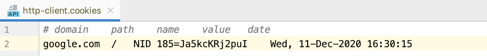


> You can prevent saving the received cookie to the cookie jar by adding a comment line with the [@no-cookie-jar](https://www.jetbrains.com/help/go/exploring-http-syntax.html#enable-disable-saving-cookies) tag before the request.
>
> 您可以在请求之前添加一行以 [@no-cookie-jar](https://www.jetbrains.com/help/go/exploring-http-syntax.html#enable-disable-saving-cookies) 标记的注释行，以防止将接收到的 Cookie 保存到 Cookie 存储中。这在请求包含某些敏感数据并且您不希望记录它时很有帮助

If you want to set custom cookies in an HTTP request, you can use the `Cookie` header. Enter your cookies as a list of `name=value` pairs separated by a semicolon, for example:

​	如果要在 HTTP 请求中设置自定义 Cookie，可以使用 `Cookie` 头部。将 Cookie 输入为由分号分隔的 `name=value` 对列表，例如：

```http
GET http://localhost:80/api
Cookie: theme=dark; country=France
```


## gRPC 请求 gRPC requests


> To work with gRPC requests, you need to install and enable the following plugins: [Protocol Buffers](https://plugins.jetbrains.com/plugin/14004-protocol-buffers) and [gRPC](https://plugins.jetbrains.com/plugin/16889-grpc).
>
> ​	要使用 gRPC 请求，您需要安装并启用以下插件：[Protocol Buffers](https://plugins.jetbrains.com/plugin/14004-protocol-buffers) 和 [gRPC](https://plugins.jetbrains.com/plugin/16889-grpc)

The HTTP Client supports gRPC requests. For the HTTP Client to treat your requests as gRPC requests, start them with the `GRPC` keyword.

​	HTTP 客户端支持 gRPC 请求。要使 HTTP 客户端将您的请求视为 gRPC 请求，请以 `GRPC` 关键字开始它们。

Based on a `.proto` file, GoLand provides completion for gRPC: all known gRPC services, unary and server-streaming methods of a particular server, and fields of accepted messages in the request body. If you don’t have a `.proto` file in your project, code completion can still be available if a server supports [gRPC reflection](https://github.com/grpc/grpc/blob/master/doc/server-reflection.md), which provides HTTP clients with information about accessible services.

​	基于 `.proto` 文件，GoLand 提供了对 gRPC 的自动完成：所有已知的 gRPC 服务、特定服务器的一元和服务器流方法，以及请求正文中接受消息的字段。如果您的项目中没有 `.proto` 文件，如果服务器支持[gRPC 反射](https://github.com/grpc/grpc/blob/master/doc/server-reflection.md)，仍然可以使用代码完成，该功能提供了关于可访问服务的信息。


### 从 proto 文件生成 gRPC 请求 Generate a gRPC request from proto files

- In the proto file, click 在 proto 文件中，单击 RPC 方法附近的 Generate request in HTTP Client near the RPC method.  Generate request in HTTP Client。

  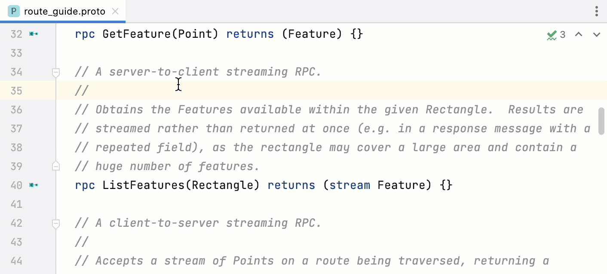

### 从 Endpoints 工具窗口生成 gRPC 请求 Generate a gRPC request from Endpoints tool window

Just like for HTTP requests, you can also use the Endpoints tool window to generate gRPC requests.

​	与 HTTP 请求一样，您还可以使用 Endpoints 工具窗口生成 gRPC 请求。 

1. Open the Endpoints tool window: View | Tool Windows | Endpoints. You will see gRPC endpoints if they are defined in your project.
2. 打开 Endpoints 工具窗口：View | Tool Windows | Endpoints。如果项目中定义了 gRPC 端点，您将看到它们。
3. Select an endpoint. This will generate a sample request to it in the HTTP Client tab.
4. 选择一个端点。这将在 HTTP 客户端选项卡中为其生成一个示例请求。
5. Complete the request and click Submit Request. You may need to substitute the default address and port with your own values. For the request body, use code completion based on the data structure in the proto file.
6. 完成请求并单击提交请求。您可能需要使用您自己的值替换默认的地址和端口。对于请求正文，请使用基于 proto 文件中的数据结构的代码完成。
7. Preview the response in the lower part of the the HTTP Client tab.
8. 在 HTTP 客户端选项卡的较低部分预览响应。

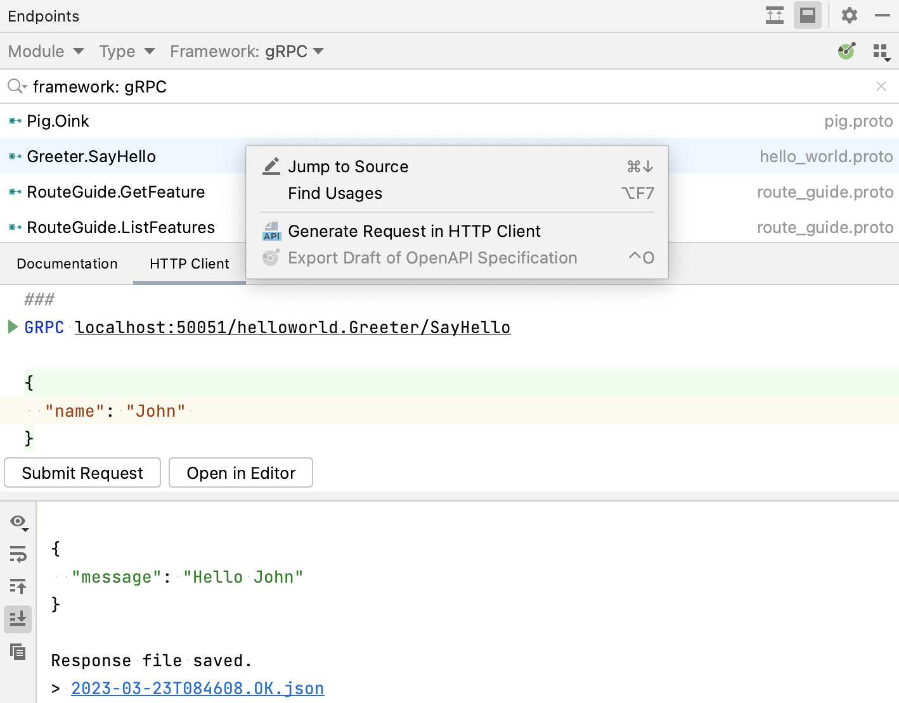

### 发送 gRPC 元数据 Send gRPC metadata

- Below your `GRPC` request, enter gRPC metadata using the following syntax: `Metadata-key: Value`.

- 在您的 `GRPC` 请求下面，使用以下语法输入 gRPC 元数据：`Metadata-key: Value`。

  For example:

  例如：
  
  ```http
  GRPC localhost:8080
  X-Myhostname: Example.org
  ```
  
  


> Currently, the supported RPC types that can be executed in the HTTP Client are unary and server-streaming. Like in ordinary HTTP requests, the request body and responses are plain JSON files.
>
> ​	目前，HTTP 客户端中支持的可以执行的 RPC 类型为一元和服务器流。与普通的 HTTP 请求一样，请求正文和响应都是普通的 JSON 文件。

### 从 PROTO 文件导航到 Go 代码Navigate from PROTO files to Go code

- You can navigate and access declarations of messages, services, and methods from Go code and their Go implementations from PROTO files.

- 您可以从 Go 代码中导航并访问消息、服务和方法的声明，以及从 PROTO 文件中导航并访问它们的 Go 实现。

  Press the Navigate to implementation icon next to a declaration of a message, service, or method, or their implementation.

  单击消息、服务或方法的声明旁边的导航到实现图标，或其实现。

  <video src="https://resources.jetbrains.com/help/img/idea/2023.1/go_navigate_from_proto_files_to_go_code.mp4" preload="auto" style="margin: 0px; padding: 0px; border: 0px; font: inherit; vertical-align: baseline; width: 648.381px; height: 386.989px;"></video>

  

  

  00:00/00:09
  
  

## WebSocket 请求 WebSocket requests

The HTTP Client supports WebSocket requests. For the HTTP Client to treat your request as a WebSocket request, start it with the `WEBSOCKET` keyword followed by a server address. The request has the following structure:

​	HTTP 客户端支持 WebSocket 请求。要将请求视为 WebSocket 请求，请以 `WEBSOCKET` 关键字开始，并跟随服务器地址。请求的结构如下：

```javascript
WEBSOCKET ws://localhost:8080/websocket
Content-Type: application-json // Used for content highlighting only 仅用于内容高亮

// Request body, for example: 请求正文，例如：
{
  "message": "First message sent on connection"
}
===  // message separator 消息分隔符
{
  "message": "Second message" // will be sent right after the previous one 将在前一条消息之后立即发送
}
=== wait-for-server  // keyword used to wait for the server response 用于等待服务器响应的关键字
{
  "message": "Send this after the server response"
}
```


> While the `Content-Type` header is not used in WebSocket connections, you can use it GoLand WebSocket requests to highlight syntax of transmitted data.
>
> ​	虽然 WebSocket 连接中不使用 `Content-Type` 头部，但您可以在 GoLand 的 WebSocket 请求中使用它来突出显示传输数据的语法。

To speed up composing a WebSocket request, you can:

为了加快组成 WebSocket 请求的速度，您可以： 

- Click 在 **.http** 文件的编辑器面板顶部点击  on top of the editor panel of an **.http** file and select WebSocket Request.，然后选择 WebSocket 请求。
- In an **.http** file, type `wsr` and press Enter to apply the WebSocket live template.
- 在 **.http** 文件中输入 `wsr`，然后按 Enter 键应用 WebSocket 活动模板。

### 发送多个消息 Send multiple messages

- Use the `===` separator to send multiple messages:

- 使用 `===` 分隔符发送多个消息：

  ```json
  {
    "message": "First message sent on connection"
  }
  ===  // message separator 消息分隔符
  {
    "message": "Second message"
  }
  ===
  {
    "message": "Third message"
  }
  ```

  

### 在服务器响应后发送消息 Send messages after the server response

- Before a message, enter `=== wait-for-server`.

- 在消息之前，输入 `=== wait-for-server`。

  This will make the HTTP Client wait for the server response before sending the message. You can wait for multiple responses by repeating the `=== wait-for-server` line. For example, the following message will be sent after 3 server responses:

  这将使 HTTP 客户端在发送消息之前等待服务器响应。您可以通过重复 `=== wait-for-server` 行来等待多个响应。例如，以下消息将在 3 个服务器响应后发送：
  
  ```json
  === wait-for-server
  === wait-for-server
  === wait-for-server
  {
    "message": "This messages is sent after 3 server responses"
  }
  ```
  
  

### 交互式发送消息 Send messages interactively

Once you have initiated a connection, you can interact with your server right from the Services tool window. You can send messages and view server responses to each new message.

​	一旦建立连接，您就可以直接从服务工具窗口与服务器进行交互。您可以发送消息并查看每条新消息的服务器响应。 

1. In the Services tool window, select an opened connection.
2. In the lower part of the window, under Message to be sent to WebSocket, enter the message content.
3. To the right of it, select the message format: plain text, JSON, XML, or HTML.
4. Press Ctrl+Enter to send the request.
5. 在服务工具窗口中，选择已打开的连接。
6. 在窗口下部的“要发送到 WebSocket 的消息”下面，输入消息内容。
7. 在其右侧，选择消息格式：纯文本、JSON、XML 或 HTML。
8. 按 Ctrl+Enter 键发送请求。

In the upper part of the window, you'll see the server response.

在窗口的上部，您将看到服务器的响应。

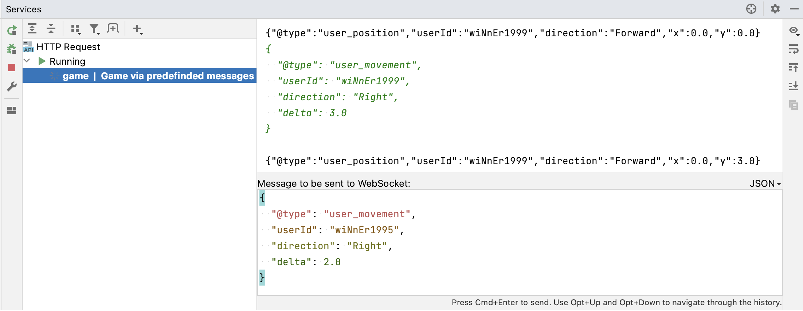

## GraphQL

GoLand provides support for sending GraphQL operations in the HTTP request body. You can send them over HTTP or [WebSocket](https://www.jetbrains.com/help/go/http-client-in-product-code-editor.html#websocket).

GoLand 支持在 HTTP 请求正文中发送 GraphQL 操作。您可以通过 HTTP 或 WebSocket 发送它们。


> For the GraphQL language support in the request body (syntax highlighting, quick navigation to schemas, and so on), you can install and enable the [GraphQL](https://plugins.jetbrains.com/plugin/8097-graphql) plugin.
>
> ​	要在请求正文中获得 GraphQL 语言支持（语法突出显示、快速导航到模式等），您可以安装并启用 [GraphQL](https://plugins.jetbrains.com/plugin/8097-graphql) 插件。

### 组合带有 GraphQL 查询的 HTTP 请求 Compose an HTTP request with GraphQL query

1. In an **.http** file, enter the `GRAPHQL` keyword followed by a server address.

2. 在 **.http** 文件中，输入 `GRAPHQL` 关键字，后跟服务器地址。

3. In the request body, compose your GraphQL operation (query, mutation, or subscription), for example:

4. 在请求正文中，组合您的 GraphQL 操作（查询、变更或订阅），例如：

   ```http
   ### HTTP request with GraphQL query
   GRAPHQL http://localhost:8080/graphql
   
   query {
     toDos {
       title,
       completed,
       author {
         username
       }
     }
   }
   ```

   


To speed up composing an HTTP request with a GraphQL query, you can:

​	为了加快组成带有 GraphQL 查询的 HTTP 请求的速度，您可以： 

- Click 在 **.http** 文件的编辑器面板顶部点击  on top of the editor panel of an **.http** file and select GraphQL Query Request.，然后选择 GraphQL 查询请求。
- In an **.http** file, type `gqlr` and press Enter to apply the GraphQL live template.
- 在 **.http** 文件中输入 `gqlr`，然后按 Enter 键应用 GraphQL 活动模板。


### 使用 GraphQL 变量 Use GraphQL variables

In the HTTP request body, you can use GraphQL variables if you want to pass some dynamic data separately from the query string.

​	在 HTTP 请求正文中，如果您想将一些动态数据单独传递给查询字符串，可以使用 GraphQL 变量。

- After the query part, enter a JSON variables dictionary:

- 在查询部分之后，输入一个 JSON 变量字典：

  ```javascript
  query ($name: String!, $capital: String!) {
    country(name: $name, capital: $capital) {
      name
      capital
    }
  }
  
  {
    "name": "France",
    "capital": "Paris"
  }
  ```

  

  You can also use [HTTP Client environment variables](https://www.jetbrains.com/help/go/exploring-http-syntax.html#using_request_vars) as GraphQL variable values. For example, in this JSON, `"{{Author}}"` is an environment variable; its value at runtime depends on the environment that you select while sending the request:

  您还可以使用 [HTTP 客户端环境变量](https://www.jetbrains.com/help/go/exploring-http-syntax.html#using_request_vars) 作为 GraphQL 变量值。例如，在此 JSON 中，`"{{Author}}"` 是一个环境变量；它在运行时的值取决于您在发送请求时选择的环境：
  
  ```json
  {
    "author": "{{Author}}"
  }
  ```
  
  


> You can quickly add a variable block to the GraphQL query by pressing Alt+Enter (Show Context Actions) in the request body and selecting Add GraphQL JSON variables block.
>
> ​	您可以通过在请求正文中按下 Alt+Enter（显示上下文操作）并选择添加 GraphQL JSON 变量块来快速添加 GraphQL 查询的变量块。

## 配置代理设置 Configure proxy settings

1. In the Settings dialog (Ctrl+Alt+S), choose System Settings under Appearance & Behavior, then choose HTTP Proxy.
2. 在设置对话框中（Ctrl+Alt+S），选择外观和行为下的系统设置，然后选择 HTTP 代理。
3. In the [HTTP Proxy](https://www.jetbrains.com/help/go/settings-http-proxy.html) dialog that opens, select Manual proxy configuration and specify the following:
4. 在打开的 [HTTP 代理](https://www.jetbrains.com/help/go/settings-http-proxy.html) 对话框中，选择手动代理配置，并指定以下内容：
   - Enter the proxy host name and port number in the Host name and Port number fields.
   - 在“主机名”和“端口号”字段中输入代理主机名和端口号。
   - To enable authorization, select the Proxy authentication checkbox and type the username and password in the corresponding fields.
   - 要启用授权，请选择“代理身份验证”复选框，并在相应字段中输入用户名和密码。

## Set up client SSL/TLS certificate设置客户端 SSL/TLS 证书 

If an HTTP server requires SSL/TLS authentication for secure communication, you may need to specify the client certificate before sending an HTTPS request. In the HTTP Client, you can set up the client certificate using the [private environment file](https://www.jetbrains.com/help/go/exploring-http-syntax.html#environment-variables).

​	如果 HTTP 服务器要求进行 SSL/TLS 身份验证以进行安全通信，则在发送 HTTPS 请求之前，您可能需要指定客户端证书。在 HTTP 客户端中，您可以使用 [private environment file](https://www.jetbrains.com/help/go/exploring-http-syntax.html#environment-variables) 设置客户端证书。

### 指定证书路径 Specify path to certificate

1. In an **.http** file, in the Run with list, select Add Environment to Private File….

2. 在 **.http** 文件中，选择Add Environment to Private File…选项。

3. In the **http-client.private.env.json** file that opens, add the `SSLConfiguration` object to the needed environment. In `clientCertificate`, enter a path to your client certificate. If a certificate key is stored in a separate file, enter its path in `clientCertificateKey`. For example:

4. 打开的 **http-client.private.env.json** 文件中，将 `SSLConfiguration` 对象添加到所需的环境中。在 `clientCertificate` 中输入您的客户端证书的路径。如果证书密钥存储在单独的文件中，请在 `clientCertificateKey` 中输入其路径。例如：

   ```json
   {
       "dev": {
           "MyVar": "SomeValue",
           "SSLConfiguration": {
               "clientCertificate": "cert.pem",
               "clientCertificateKey": "MyFolder/key.pem"
           }
       }
   }
   ```

   

   > You can specify an absolute path or a path relative to the **http-client.private.env.json** file. If the environment file is stored in scratches, you can additionally specify a path relative to your project root. Start typing a path to get the code completion popup.
   >
   > ​	您可以指定绝对路径或相对于 **http-client.private.env.json** 文件的路径。如果环境文件存储在临时文件中，您还可以指定相对于项目根目录的路径。开始输入路径以获取代码完成弹出窗口。

   Alternatively, you can describe `clientCertificate` and `clientCertificateKey` as objects, which lets you specify the certificate format in addition to the path. For example:

   或者，您可以将 `clientCertificate` 和 `clientCertificateKey` 描述为对象，这样您可以除了路径之外还可以指定证书格式。例如：

   ```json
   {
       "dev": {
           "SSLConfiguration": {
               "clientCertificate": {
                   "path": "file.crt",
                   "format": "PEM"
               },
               "clientCertificateKey": {
                   "path": "file.key",
                   "format": "DER"
               }
           }
       }
   }
   ```

   


### 设置证书密码 Set up a certificate passphrase

If you used a passphrase when generating your client certificate, you should provide it to the HTTP Client.

​	如果在生成客户端证书时使用了密码短语，则您应该将其提供给 HTTP 客户端。

1. In the **http-client.private.env.json** file, add `"hasCertificatePassphrase": true` to the `SSLConfiguration` object, for example:

2. 在 **http-client.private.env.json** 文件中，将 `"hasCertificatePassphrase": true` 添加到 `SSLConfiguration` 对象，例如：

   ```json
   {
       "dev": {
           "SSLConfiguration": {
               "clientCertificate": "file.crt",
               "hasCertificatePassphrase": true
           }
       }
   }
   ```

   

3. Click 单击左侧导航栏的  in the gutter or, with the caret placed at `hasCertificatePassphrase`, press Alt+Enter and select Set value for 'Certificate passphrase'. 图标，或者将光标放置在 `hasCertificatePassphrase` 上，然后按下 Alt+Enter 并选择 Set value for 'Certificate passphrase'。

4. In the window that opens, enter your certificate passphrase.

5. 在打开的窗口中，输入您的证书密码。


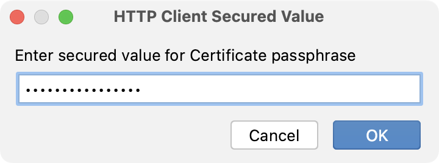

You can omit the second step if you do not want to enter the passphrase now. In this case, GoLand will prompt you to enter the passphrase when you execute an HTTPS request.

​	如果您不想现在输入密码，可以省略第二步。在这种情况下，当您执行 HTTPS 请求时，GoLand 将提示您输入密码。

### 禁用证书验证 Disable certificate verification

For development purposes, you may have a host with self-signed or expired certificates. If you trust this host, you can disable verification of its certificate.

​	出于开发目的，您可能会遇到使用自签名或过期证书的主机。如果您信任此主机，可以禁用对其证书的验证。

- In the **http-client.private.env.json** file, add `verifyHostCertificate": false` to the `SSLConfiguration` object. For example:

- 在 **http-client.private.env.json** 文件中，将 `verifyHostCertificate": false` 添加到 `SSLConfiguration` 对象。例如：

  ```json
  {
      "sslTest": {
          "SSLConfiguration": {
              "verifyHostCertificate": false
          }
      }
  }
  ```

  

If you run a request with this environment, GoLand will not verify host certificates.

​	如果您使用此环境运行请求，GoLand 将不会验证主机证书。