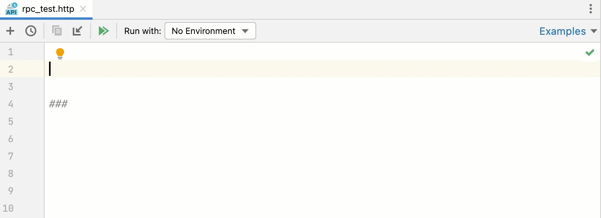

+++
title = "HTTP Client"
weight = 50
date = 2023-06-19T11:20:58+08:00
type = "docs"
description = ""
isCJKLanguage = true
draft = false
+++
# HTTP Client

https://www.jetbrains.com/help/go/http-client-in-product-code-editor.html#ssl_certificate

Last modified: 03 May 2023

With the HTTP Client plugin, you can create, edit, and execute HTTP requests directly in the GoLand [code editor](https://www.jetbrains.com/help/go/using-code-editor.html).


There are two main use cases when you need to compose and run HTTP requests:

- When you are developing a RESTful web service and want to make sure it works as expected, is accessible in compliance with the specification, and responds correctly.
- When you are developing an application that addresses a RESTful web service. In this case, it is helpful to investigate the access to the service and the required input data before you start the development. During the development, you may also call this web service from outside your application. This may help locate errors when your application results in unexpected output while no logical errors are detected in your code and you suspect that the bottleneck is the interaction with the web service.

HTTP requests are stored in **.http** and **.rest** files and are marked with the  icon.

Support for HTTP files includes the following features:

- [Code highlighting](https://www.jetbrains.com/help/go/configuring-colors-and-fonts.html)
- [Code completion](https://www.jetbrains.com/help/go/auto-completing-code.html) for hosts, method types, header fields, and endpoints defined via OpenAPI
- [Code folding](https://www.jetbrains.com/help/go/working-with-source-code.html#code_folding) for requests, their parts, and response handler scripts
- [Reformat](https://www.jetbrains.com/help/go/reformat-and-rearrange-code.html) requests according to your HTTP Request code style.
- [Inline documentation](https://www.jetbrains.com/help/go/viewing-reference-information.html) for request header fields and doc tags
- [Viewing a structure](https://www.jetbrains.com/help/go/viewing-structure-of-a-source-file.html) of HTTP requests
- [Language injections in Web languages](https://www.jetbrains.com/help/go/using-language-injections.html) inside the request message body
- [Live templates](https://www.jetbrains.com/help/go/using-live-templates.html)

If necessary, before you begin, [configure the Proxy settings](https://www.jetbrains.com/help/go/http-client-in-product-code-editor.html#configureProxy) on the [HTTP Proxy](https://www.jetbrains.com/help/go/settings-http-proxy.html) page of the Settings dialog (Ctrl+Alt+S).

## Create HTTP request files

You can work with HTTP requests either from scratch files or from physical files of the HTTP Request type. Each file can contain multiple requests, and you can create as many files as needed.

[Scratch files](https://www.jetbrains.com/help/go/scratches.html) can be used to test HTTP requests during development. Scratch files are not stored inside a project, so GoLand can modify them and add additional information about the request. When an HTTP request is executed from a scratch file, the link to the response output file is added below the request and at the top of the [requests history](https://www.jetbrains.com/help/go/http-client-in-product-code-editor.html#requests_history) file.

### Create an HTTP request scratch file

- Press Ctrl+Alt+Shift+Insert and select HTTP Request.

Physical files can be used for documenting, testing, and validating HTTP requests. Physical files are stored inside your project, and GoLand will not modify them. When an HTTP request is executed from a physical file, this file is not modified. Information about the executed request with the link to the response output file is added to the top of the [requests history](https://www.jetbrains.com/help/go/http-client-in-product-code-editor.html#requests_history) file.

### Create a physical HTTP request file

- In the File menu, point to New, and then click HTTP Request.

### Move an HTTP request

You can use the [Move](https://www.jetbrains.com/help/go/move-refactorings.html) refactoring F6 to move HTTP requests from scratches to physical files, as well as between physical files.

1. In the editor, position the caret at the request to be moved and do one of the following:

   - From the main menu or the context menu, select Refactor | Move.
   - Press Alt+Enter and select the Move HTTP Requests [intention action](https://www.jetbrains.com/help/go/intention-actions.html).
   - Press F6.

2. In the Move HTTP Requests dialog that opens, do the following:

   1. In the Path field, choose one of the existing **.http** files from the list or click  to locate the file.

      You can also type the full path to the file manually. If you specify the name of a non-existing file, a new file with the provided name will be created automatically.

   2. In the Requests list, select the checkboxes next to the requests you want to move.

## Compose HTTP requests

GoLand uses the HTTP request in Editor format, which provides a simple way to create, execute, and store information about HTTP requests. You can type them directly in the [created HTTP request files](https://www.jetbrains.com/help/go/http-client-in-product-code-editor.html#creating-http-request-files) using the following general syntax:

```shell
###
Method Request-URI HTTP-Version
Header-field: Header-value

Request-Body
```


After the `###` separator, you can enter any comments preceded by `#` or `//`.


> To quickly find your request in run/debug configurations, Search Everywhere, and Run Anything, you can [give it a name](https://www.jetbrains.com/help/go/exploring-http-syntax.html#http_request_names).


> You can use the Editor | Color Scheme | HTTP Request settings to [customize colors and style](https://www.jetbrains.com/help/go/configuring-colors-and-fonts.html#customize-color-scheme) for highlighting request syntax (name, comments, parameters, headers, and so on).

To speed up composing HTTP requests, you can:

- Click Tools | HTTP Client | Create Request in HTTP Client. If a request file is opened in the editor, this will add a request template to the opened file. Otherwise, this will create a new **.http** scratch file.

- Click  on top of the request's editor panel. In the popup menu, choose the type of the request to add.

  

Alternatively, use [live templates](https://www.jetbrains.com/help/go/using-live-templates.html). In the editor, you can press Ctrl+J to view the list of available templates. For example, gtr expands to a simple GET request; mptr expands to a `multipart/form-data` POST request.


To get an overview of the HTTP Client possibilities, you can explore the HTTP Requests Collection, which is a handful selection of composed requests.

### Open a request from the HTTP Requests Collection

1. Click the Examples shortcut link on top of the request's editor panel.

2. In the popup menu, choose the HTTP Requests collection you wish to open:

   


> See [Exploring the HTTP request syntax](https://www.jetbrains.com/help/go/exploring-http-syntax.html) for the syntax and capabilities overview, and [HTTP request in Editor specification](https://github.com/JetBrains/http-request-in-editor-spec/blob/master/spec.md) for the full format description.

### Convert cURL requests

If you are working with [cURL](https://curl.haxx.se/) requests, you can convert between cURL requests and the HTTP request in Editor format.

### Convert cURL to HTTP request

- Paste the cURL request into an HTTP request file. GoLand will convert it to the HTTP request format and leave the original cURL request commented out for later reference.

  

- Alternatively, click  on top of the HTTP request editor panel and select Convert cURL to HTTP Request.

  In the Convert cURL to HTTP Request dialog, type or paste the cURL request that you want to convert.

  

Consider the following example cURL request:

```bash
curl 'http://httpbin.org/' -H 'Connection: keep-alive' -H 'Accept: text/html' -H 'Accept-Encoding: gzip, deflate' -H 'Accept-Language: en-US,en;q=0.9,es;q=0.8'
```


GoLand will convert it to the following:

```http
# curl 'http://httpbin.org/' -H 'Connection: keep-alive' -H 'Accept: text/html' -H 'Accept-Encoding: gzip, deflate' -H 'Accept-Language: en-US,en;q=0.9,es;q=0.8'
GET http://httpbin.org/
Connection: keep-alive
Accept: text/html
Accept-Encoding: gzip, deflate
Accept-Language: en-US,en;q=0.9,es;q=0.8

###
```


The converter supports the following cURL options:

| Option                                                       | Description                                                  |
| ------------------------------------------------------------ | ------------------------------------------------------------ |
| [-X, --request](https://curl.haxx.se/docs/manpage.html#-X)   | The request method to use.                                   |
| [-H, --header](https://curl.haxx.se/docs/manpage.html#-H)    | The request header to include in the request.                |
| [-u, --user](https://curl.haxx.se/docs/manpage.html#-u)[--basic](https://curl.haxx.se/docs/manpage.html#--basic)[--digest](https://curl.haxx.se/docs/manpage.html#--digest) | The user's credentials to be provided with the request, and the authorization method to use. |
| [-d, --data, --data-ascii](https://curl.haxx.se/docs/manpage.html#-d)[--data-binary](https://curl.haxx.se/docs/manpage.html#--data-binary)[--data-raw](https://curl.haxx.se/docs/manpage.html#--data-raw)[--data-urlencode](https://curl.haxx.se/docs/manpage.html#--data-urlencode) | The data to be sent in a POST request.                       |
| [-F, --form](https://curl.haxx.se/docs/manpage.html#-F)      | The multipart/form-data message to be sent in a POST request. |
| [--url](https://curl.haxx.se/docs/manpage.html#--url)        | The URL to fetch (mostly used when specifying URLs in a config file). |
| [-i, --include](https://curl.haxx.se/docs/manpage.html#-i)   | Defines whether the HTTP response headers are included in the output. |
| [-v, --verbose](https://curl.haxx.se/docs/manpage.html#-v)   | Enables the verbose operating mode.                          |
| [-L, --location](https://curl.haxx.se/docs/manpage.html#-L)  | Enables resending the request in case the requested page has moved to a different location. |

### Convert HTTP request to cURL

1. Put the caret at the HTTP request that you want to convert to cURL format.

2. Click Alt+Enter and select Convert to cURL and copy to clipboard.

   Alternatively, you can click the Convert shortcut link on top of the HTTP request editor panel and select Convert HTTP Request Under Caret to cURL and Copy.

This will generate a cURL request based on the HTTP request and copy it to the clipboard.

### Generate requests using context action

You can quickly generate an HTTP request if you have a URL starting with `http` or `https` in your code string literals or in JSON, YAML, TOML, and Properties files.

1. Click a URL and press Alt+Enter.

2. In the context menu that opens, click Generate request in HTTP Client.

   This will create a new GET HTTP request to the specified URL in the **generated-requests.http** scratch file.


### Create requests from OpenAPI specifications

When working with OpenAPI Specification files, you can create HTTP requests to the specified endpoints.

### Create an HTTP request to an endpoint

- In an OpenAPI specification file, click  in the editor gutter next to the endpoint definition.
- Alternatively, open View | Tool Windows | Endpoints, right-click an endpoind, and select Generate Request in HTTP Client.

GoLand will create a new HTTP request and save it in the **generated-requests.http** [scratch file](https://www.jetbrains.com/help/go/http-client-in-product-code-editor.html#creating-http-request-files).

### Rename an endpoint and its usages

Use the [Rename refactoring](https://www.jetbrains.com/help/go/rename-refactorings.html) to rename the defined endpoint and its usages in HTTP requests simultaneously.

1. Do any of the following:
   - In an OpenAPI specification file, position the caret at the endpoint's definition you want to rename.
   - In an HTTP request file, position the caret at the URL path segment you want to rename.
2. Select Refactor | Rename from the main menu or the context menu, or press Shift+F6.
3. In the Rename dialog that opens, specify the new endpoint's name.
4. Preview and apply changes.

GoLand will rename the endpoint and its usages.

### Use response handler scripts

With response handler scripts, you can programmatically react to a received HTTP response. By using these scripts, you can automatically process the received data as well as validate it against the conditions that you specify. Response handler scripts are provided as a part of the request within the HTTP request file and are executed as soon as a response is received. To view the response handling examples, open the Requests with Authorization or Requests with Tests [requests collections](https://www.jetbrains.com/help/go/http-client-in-product-code-editor.html#open-requests-collection).

You can insert a response handler script into your request either in-place or by referring to an external file.

### Insert the script into the request

- To insert the script in-place, prepend it with `>` and enclose it in ``:

  ```http
  GET host/api/test
  
  > 
  ```

  

- To insert the script from an external file, prepend it with `>`:

  ```http
  GET host/api/test
  
  > scripts/my-script.js
  ```

  

Response handler scripts are written in JavaScript ECMAScript 6, with coding assistance and documentation handled by the bundled `HTTP Response Handler` library. For in-place scripts, this functionality is enabled automatically. For external scripts, you need to enable it manually.

### Enable JavaScript coding assistance for response handler scripts

1. Open the script file in the editor.
2. In the context menu, choose Use JavaScript Library | HTTP Response Handler.

The `HTTP Response Handler` library exposes two objects to be used for composing response handler scripts:

- The `client` object stores the session metadata, which can be modified inside the script. The `client` state is preserved until you close GoLand. Every variable saved in `client.global` as `variable_name` is accessible to subsequent HTTP requests as `{{variable_name}}`.
- `response` holds information about the received response: its content type, status, response body, and so on.

To open the HTTP Response Handler library in the editor, position the caret at the library object and press Ctrl+B.

Response handler scripts can include tests, which lets you use the HTTP Client as a testing framework. To create a test, invoke the `client.test(testName, function)` method. Inside the test, you can assert a condition by invoking the `client.assert(condition, message)` method, for example:

```javascript
GET https://httpbin.org/status/200

> 
```


## Execute HTTP requests

1. If you are going to test your own web service, make sure it is deployed and running.
2. If you have [environments](https://www.jetbrains.com/help/go/exploring-http-syntax.html#environment-variables) defined, select an environment in the Run with list on top of the request's editor panel.
3. In the gutter, click  next to the request.

If you have multiple HTTP requests defined in an **.http** file, you can run all of them sequentially. To do this, click  on top of the request's editor panel.

When a request is executed, GoLand automatically creates a dedicated temporary [HTTP Request run/debug configuration](https://www.jetbrains.com/help/go/http-client-in-product-code-editor.html#http-request-run-debug-configurations) for it. You can [save it as a permanent run/debug configuration](https://www.jetbrains.com/help/go/http-client-in-product-code-editor.html#save-temporary-http-request-run-debug-configuration) if necessary.

### Open a request in the browser

You can open an HTTP request in the browser specified on the [Web Browsers and Preview](https://www.jetbrains.com/help/go/settings-tools-web-browsers.html) page of the Settings dialog (Ctrl+Alt+S).

- Press Alt+Enter and select the Open in web browser [intention action](https://www.jetbrains.com/help/go/intention-actions.html).

### Work with HTTP request run/debug configurations

When you [execute an HTTP request from the editor](https://www.jetbrains.com/help/go/http-client-in-product-code-editor.html#execute_request_procedure), GoLand automatically creates a temporary run/debug configuration with the request parameters. A temporary run/debug configuration works the same way as a permanent run/debug configuration. You can change its settings using the [Run/Debug Configuration](https://www.jetbrains.com/help/go/run-debug-configurations-dialog.html) dialog and optionally save it as permanent.

### Modify an HTTP Request run/debug configuration

1. Do any of the following:
   - In the editor, right-click a request and in the context menu, select Modify Run Configuration.
   - Alternatively, choose Run | Edit Configurations from the main menu, and select the needed run/debug configuration in the HTTP Request list.
2. Change the needed configuration parameters:
   - In the Environment list, select an [environment](https://www.jetbrains.com/help/go/exploring-http-syntax.html#using_request_vars) that will define the set of environment variables used in the request.
   - In the File field, provide the path to the [HTTP request file](https://www.jetbrains.com/help/go/http-client-in-product-code-editor.html#creating-http-request-files). You can type the path manually and use path completion Ctrl+Space as you type, or click  and select the required folder in the dialog that opens.
   - If your request file contains multiple requests, in the Request list, choose the name of the request to execute.

### Save a temporary HTTP Request run/debug configuration

- In the Run/Debug Configuration selector, choose Save <configuration name>.
- In the Run/Debug Configuration dialog, select the configuration and click .

### Execute a request using a run/debug configuration

- In the Run/Debug Configuration selector, select the desired run configuration. Then click  on the main toolbar or press Shift+F10.
- Press Alt+Shift+F10, select the desired run configuration from the list, and press Enter.

## View responses from web services

When you execute an HTTP request, GoLand automatically saves the response into a separate file under the **.idea/httpRequests/** directory. You can view the 50 most recently stored responses and navigate to the corresponding files using the [requests history](https://www.jetbrains.com/help/go/http-client-in-product-code-editor.html#requests_history). If the request was executed from a scratch file, the link to its response output is also added below the original request:


### View a received response

1. Switch to the [Services tool window](https://www.jetbrains.com/help/go/services-tool-window.html), which opens automatically as soon as a response is received.

2. By default, the server response is shown in the format specified in the request header via the [content-type](http://www.w3.org/Protocols/rfc2616/rfc2616-sec14.html#sec14.17) field. To have the response converted into another format, click  and select Text, JSON, XML, or HTML.

   

If the response contains a binary file, this file is also saved under the **.idea/httpRequests/** directory. If the response is an image, you can see its preview in the Services tool window.


If you have a [response handler script](https://www.jetbrains.com/help/go/http-client-in-product-code-editor.html#using-response-handler-scripts), the results of the tests executed as part of this script are displayed on the Tests tab of the Services tool window. You can click each of the tests to quickly navigate to the test source code in the corresponding response handler script.


If you subscribe to an event stream, GoLand displays events in the Services tool window. Here, you can also view the status of the client-server connection and terminate it by clicking . Depending on the content type (either `text/event-stream` or `application/x-ndjson`), the response will be formatted as plain text or newline-delimited JSON. You can write a response handler script to [process each line of the event stream](https://www.jetbrains.com/help/go/http-response-handling-examples.html#stream_scripting).


[Redirecting](https://www.jetbrains.com/help/go/exploring-http-syntax.html#response-redirect) stream events to a file is currently not supported.

### Open a response file in the editor

1. Position the caret at the link to the response you want to open.
2. Choose View | Jump to Source from the main menu, or press Ctrl+B or F4

Alternatively, you can Ctrl+Click the response line:

### Compare responses in a scratch file

When a request is executed from a scratch file, the link to the response output file is added below the original request.

- Do any of the following:

  - Position the caret at the link to the response file. Press Alt+Enter and select the Compare with <response name> intention action.

  - Click  in the gutter and select Compare with <response name> from the list:

    

### Compare responses in the request history

When a request is executed from a physical file, the link to the response output is added to the [requests history](https://www.jetbrains.com/help/go/http-client-in-product-code-editor.html#requests_history).

1. Position the caret at the link to the response file. Choose View | Jump to Source from the main menu, or press Ctrl+B or F4 to open this file in a new editor tab.
2. Choose View | Compare With from the main menu, or press Ctrl+D. GoLand will prompt you to open a response file from the **httpRequests** folder.
3. Select the response file you would like to compare the current file with and click Open.

The two response files will be opened in the [Differences viewer](https://www.jetbrains.com/help/go/differences-viewer.html) allowing you to compare their contents:


## View request history

GoLand automatically saves the 50 recently executed requests into the **http-requests-log.http** file, which is stored on the project level under the **.idea/httpRequests/** directory. With requests history, you can quickly navigate to a particular response as well as [issue any request again](https://www.jetbrains.com/help/go/http-client-in-product-code-editor.html#run_request). If a request is issued again from the request history, its execution information and the link to the response output are added to the top of the request history file.


> To prevent saving a request to the request history, add a comment line with the [@no-log](https://www.jetbrains.com/help/go/exploring-http-syntax.html#enable-disable-saving-request) tag before the request. This can be helpful in case a request contains some sensitive data, and you don't want to log it.

### Open request history

- Click  on top of the request's editor panel.
- Select Tools | HTTP Client | Show HTTP Requests History from the main menu.

### Redirect output to a custom file or directory

- The HTTP Client can redirect output to a custom file or directory. It supports two operators for force and soft redirects:
  - The `>>` operator always creates a new file, adding an `-n` suffix to a filename if the requested filename already exists.
  - The `>>!` operator rewrites the file if it already exists.

## Manage cookies

The cookies received through a response are automatically saved into the dedicated **http-client.cookies** file under the **.idea/httpRequests/** directory. The number of cookies that can be saved is limited to 300. The name and value of a cookie are automatically included in each subsequent request to the URL that matches the domain and path specified for the cookie, provided that the expiry date has not been reached.


> You can prevent saving the received cookie to the cookie jar by adding a comment line with the [@no-cookie-jar](https://www.jetbrains.com/help/go/exploring-http-syntax.html#enable-disable-saving-cookies) tag before the request.

If you want to set custom cookies in an HTTP request, you can use the `Cookie` header. Enter your cookies as a list of `name=value` pairs separated by a semicolon, for example:

```http
GET http://localhost:80/api
Cookie: theme=dark; country=France
```


## gRPC requests


> To work with gRPC requests, you need to install and enable the following plugins: [Protocol Buffers](https://plugins.jetbrains.com/plugin/14004-protocol-buffers) and [gRPC](https://plugins.jetbrains.com/plugin/16889-grpc).

The HTTP Client supports gRPC requests. For the HTTP Client to treat your requests as gRPC requests, start them with the `GRPC` keyword.

Based on a `.proto` file, GoLand provides completion for gRPC: all known gRPC services, unary and server-streaming methods of a particular server, and fields of accepted messages in the request body. If you don’t have a `.proto` file in your project, code completion can still be available if a server supports [gRPC reflection](https://github.com/grpc/grpc/blob/master/doc/server-reflection.md), which provides HTTP clients with information about accessible services.



### Generate a gRPC request from proto files

- In the proto file, click  Generate request in HTTP Client near the RPC method.

  

### Generate a gRPC request from Endpoints tool window

Just like for HTTP requests, you can also use the Endpoints tool window to generate gRPC requests.

1. Open the Endpoints tool window: View | Tool Windows | Endpoints. You will see gRPC endpoints if they are defined in your project.
2. Select an endpoint. This will generate a sample request to it in the HTTP Client tab.
3. Complete the request and click Submit Request. You may need to substitute the default address and port with your own values. For the request body, use code completion based on the data structure in the proto file.
4. Preview the response in the lower part of the the HTTP Client tab.


### Send gRPC metadata

- Below your `GRPC` request, enter gRPC metadata using the following syntax: `Metadata-key: Value`.

  For example:

  ```http
  GRPC localhost:8080
  X-Myhostname: Example.org
  ```

  


> Currently, the supported RPC types that can be executed in the HTTP Client are unary and server-streaming. Like in ordinary HTTP requests, the request body and responses are plain JSON files.

### Navigate from PROTO files to Go code

- You can navigate and access declarations of messages, services, and methods from Go code and their Go implementations from PROTO files.

  Press the Navigate to implementation icon next to a declaration of a message, service, or method, or their implementation.

  <video src="https://resources.jetbrains.com/help/img/idea/2023.1/go_navigate_from_proto_files_to_go_code.mp4" preload="auto" style="margin: 0px; padding: 0px; border: 0px; font: inherit; vertical-align: baseline; width: 648.381px; height: 386.989px;"></video>

  

  

  00:00/00:09

  

## WebSocket requests

The HTTP Client supports WebSocket requests. For the HTTP Client to treat your request as a WebSocket request, start it with the `WEBSOCKET` keyword followed by a server address. The request has the following structure:

```javascript
WEBSOCKET ws://localhost:8080/websocket
Content-Type: application-json // Used for content highlighting only

// Request body, for example:
{
  "message": "First message sent on connection"
}
===  // message separator
{
  "message": "Second message" // will be sent right after the previous one
}
=== wait-for-server  // keyword used to wait for the server response
{
  "message": "Send this after the server response"
}
```


> While the `Content-Type` header is not used in WebSocket connections, you can use it GoLand WebSocket requests to highlight syntax of transmitted data.

To speed up composing a WebSocket request, you can:

- Click  on top of the editor panel of an **.http** file and select WebSocket Request.
- In an **.http** file, type `wsr` and press Enter to apply the WebSocket live template.

### Send multiple messages

- Use the `===` separator to send multiple messages:

  ```json
  {
    "message": "First message sent on connection"
  }
  ===  // message separator
  {
    "message": "Second message"
  }
  ===
  {
    "message": "Third message"
  }
  ```

  

### Send messages after the server response

- Before a message, enter `=== wait-for-server`.

  This will make the HTTP Client wait for the server response before sending the message. You can wait for multiple responses by repeating the `=== wait-for-server` line. For example, the following message will be sent after 3 server responses:

  ```json
  === wait-for-server
  === wait-for-server
  === wait-for-server
  {
    "message": "This messages is sent after 3 server responses"
  }
  ```

  

### Send messages interactively

Once you have initiated a connection, you can interact with your server right from the Services tool window. You can send messages and view server responses to each new message.

1. In the Services tool window, select an opened connection.
2. In the lower part of the window, under Message to be sent to WebSocket, enter the message content.
3. To the right of it, select the message format: plain text, JSON, XML, or HTML.
4. Press Ctrl+Enter to send the request.

In the upper part of the window, you'll see the server response.


## GraphQL

GoLand provides support for sending GraphQL operations in the HTTP request body. You can send them over HTTP or [WebSocket](https://www.jetbrains.com/help/go/http-client-in-product-code-editor.html#websocket).


> For the GraphQL language support in the request body (syntax highlighting, quick navigation to schemas, and so on), you can install and enable the [GraphQL](https://plugins.jetbrains.com/plugin/8097-graphql) plugin.

### Compose an HTTP request with GraphQL query

1. In an **.http** file, enter the `GRAPHQL` keyword followed by a server address.

2. In the request body, compose your GraphQL operation (query, mutation, or subscription), for example:

   ```http
   ### HTTP request with GraphQL query
   GRAPHQL http://localhost:8080/graphql
   
   query {
     toDos {
       title,
       completed,
       author {
         username
       }
     }
   }
   ```

   

To speed up composing an HTTP request with a GraphQL query, you can:


- Click  on top of the editor panel of an **.http** file and select GraphQL Query Request.
- In an **.http** file, type `gqlr` and press Enter to apply the GraphQL live template.


### Use GraphQL variables

In the HTTP request body, you can use GraphQL variables if you want to pass some dynamic data separately from the query string.

- After the query part, enter a JSON variables dictionary:

  ```javascript
  query ($name: String!, $capital: String!) {
    country(name: $name, capital: $capital) {
      name
      capital
    }
  }
  
  {
    "name": "France",
    "capital": "Paris"
  }
  ```

  

  You can also use [HTTP Client environment variables](https://www.jetbrains.com/help/go/exploring-http-syntax.html#using_request_vars) as GraphQL variable values. For example, in this JSON, `"{{Author}}"` is an environment variable; its value at runtime depends on the environment that you select while sending the request:

  ```json
  {
    "author": "{{Author}}"
  }
  ```

  


> You can quickly add a variable block to the GraphQL query by pressing Alt+Enter (Show Context Actions) in the request body and selecting Add GraphQL JSON variables block.

## Configure proxy settings

1. In the Settings dialog (Ctrl+Alt+S), choose System Settings under Appearance & Behavior, then choose HTTP Proxy.
2. In the [HTTP Proxy](https://www.jetbrains.com/help/go/settings-http-proxy.html) dialog that opens, select Manual proxy configuration and specify the following:
   - Enter the proxy host name and port number in the Host name and Port number fields.
   - To enable authorization, select the Proxy authentication checkbox and type the username and password in the corresponding fields.

## Set up client SSL/TLS certificate

If an HTTP server requires SSL/TLS authentication for secure communication, you may need to specify the client certificate before sending an HTTPS request. In the HTTP Client, you can set up the client certificate using the [private environment file](https://www.jetbrains.com/help/go/exploring-http-syntax.html#environment-variables).

### Specify path to certificate

1. In an **.http** file, in the Run with list, select Add Environment to Private File….

2. In the **http-client.private.env.json** file that opens, add the `SSLConfiguration` object to the needed environment. In `clientCertificate`, enter a path to your client certificate. If a certificate key is stored in a separate file, enter its path in `clientCertificateKey`. For example:

   ```json
   {
       "dev": {
           "MyVar": "SomeValue",
           "SSLConfiguration": {
               "clientCertificate": "cert.pem",
               "clientCertificateKey": "MyFolder/key.pem"
           }
       }
   }
   ```

   

   > ### 
   >
   > 
   >
   > You can specify an absolute path or a path relative to the **http-client.private.env.json** file. If the environment file is stored in scratches, you can additionally specify a path relative to your project root. Start typing a path to get the code completion popup.

   Alternatively, you can describe `clientCertificate` and `clientCertificateKey` as objects, which lets you specify the certificate format in addition to the path. For example:

   ```json
   {
       "dev": {
           "SSLConfiguration": {
               "clientCertificate": {
                   "path": "file.crt",
                   "format": "PEM"
               },
               "clientCertificateKey": {
                   "path": "file.key",
                   "format": "DER"
               }
           }
       }
   }
   ```

   

### Set up a certificate passphrase

If you used a passphrase when generating your client certificate, you should provide it to the HTTP Client.

1. In the **http-client.private.env.json** file, add `"hasCertificatePassphrase": true` to the `SSLConfiguration` object, for example:

   ```json
   {
       "dev": {
           "SSLConfiguration": {
               "clientCertificate": "file.crt",
               "hasCertificatePassphrase": true
           }
       }
   }
   ```

   

2. Click  in the gutter or, with the caret placed at `hasCertificatePassphrase`, press Alt+Enter and select Set value for 'Certificate passphrase'.

3. In the window that opens, enter your certificate passphrase.


You can omit the second step if you do not want to enter the passphrase now. In this case, GoLand will prompt you to enter the passphrase when you execute an HTTPS request.

### Disable certificate verification

For development purposes, you may have a host with self-signed or expired certificates. If you trust this host, you can disable verification of its certificate.

- In the **http-client.private.env.json** file, add `verifyHostCertificate": false` to the `SSLConfiguration` object. For example:

  ```json
  {
      "sslTest": {
          "SSLConfiguration": {
              "verifyHostCertificate": false
          }
      }
  }
  ```

  

If you run a request with this environment, GoLand will not verify host certificates.