+++
title = "Run tests"
weight = 30
date = 2023-06-19T11:20:58+08:00
type = "docs"
description = ""
isCJKLanguage = true
draft = false
+++
# Run tests

https://www.jetbrains.com/help/go/performing-tests.html#run-individual-table-tests

Last modified: 03 May 2023

Run the selected test or test folder: Ctrl+Shift+F10

Stop the current test session: Ctrl+F2

### Quick way

If your tests don't require any specific actions before start and you don't want to configure additional options, you can run them by using the following options:

- Place the caret at the test file to run all tests in that file, or at the test method, and press Ctrl+Shift+F10. Alternatively, click the gutter icon next to the test method.

  The gutter icon changes depending on the state of your test:

  - The  gutter icon marks new tests.
  - The  gutter icon marks successful tests.
  - The  gutter icon marks failed tests.

- To run all tests in a folder, select this folder in the Project tool window and press Ctrl+Shift+F10 or select Run Tests in 'folder' from the context menu .

  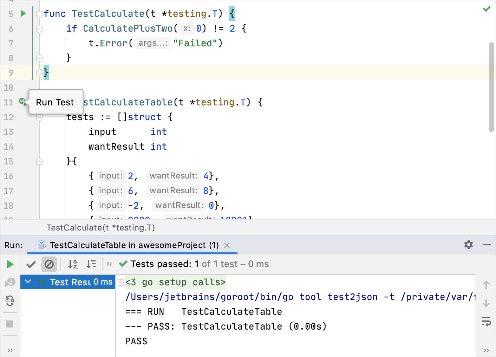

### Customizable way

When you run a test, GoLand creates a temporary run configuration. You can save temporary run configurations, change their settings, share them with other members of your team. For more information, refer to [Run/debug configurations](https://www.jetbrains.com/help/go/run-debug-configuration.html).

1. Create a new [run configuration](https://www.jetbrains.com/help/go/run-debug-configuration.html) or save a temporary one.

2. From the list on the main toolbar, select the configuration you want to run.

3. Click  or press Shift+F10.

   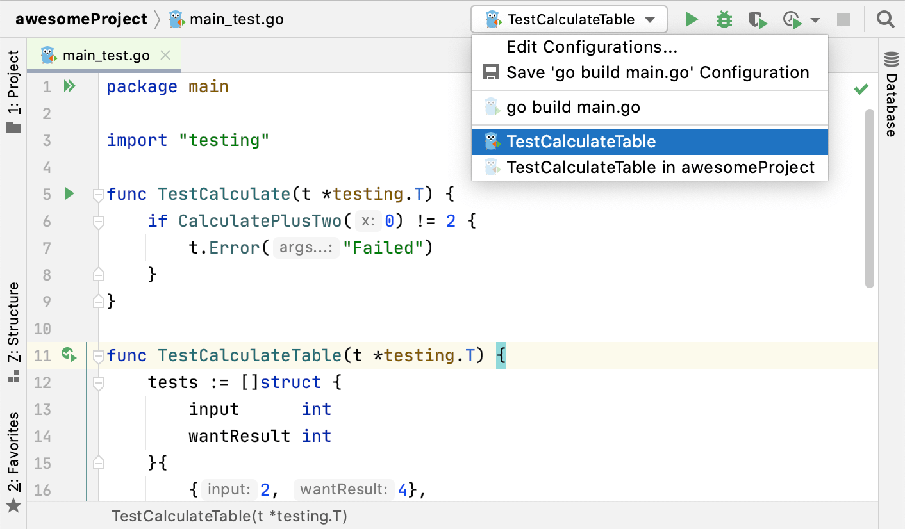


> Enable the Pin Tab  option on the Run toolbar to open the results of each test run in a separate tab.

After GoLand finishes running your tests, it shows the results in the Run tool window on the Test Runner tab. For more information on how to analyze test results, refer to [Explore test results](https://www.jetbrains.com/help/go/viewing-and-exploring-test-results.html).

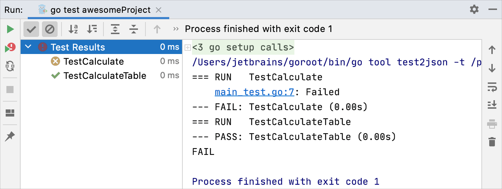

### Run tests with test flags

You can run tests with test flags like `-race`, `-failfast`, `-short`, and others. Check other flags in [the Go documentation at pkg.go.dev](https://pkg.go.dev/cmd/go).

1. Navigate to Run | Edit Configurations.

2. Click the run/debug configuration that you use to run your application or your tests. In the Go tool arguments field, specify a flag that you plan to use:

   - `-race`: enables data race detection. Supported only on `linux/amd64`, `freebsd/amd64`, `darwin/amd64`, `windows/amd64`, `linux/ppc64le` and `linux/arm64` (only for 48-bit VMA).
   - `-test.failfast`: stops new tests after the first test failure.
   - `-test.short`: shortens run time of long-running tests.
   - `-test.benchmem`: prints memory allocation statistics for benchmarks.

   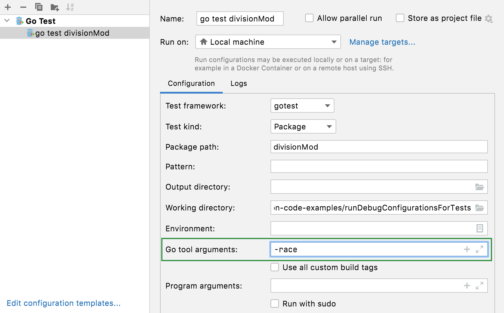

## Fuzz testing

Fuzz testing is a way to automate your tests by continuously submitting various input. The input is generated according to the sample data that you provided in `f.Add("mySampleData")`.

The `f.Add()` which accepts the following data types: `string`, `[]byte`, `rune`, `int`, `int8`, `int16`, `int32`, `int64`, `uint`, `uint8`, `unit16`, `uint32`, `uint64`, `float32`, `float64`, `bool`.

### Running fuzz testing

- Click the gutter Run Test icon, select Run, and then select the fuzz testing configuration (for example, go test -fuzz FuzzTest).

  If the testing fails, you can click the link to the **testdata** directory to see what input has failed the test.

  To run go test with the failing seed corpus entry, open the file from the **testdata** directory, click the Run Fuzzing icon in the gutter, and select the necessary configuration.

  <video src="https://resources.jetbrains.com/help/img/idea/2023.1/go_run_fuzz_testing.mp4" preload="auto" style="margin: 0px; padding: 0px; border: 0px; font: inherit; vertical-align: baseline; width: 648.381px; height: 483.991px;"></video>

  

  

  00:01/00:11

  

### Debugging fuzz tests

1. Create a breakpoint by clicking the gutter on the necessary line.

   Alternatively, click the line where you want to create a breakpoint and press Ctrl+F8.

2. Click Run | Debug.

3. In the Debug popup window, select the desired run/debug configuration.

You cannot debug fuzz tests with configurations that have the Directory test kind. Use File or Package test kinds instead.

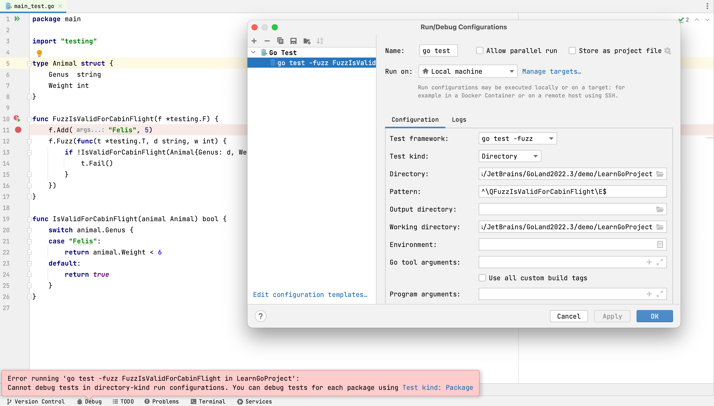

## Run tests after commit

When you want to check that your changes wouldn't break the code before pushing them, you can do that by running tests as commit checks.


> This feature is only available for Git and Mercurial.

### Set up test configuration

1. Open the Commit tool window as described in the following topics:

   - [Git](https://www.jetbrains.com/help/go/commit-and-push-changes.html)
   - [Mercurial](https://www.jetbrains.com/help/go/uploading-a-local-mercurial-repository-push.html)

2. Click Show Commit Options . In the menu, click Choose configuration near Run Tests and select which configuration you want to run.

   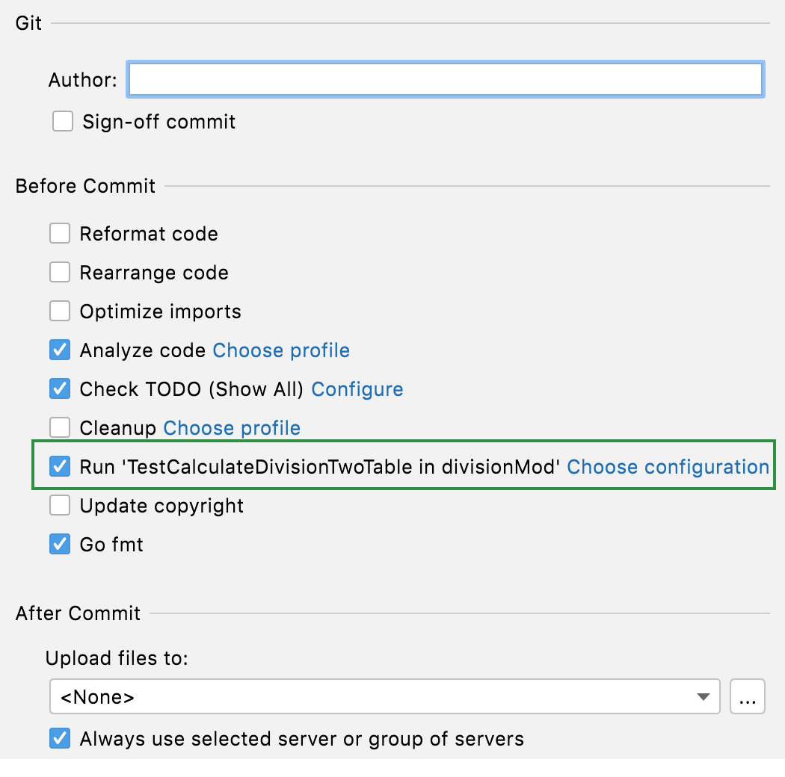

After you have set up the test configuration, the specified tests will run every time you make a commit.

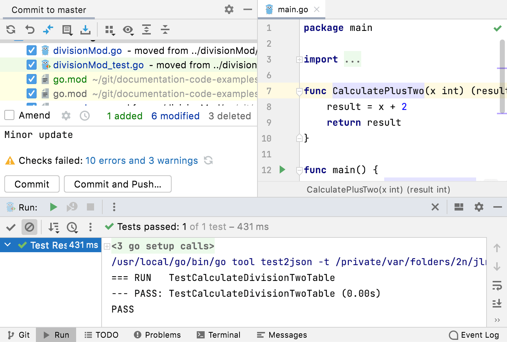

## Stop tests

Use the following options on the Run toolbar of the Test Runner tab:

- Click  or press Ctrl+F2 to terminate the process immediately.

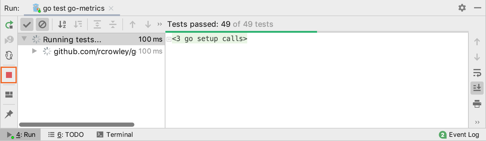

## Rerun tests

### Rerun a single test

- Right-click a test on the Test Runner tab of the Run tool window and select Run 'test name'.

### Rerun all tests in a session

- Click  on the Run toolbar or press Ctrl+F5 to rerun all tests in a session.

### Rerun failed tests

- Click  on the Run toolbar to rerun only failed tests.

  Hold Shift and click  to choose whether you want to Run the tests again or Debug them.

  You can configure the IDE to trigger tests that were ignored or not started during the previous test run together with failed tests. Click  on the Test Runner toolbar and enable the Include Non-Started Tests into Rerun Failed option.

### Rerun tests automatically

In GoLand, you can enable the autotest-like runner: any test in the current run configuration restarts automatically after you change the related source code.

- Click  Toggle auto-test on the Run toolbar to enable the autotest-like runner.

## Debug failed tests

If you don't know why a test fails, you can debug it.

1. In the editor, click the gutter on the line where you want to set a breakpoint.

   There are different types of breakpoints that you can use depending on where you want to suspend the program. For more information, refer to [Breakpoints](https://www.jetbrains.com/help/go/using-breakpoints.html).

2. Right-click the  gutter icon next to the failed test and select Debug 'test name'.

   The test that has failed will be rerun in the debug mode. After that, the test will be suspended, allowing you to [examine its current state](https://www.jetbrains.com/help/go/examining-suspended-program.html).

   You can [step through the test](https://www.jetbrains.com/help/go/stepping-through-the-program.html) to analyze its execution in detail.

   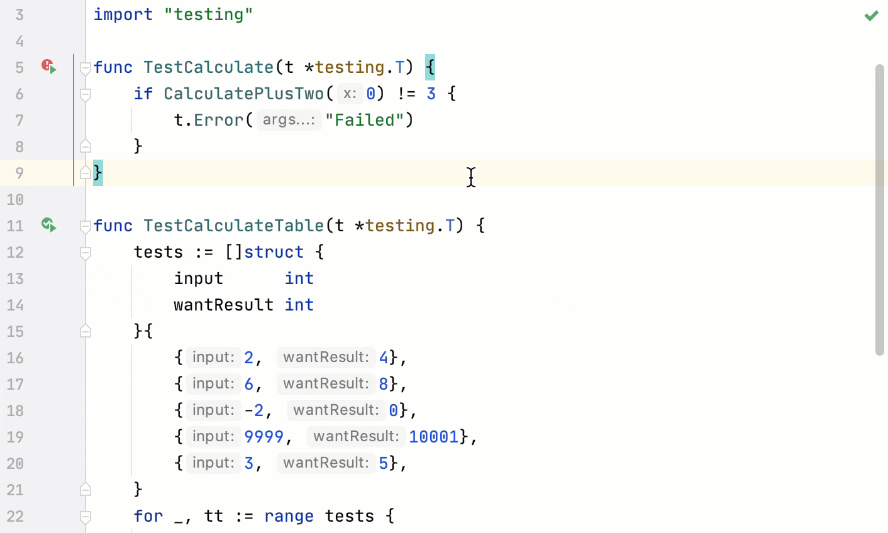

### Run a run/debug configuration for tests

To run a run/debug configuration for a test, you must create the run/debug configuration. Read about creating a run/debug configuration for tests in [Run/debug configuration templates for tests](https://www.jetbrains.com/help/go/run-debug-configuration.html#run-debug-configuration-templates-for-tests).

1. Click the Edit Run/Debug Configurations list and select configuration that you want to run.
2. Click the Run button .

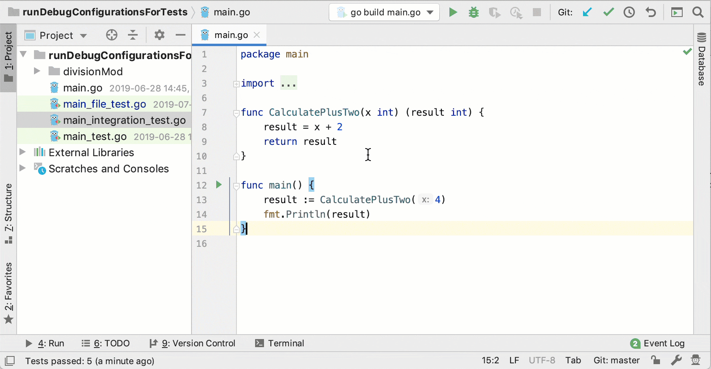

### Run tests from the gutter

When you run a test from the gutter, you create a temporary run/debug configuration. To save this configuration, navigate to Run | Edit Configurations, select the grayed-out item in the configurations list, and click the Save Configuration button .

1. Click the Run Test icon  in the gutter.

2. Select Run <configuration_name>.

   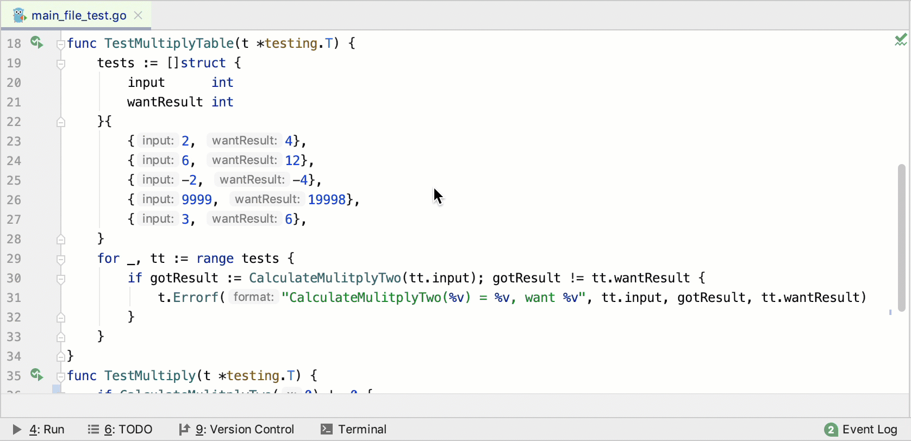

### Run tests from the context menu

- Right-click a test file or a directory with test files and select Run | Go test <object_name> (for directories) or Run <object_name> (for files).

  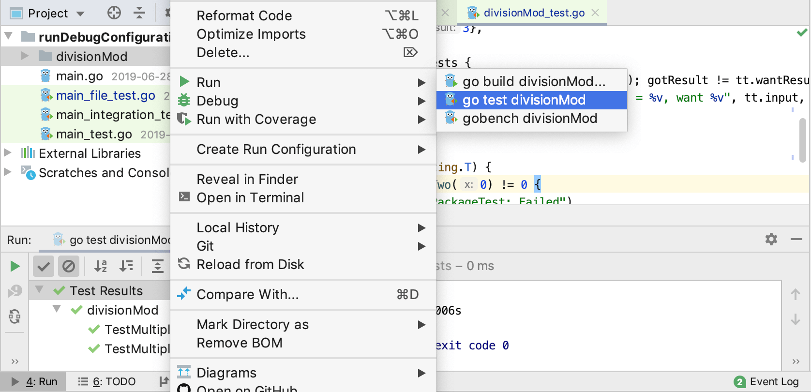

## Productivity tips

### Run individual table tests

- You can run individual table tests by using the Run icon () in the gutter. Also, you can navigate to an individual table test from the Run tool window.

  Current support of table tests has following limitations:

  - The test data variable must be a slice, an array, or a map. It must be defined in the same function as the `t.Run` call and must not be used after initialization (except for the `range` clause in the `for` loop).

  - The individual test data entry must be a struct literal. Loop variables used in a subtest name expression must not be used before the `t.Run` call.

  - A subtest name expression can be test data string field, a concatenation of test data string fields, or a `fmt.Sprintf()` call with `%s` and `%d` verbs.

    For example, in the following code snippet, `fmt.Sprintf("%s in %s", tc.gmt, tc.loc)` is a subtest name expression.

    ```go
    for _, tc := range testCases {
        t.Run(fmt.Sprintf("%s in %s", tc.gmt, tc.loc), func(t *testing.T) {
            loc, err := time.LoadLocation(tc.loc)
            if err != nil {
                t.Fatal("could not load location")
            }
            gmt, _ := time.Parse("15:04", tc.gmt)
            if got := gmt.In(loc).Format("15:04"); got != tc.want {
                t.Errorf("got %s; want %s", got, tc.want)
            }
        })
    }
    ```

    

  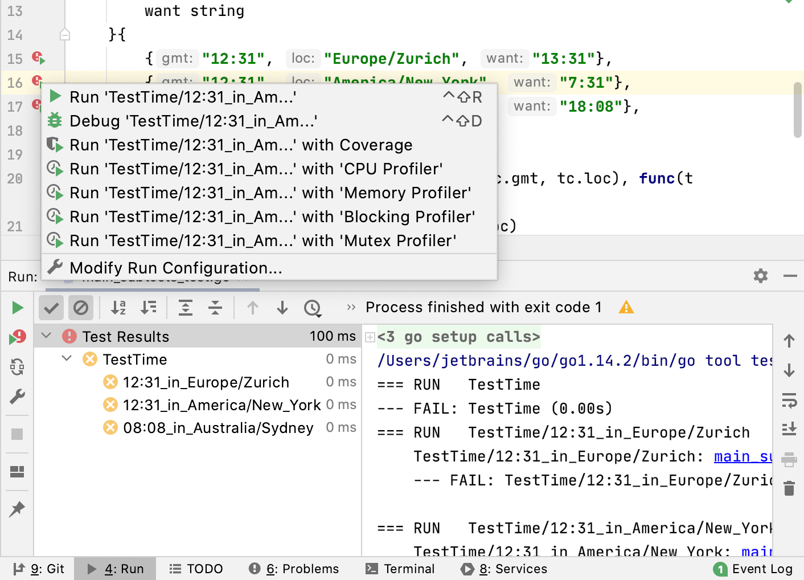