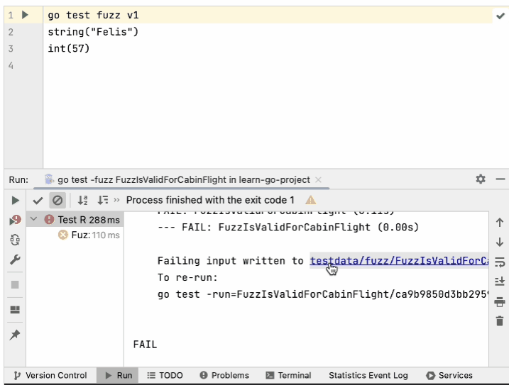

+++
title = "运行测试"
weight = 30
date = 2023-06-19T11:20:58+08:00
type = "docs"
description = ""
isCJKLanguage = true
draft = false

+++
# Run tests 运行测试

https://www.jetbrains.com/help/go/performing-tests.html

Last modified: 03 May 2023

最后修改日期：2023年5月3日

​	运行选定的测试或测试文件夹：Ctrl+Shift+F10

​	停止当前的测试会话：Ctrl+F2

### 快速方式

​	如果您的测试在开始之前不需要任何特定的操作，并且您不想配置额外的选项，您可以使用以下选项来运行它们：

- 将光标放置在要运行该文件中的所有测试或测试方法处，然后按下Ctrl+Shift+F10。或者，单击测试方法旁边的沟槽图标。

  沟槽图标会根据测试的状态而变化： 

  - 该 的沟槽图标表示新的测试。
  - 该 的沟槽图标表示成功的测试。
  - 该 的沟槽图标表示失败的测试。

- 要运行文件夹中的所有测试，请在项目工具窗口中选择该文件夹，然后按下Ctrl+Shift+F10，或者从上下文菜单中选择Run Tests in 'folder'。

  


### 可自定义的方式

​	当您运行一个测试时，GoLand会创建一个临时运行配置。您可以保存临时运行配置，更改其设置，并与团队的其他成员共享。有关更多信息，请参阅[运行/调试配置](https://www.jetbrains.com/help/go/run-debug-configuration.html)。

1. 创建一个新的[运行配置](https://www.jetbrains.com/help/go/run-debug-configuration.html)或保存一个临时运行配置。

3. 从主工具栏的列表中选择要运行的配置。

5. 单击或按下Shift+F10。

   


> ​	在运行工具栏上启用固定选项卡选项，以在单独的选项卡中打开每次测试运行的结果。

​	GoLand完成运行测试后，会在运行工具窗口的测试运行器选项卡中显示结果。有关如何分析测试结果的更多信息，请参阅[查看和探索测试结果](https://www.jetbrains.com/help/go/viewing-and-exploring-test-results.html)。


### 使用测试标志运行测试

​	您可以使用类似于`-race`、`-failfast`、`-short`等的测试标志来运行测试。在[pkg.go.dev的Go文档](https://pkg.go.dev/cmd/go)中检查其他标志。

1. 导航到Run | Edit Configurations菜单。

2. 单击您用于运行应用程序或测试的运行/调试配置。在Go工具参数字段中，指定您计划使用的标志:

   - `-race`：启用数据竞争检测。仅支持`linux/amd64`、`freebsd/amd64`、`darwin/amd64`、`windows/amd64`、`linux/ppc64le`和`linux/arm64`（仅限48位VMA）。
   - `-test.failfast`：在第一个测试失败后停止运行新的测试。
   - `-test.short`：缩短长时间运行的测试的运行时间。
   - `-test.benchmem`：为基准测试打印内存分配统计信息。

   


## 模糊测试

​	模糊测试是一种通过不断提交各种输入来自动化测试的方法。输入是根据您在`f.Add(mySampleData)`中提供的示例数据生成的。

​	`f.Add()`接受以下数据类型：`string`、`[]byte`、`rune`、`int`、`int8`、`int16`、`int32`、`int64`、`uint`、`uint8`、`uint16`、`uint32`、`uint64`、`float32`、`float64`、`bool`。

### 运行模糊测试 Running fuzz testing

- 单击gutter中的Run Test图标，选择Run，然后选择模糊测试配置（例如，`go test -fuzz FuzzTest`）。

  如果测试失败，您可以单击链接到**testdata**目录以查看哪些输入导致了测试失败。

  要使用失败的种子语料库条目运行go test，请打开**testdata**目录中的文件，单击gutter中的Run Fuzzing图标，然后选择所需的配置。

  

  


### 调试模糊测试

1. 通过单击需要设置断点的gutter上的位置来创建断点。

   或者，单击要创建断点的行，并按Ctrl+F8。

2. 单击 Run | Debug.

3. 在Debug弹出窗口中，选择所需的运行/调试配置。


​	您无法使用具有Directory 测试类型的配置来调试模糊测试。请改用File或Package测试类型。


## 提交后运行测试

​	当您想在推送更改之前检查更改不会破坏代码时，可以通过将测试作为提交检查来实现。


> ​	此功能仅适用于Git和Mercurial。

### 设置测试配置

1. 按照以下主题中的描述打开Commit工具窗口：

   - [Git](https://www.jetbrains.com/help/go/commit-and-push-changes.html)
   - [Mercurial](https://www.jetbrains.com/help/go/uploading-a-local-mercurial-repository-push.html)

3. 单击 Show Commit Options 在菜单中，单击Choose configuration旁边的Run Tests，然后选择要运行的配置。

   

​	设置了测试配置后，每次提交时指定的测试都将运行。


## 停止测试

​	在测试运行器选项卡的运行工具栏上使用以下选项： 

- 单击或按Ctrl+F2立即终止进程。


## 重新运行测试

### 重新运行单个测试

- 在运行工具窗口的测试运行器选项卡上，右键单击一个测试，然后选择Run 'test name'。

### 重新运行会话中的所有测试

- 单击运行工具栏上的或按Ctrl+F5重新运行会话中的所有测试。

### 重新运行失败的测试

- 单击运行工具栏上的以仅重新运行失败的测试。

  按住Shift并单击以选择是重新运行测试还是调试测试。

  您可以配置IDE，使其在重新运行失败的测试时触发被忽略或未启动的测试。单击测试运行器工具栏上的，然后启用Include Non-Started Tests into Rerun Failed选项。

### 自动重新运行测试

​	在GoLand中，您可以启用类似于自动测试的运行器：在更改相关源代码后，当前运行配置中的任何测试都会自动重新启动。

 

- 单击运行工具栏上的切换自动测试以启用类似于自动测试的运行器。

## 调试失败的测试

​	如果您不知道为什么测试失败，可以进行调试。

1. 在编辑器中，单击要设置断点的行的沟槽。

   根据您希望在程序暂停的位置，可以使用不同类型的断点。有关更多信息，请参阅[断点](https://www.jetbrains.com/help/go/using-breakpoints.html)。

3. 在失败的测试旁边右键单击的沟槽图标，然后选择Debug 'test name'。

   失败的测试将在调试模式下重新运行。之后，测试将暂停，允许您[检查其当前状态](https://www.jetbrains.com/help/go/examining-suspended-program.html)。

   您可以[逐步执行测试](https://www.jetbrains.com/help/go/stepping-through-the-program.html)，以详细分析其执行过程。

   

### 运行/调试测试的运行/调试配置

​	要为测试运行/调试配置运行/调试配置，必须创建运行/调试配置。有关为测试创建运行/调试配置的信息，请阅读[运行/调试配置模板](https://www.jetbrains.com/help/go/run-debug-configuration.html#run-debug-configuration-templates-for-tests)。

 

1. 单击Edit Run/Debug Configurations列表，并选择要运行的配置。
3. 单击运行按钮。


### 从沟槽运行测试

​	当您从沟槽运行测试时，将创建一个临时的运行/调试配置。要保存此配置，请导航到Run | Edit Configurations，选择配置列表中的灰色项目，然后单击Save Configuration按钮。

1. 单击沟槽上的运行测试图标。

2. 选择Run <configuration_name>。

   

### 从上下文菜单运行测试

- 右键单击测试文件或包含测试文件的目录，然后选择Run | Go test <object_name>（对于目录）或Run <object_name>（对于文件）。

  


## 提高工作效率的技巧

### 运行单个表格测试

- 您可以使用沟槽上的运行图标（运行单个表格测试。此外，您还可以在表格测试名称上右键单击，然后选择Run <test_name>。

  ​	表格测试的当前支持有以下限制：

  - 测试数据变量必须是切片、数组或映射。它必须在与`t.Run`调用相同的函数中定义，并且在初始化后不能再使用（除了在`for`循环的`range`子句中）。

  - 每个测试数据条目必须是结构体字面量。在子测试名称表达式中使用的循环变量不能在`t.Run`调用之前使用。

  - 子测试名称表达式可以是测试数据字符串字段、测试数据字符串字段的连接，或者是使用`fmt.Sprintf()`调用配合`%s`和`%d`占位符。

    例如，在下面的代码片段中，`fmt.Sprintf(%s in %s, tc.gmt, tc.loc)`就是一个子测试名称表达式。

    ```go
    for _, tc := range testCases {
        t.Run(fmt.Sprintf(%s in %s, tc.gmt, tc.loc), func(t *testing.T) {
            loc, err := time.LoadLocation(tc.loc)
            if err != nil {
                t.Fatal(could not load location)
            }
            gmt, _ := time.Parse(15:04, tc.gmt)
            if got := gmt.In(loc).Format(15:04); got != tc.want {
                t.Errorf(got %s; want %s, got, tc.want)
            }
        })
    }
    ```
  
    
  
  
  