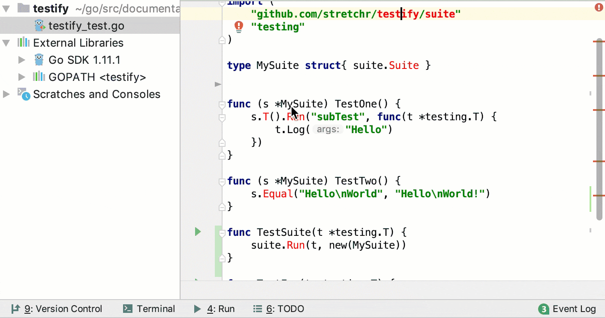
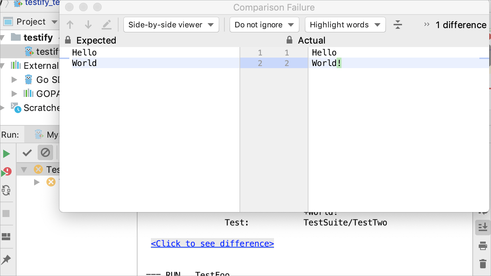

+++
title = "使用Testify工具包"
weight = 60
date = 2023-06-19T11:20:58+08:00
type = "docs"
description = ""
isCJKLanguage = true
draft = false

+++
# Using the Testify toolkit - 使用Testify工具包

https://www.jetbrains.com/help/go/using-the-testify-toolkit.html

Last modified: 16 January 2023

最后修改日期：2023年1月16日

​	编程并不总是一个直截了当的过程。特别是当您需要向应用程序添加一小段代码并确保整个应用程序按预期工作时。在这种情况下，测试可以帮助您保持代码质量并提高其可靠性。

​	GoLand支持Testify工具包。Testify提供了几个包来处理断言、模拟对象和测试套件。使用Testify，您可以将套件和方法作为普通的测试函数运行。有关该工具包的更多信息，请阅读[Testify在GitHub上的描述](https://github.com/stretchr/testify)。

### 使用Testify运行测试

1. 在终端中运行`go get -u github.com/stretchr/testify`。或者，使用Alt+Enter意图操作下载并安装工具包。
3. 单击运行测试图标，然后选择运行<configuration>。

> ​	请确保测试文件的后缀名为**_test**（例如，**testify_test.go**）。

### 比较预期值和实际值

​	您可以比较断言测试的预期值和实际值。 

- 要查看差异，请单击运行窗格中的Click to see difference链接。

  
