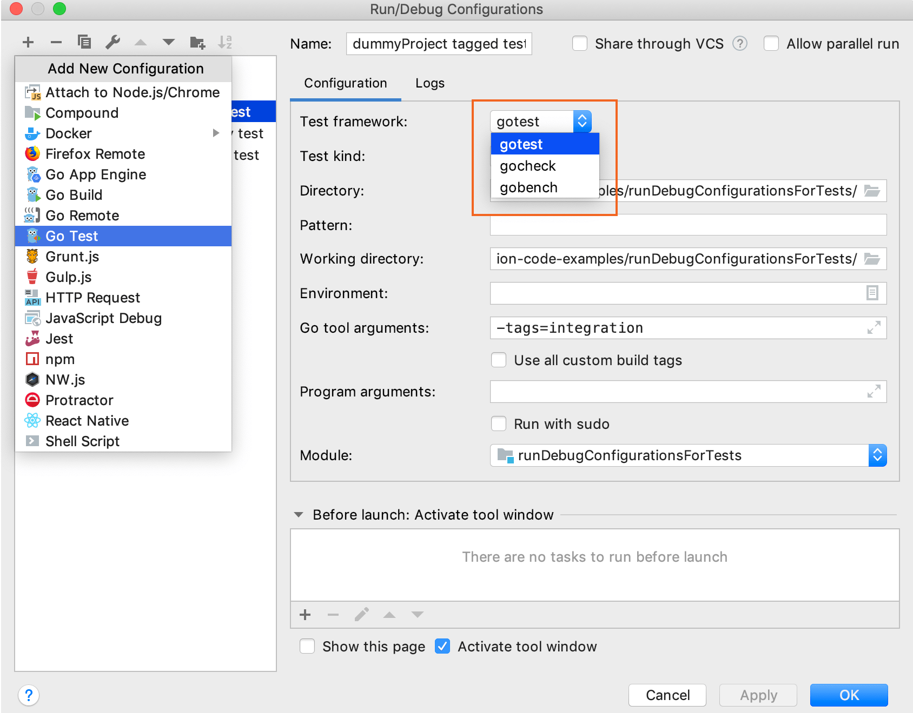

+++
title = "测试"
linkTitle = "测试"
date = 2023-06-19T11:20:58+08:00
type = "docs"
description = ""
isCJKLanguage = true
draft = false
[menu.main]
    weight = 20
+++
# Testing 测试

https://www.jetbrains.com/help/go/testing.html

Last modified: 03 May 2023

最后修改日期：2023年5月3日

​	测试可以确保代码的行为是正确和符合预期的。良好编写的测试可以让您有信心开发代码，确保其正常工作且不会破坏现有代码。

​	GoLand包含多个可以用于运行测试的包。此外，您还可以为选定的包应用特定的测试范围。

## 用于测试的包

​	为了测试目的，GoLand包含了以下几个包：

